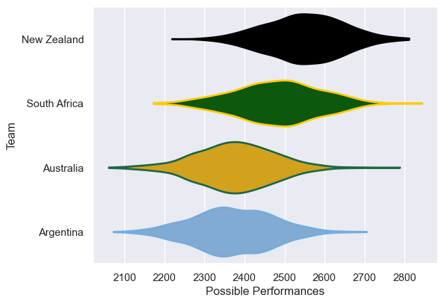

---  
title: "Rugby Championship 2025 Status"  
date: 2025-07-28 6:00:00 -0500  
categories: model review projection  
layout: article  
aside:  
    toc: true  
---
# Current Team Rankings

# Standings

## Projected Remaining Table

| Club         |   To Play |   Projected Wins |   Projected Differential |   Projected Losing Bonus Points | Projected Try Bonus Points   |   Projected Competition Points |
|:-------------|----------:|-----------------:|-------------------------:|--------------------------------:|:-----------------------------|-------------------------------:|
| New Zealand  |         6 |            3.765 |                   25.414 |                           1.074 |                              |                         16.61  |
| South Africa |         6 |            3.602 |                   28.033 |                           1.082 |                              |                         15.922 |
| Australia    |         6 |            2.16  |                  -28.794 |                           1.257 |                              |                         10.321 |
| Argentina    |         6 |            2.017 |                  -24.653 |                           1.458 |                              |                         10.018 |

## Projected Total Table

| Club         |   Played |   Wins |   Point Differential |   Losing Bonus Points | Try Bonus Points   |   Competition Points |
|:-------------|---------:|-------:|---------------------:|----------------------:|:-------------------|---------------------:|
| New Zealand  |        6 |  3.765 |               25.414 |                 1.074 |                    |               16.61  |
| South Africa |        6 |  3.602 |               28.033 |                 1.082 |                    |               15.922 |
| Australia    |        6 |  2.16  |              -28.794 |                 1.257 |                    |               10.321 |
| Argentina    |        6 |  2.017 |              -24.653 |                 1.458 |                    |               10.018 |

# Future Predictions

## Week 1

### South Africa V Australia on 2025/08/16

Average Margin: South Africa by 10.9

### Argentina V New Zealand on 2025/08/16

Average Margin: New Zealand by 4.9

## Week 2

### Argentina V New Zealand on 2025/08/23

Average Margin: New Zealand by 5.3

### South Africa V Australia on 2025/08/23

Average Margin: South Africa by 11.3

## Week 3

### Australia V Argentina on 2025/09/05

Average Margin: Australia by 2.0

### New Zealand V South Africa on 2025/09/06

Average Margin: New Zealand by 2.1

## Week 4

### Australia V Argentina on 2025/09/12

Average Margin: Australia by 1.9

### New Zealand V South Africa on 2025/09/13

Average Margin: New Zealand by 2.7

## Week 5

### New Zealand V Australia on 2025/09/26

Average Margin: New Zealand by 7.8

### South Africa V Argentina on 2025/09/27

Average Margin: South Africa by 7.9

## Week 6

### Argentina V South Africa on 2025/10/04

Average Margin: South Africa by 2.8

### Australia V New Zealand on 2025/10/04

Average Margin: New Zealand by 2.6

