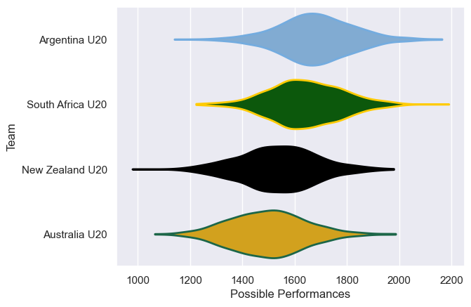
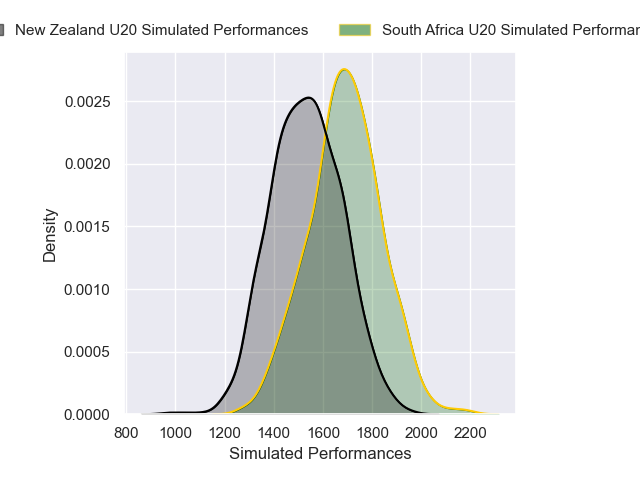
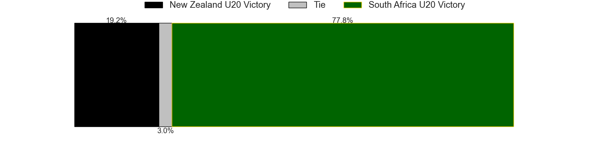
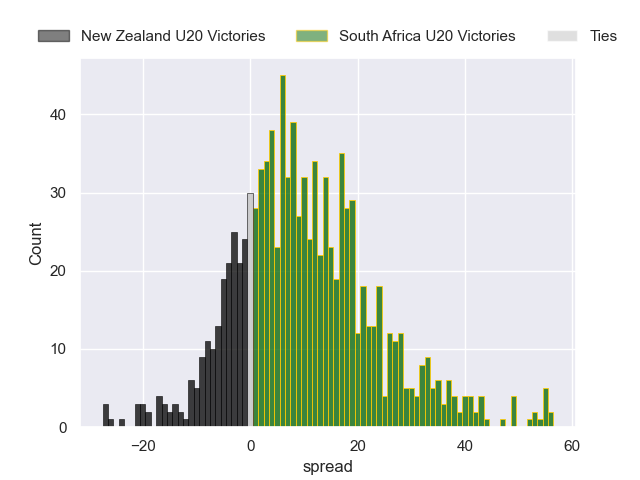
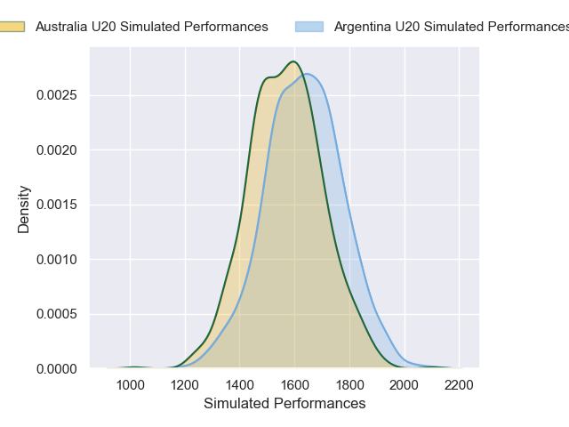
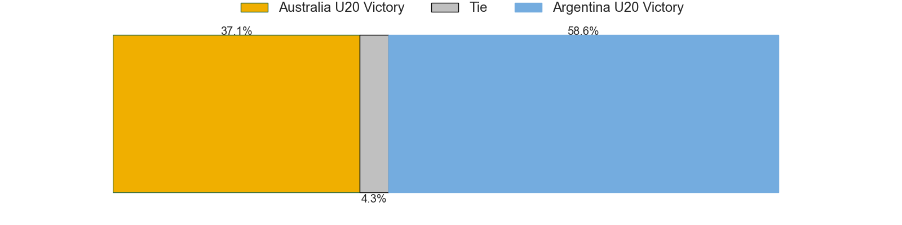
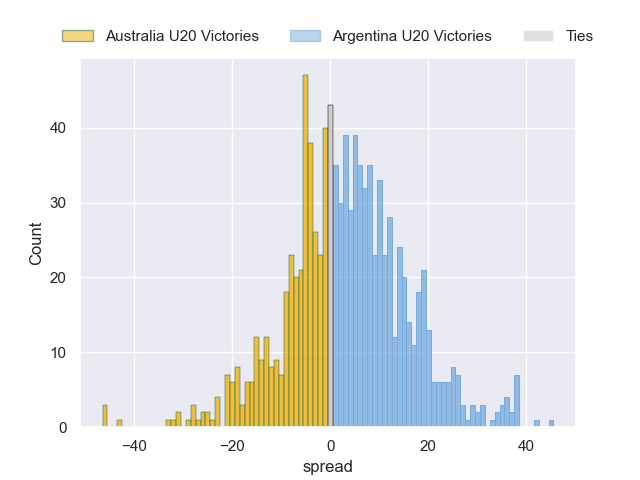

---  
title: "Rugby Championship U20 2025 Status"  
date: 2025-05-09 6:00:00 -0500  
categories: model review projection  
layout: article  
aside:  
    toc: true  
---
# Current Team Rankings

# Standings

## Current Standings

| Club             |   Played |   Wins |   Point Differential |   Losing Bonus Points |   Try Bonus Points |   Competition Points |
|:-----------------|---------:|-------:|---------------------:|----------------------:|-------------------:|---------------------:|
| New Zealand U20  |        2 |      1 |                   54 |                     0 |                  2 |                    8 |
| Australia U20    |        2 |      1 |                    5 |                     0 |                  2 |                    8 |
| South Africa U20 |        2 |      1 |                    6 |                     1 |                  1 |                    6 |
| Argentina U20    |        2 |      0 |                  -65 |                     0 |                  0 |                    0 |

## Projected Remaining Table

| Club             |   Matches Remaining |   Wins |   Point Differential |   Losing Bonus Points |   Try Bonus Points |   Competition Points |
|:-----------------|--------------------:|-------:|---------------------:|----------------------:|-------------------:|---------------------:|
| New Zealand U20  |                   1 |    0.6 |              2.37399 |                   0.2 |                0.8 |                  3.3 |
| Argentina U20    |                   1 |    0.6 |              3.36647 |                   0.2 |                0.3 |                  3   |
| South Africa U20 |                   1 |    0.4 |             -2.37399 |                   0.2 |                0.3 |                  2.2 |
| Australia U20    |                   1 |    0.4 |             -3.36647 |                   0.2 |                0.3 |                  2.1 |

## Projected Total Table

| Club             |   Total Matches |   Wins |   Point Differential |   Losing Bonus Points |   Try Bonus Points |   Competition Points |
|:-----------------|----------------:|-------:|---------------------:|----------------------:|-------------------:|---------------------:|
| New Zealand U20  |               3 |    1.6 |             56.374   |                   0.2 |                2.8 |                 11.3 |
| Australia U20    |               3 |    1.4 |              1.63353 |                   0.2 |                2.3 |                 10.1 |
| South Africa U20 |               3 |    1.4 |              3.62601 |                   1.2 |                1.3 |                  8.2 |
| Argentina U20    |               3 |    0.6 |            -61.6335  |                   0.2 |                0.3 |                  3   |

# Completed Match Review

| Model | Percent Correct Predictions | Spread Error |
| ------ | ------ | ------ |
| Club Level | 0.0% | 25.8 |
| Player Level: Lineup | 50.0% | 18.8 |
| Player Level: Minutes | 25.0% | 18.6 |

# Future Predictions

## Week 3

### South Africa U20 V New Zealand U20 on 2025/05/11

Average Margin: New Zealand U20 by 2.4

Average Scoreline: 34-32

### Argentina U20 V Australia U20 on 2025/05/11

Average Margin: Argentina U20 by 3.4

Average Scoreline: 24-21

