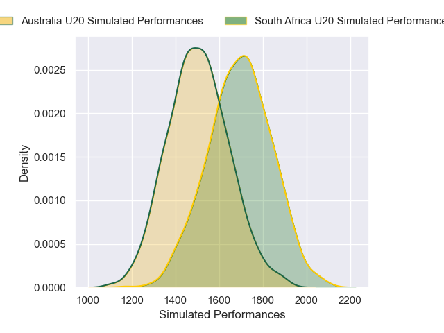
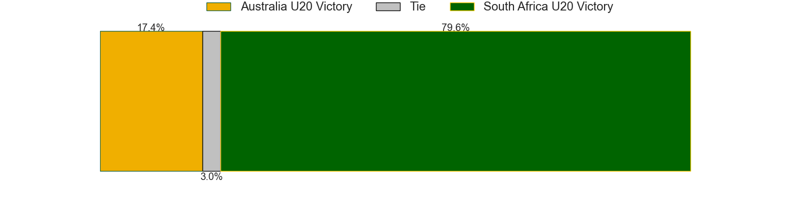
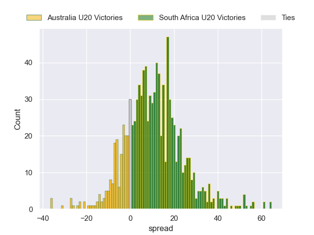
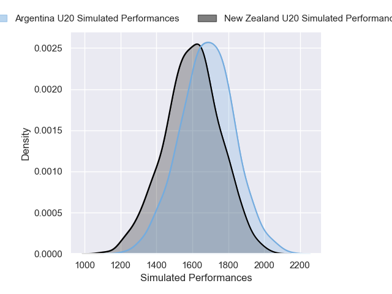
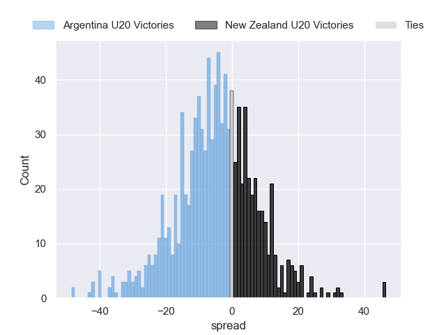

---  
title: "Rugby Championship U20 2025 Status"  
date: 2025-05-05 6:00:00 -0500  
categories: model review projection  
layout: article  
aside:  
    toc: true  
---
# Current Team Rankings

# Standings

## Current Standings

| Club             |   Played |   Wins |   Point Differential |   Losing Bonus Points |   Try Bonus Points |   Competition Points |
|:-----------------|---------:|-------:|---------------------:|----------------------:|-------------------:|---------------------:|
| South Africa U20 |        1 |      1 |                   11 |                     0 |                  1 |                    5 |
| New Zealand U20  |        1 |      0 |                    0 |                     0 |                  1 |                    3 |
| Australia U20    |        1 |      0 |                    0 |                     0 |                  1 |                    3 |
| Argentina U20    |        1 |      0 |                  -11 |                     0 |                  0 |                    0 |

## Projected Remaining Table

| Club             |   Matches Remaining |   Wins |   Point Differential |   Losing Bonus Points |   Try Bonus Points |   Competition Points |
|:-----------------|--------------------:|-------:|---------------------:|----------------------:|-------------------:|---------------------:|
| South Africa U20 |                   2 |    1.6 |              21.505  |                   0.2 |                0.8 |                  7.5 |
| Argentina U20    |                   2 |    1.5 |              18.2948 |                   0.3 |                1.1 |                  7.5 |
| New Zealand U20  |                   2 |    0.5 |             -15.5134 |                   0.5 |                0.9 |                  3.5 |
| Australia U20    |                   2 |    0.3 |             -24.2864 |                   0.4 |                0.4 |                  2   |

## Projected Total Table

| Club             |   Total Matches |   Wins |   Point Differential |   Losing Bonus Points |   Try Bonus Points |   Competition Points |
|:-----------------|----------------:|-------:|---------------------:|----------------------:|-------------------:|---------------------:|
| South Africa U20 |               3 |    2.6 |              32.505  |                   0.2 |                1.8 |                 12.5 |
| Argentina U20    |               3 |    1.5 |               7.2948 |                   0.3 |                1.1 |                  7.5 |
| New Zealand U20  |               3 |    0.5 |             -15.5134 |                   0.5 |                1.9 |                  6.5 |
| Australia U20    |               3 |    0.3 |             -24.2864 |                   0.4 |                1.4 |                  5   |

# Completed Match Review

| Model | Percent Correct Predictions | Spread Error |
| ------ | ------ | ------ |
| Club Level | 0.0% | 15.4 |
| Player Level: Lineup | 50.0% | 7.1 |
| Player Level: Minutes | 50.0% | 7.4 |

# Future Predictions

## Week 2

### South Africa U20 V Australia U20 on 2025/05/06

Average Margin: South Africa U20 by 10.8

Average Scoreline: 23-13

### New Zealand U20 V Argentina U20 on 2025/05/06

Average Margin: Argentina U20 by 4.8

Average Scoreline: 23-18

### South Africa U20 V New Zealand U20 on 2025/05/11

Average Margin: South Africa U20 by 10.7

Average Scoreline: 35-25

### Argentina U20 V Australia U20 on 2025/05/11

Average Margin: Argentina U20 by 13.5

Average Scoreline: 31-17

