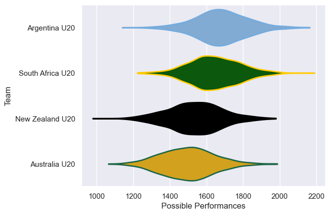
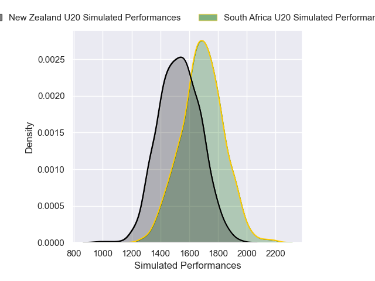
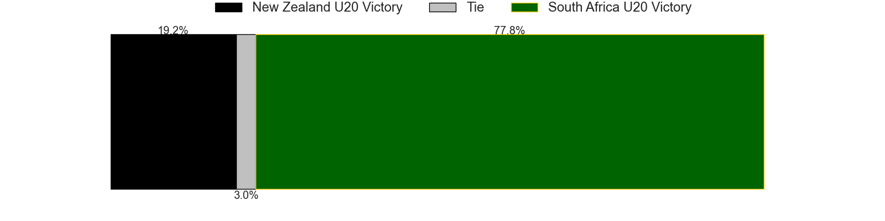
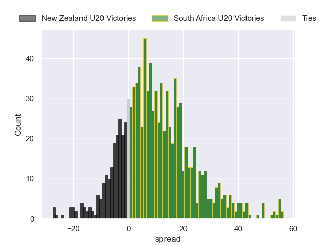
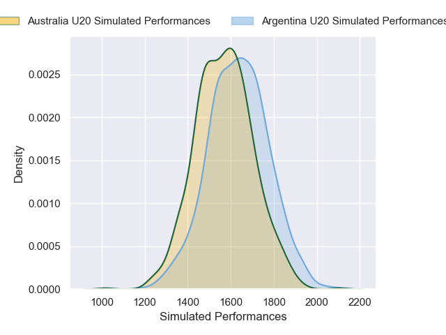
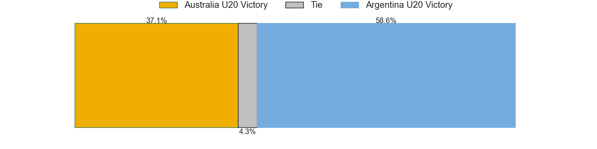
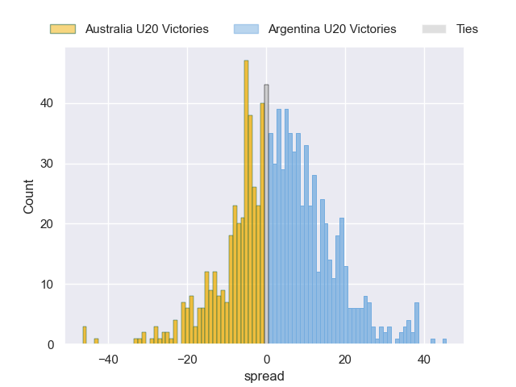

---  
title: "Rugby Championship U20 2025 Status"  
date: 2025-05-08 6:00:00 -0500  
categories: model review projection  
layout: article  
aside:  
    toc: true  
---
# Current Team Rankings

# Standings

## Current Standings

| Club             |   Played |   Wins |   Point Differential |   Losing Bonus Points |   Try Bonus Points |   Competition Points |
|:-----------------|---------:|-------:|---------------------:|----------------------:|-------------------:|---------------------:|
| South Africa U20 |        1 |      1 |                   11 |                     0 |                  1 |                    5 |
| New Zealand U20  |        1 |      0 |                    0 |                     0 |                  1 |                    3 |
| Australia U20    |        1 |      0 |                    0 |                     0 |                  1 |                    3 |
| Argentina U20    |        1 |      0 |                  -11 |                     0 |                  0 |                    0 |

## Projected Remaining Table

| Club             |   Matches Remaining |   Wins |   Point Differential |   Losing Bonus Points |   Try Bonus Points |   Competition Points |
|:-----------------|--------------------:|-------:|---------------------:|----------------------:|-------------------:|---------------------:|
| Argentina U20    |                   1 |    0.8 |              12.4225 |                   0.1 |                0.5 |                  4   |
| South Africa U20 |                   1 |    0.8 |              10.3191 |                   0.1 |                0.4 |                  3.7 |
| New Zealand U20  |                   1 |    0.2 |             -10.3191 |                   0.2 |                0.5 |                  1.6 |
| Australia U20    |                   1 |    0.2 |             -12.4225 |                   0.2 |                0.2 |                  1   |

## Projected Total Table

| Club             |   Total Matches |   Wins |   Point Differential |   Losing Bonus Points |   Try Bonus Points |   Competition Points |
|:-----------------|----------------:|-------:|---------------------:|----------------------:|-------------------:|---------------------:|
| South Africa U20 |               2 |    1.8 |             21.3191  |                   0.1 |                1.4 |                  8.7 |
| New Zealand U20  |               2 |    0.2 |            -10.3191  |                   0.2 |                1.5 |                  4.6 |
| Argentina U20    |               2 |    0.8 |              1.42249 |                   0.1 |                0.5 |                  4   |
| Australia U20    |               2 |    0.2 |            -12.4225  |                   0.2 |                1.2 |                  4   |

# Completed Match Review

| Model | Percent Correct Predictions | Spread Error |
| ------ | ------ | ------ |
| Club Level | 0.0% | 15.4 |
| Player Level: Lineup | 50.0% | 7.0 |
| Player Level: Minutes | 0.0% | 8.0 |

# Future Predictions

## Week 2

### South Africa U20 V New Zealand U20 on 2025/05/11

Average Margin: South Africa U20 by 10.3

Average Scoreline: 35-25

### Argentina U20 V Australia U20 on 2025/05/11

Average Margin: Argentina U20 by 12.4

Average Scoreline: 30-18

