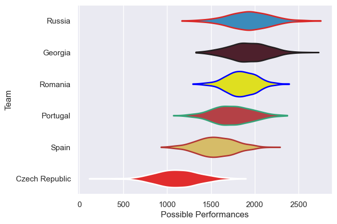

---  
title: "Rugby Europe Championship 2007"  
date: 2025-07-29 6:00:00 -0500  
categories: model review projection  
layout: article  
aside:  
    toc: true  
---
# Current Team Rankings

# Standings

## Current Standings

| Club           |   Played |   Wins |   Point Differential |   Losing Bonus Points | Try Bonus Points   |   Competition Points |
|:---------------|---------:|-------:|---------------------:|----------------------:|:-------------------|---------------------:|
| Russia         |        5 |      4 |                   80 |                     0 |                    |                   16 |
| Romania        |        5 |      3 |                   71 |                     1 |                    |                   13 |
| Spain          |        6 |      3 |                   23 |                     1 |                    |                   13 |
| Georgia        |        4 |      3 |                  103 |                     0 |                    |                   12 |
| Portugal       |        4 |      2 |                    0 |                     0 |                    |                    8 |
| Czech Republic |        6 |      0 |                 -277 |                     0 |                    |                    0 |

# Completed Match Review

| Model | Percent Correct Predictions | Spread Error |
| ------ | ------ | ------ |
| Club Level | 66.7% | 23.9 |
| Player Level: Lineup | nan% | nan |
| Player Level: Minutes | nan% | nan |

