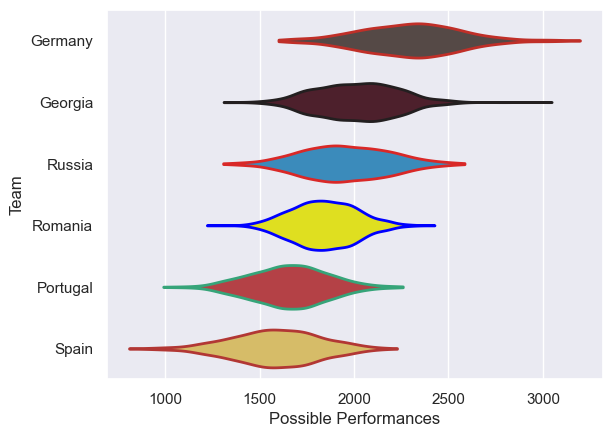

---  
title: "Rugby Europe Championship 2008"  
date: 2025-07-29 6:00:00 -0500  
categories: model review projection  
layout: article  
aside:  
    toc: true  
---
# Current Team Rankings

# Standings

## Current Standings

| Club     |   Played |   Wins |   Point Differential |   Losing Bonus Points | Try Bonus Points   |   Competition Points |
|:---------|---------:|-------:|---------------------:|----------------------:|:-------------------|---------------------:|
| Georgia  |        2 |      2 |                   43 |                     0 |                    |                    8 |
| Russia   |        2 |      2 |                   42 |                     0 |                    |                    8 |
| Spain    |        2 |      1 |                  -16 |                     0 |                    |                    4 |
| Germany  |        1 |      0 |                  -11 |                     0 |                    |                    0 |
| Romania  |        1 |      0 |                  -15 |                     0 |                    |                    0 |
| Portugal |        2 |      0 |                  -43 |                     0 |                    |                    0 |

# Completed Match Review

| Model | Percent Correct Predictions | Spread Error |
| ------ | ------ | ------ |
| Club Level | 80.0% | 11.6 |
| Player Level: Lineup | nan% | nan |
| Player Level: Minutes | nan% | nan |

