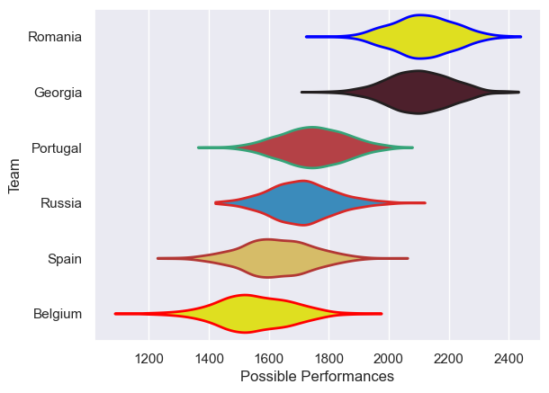

---  
title: "Rugby Europe Championship 2014"  
date: 2025-07-29 6:00:00 -0500  
categories: model review projection  
layout: article  
aside:  
    toc: true  
---
# Current Team Rankings

# Standings

## Current Standings

| Club     |   Played |   Wins |   Point Differential |   Losing Bonus Points | Try Bonus Points   |   Competition Points |
|:---------|---------:|-------:|---------------------:|----------------------:|:-------------------|---------------------:|
| Georgia  |        5 |      5 |                  106 |                     0 |                    |                   20 |
| Romania  |        5 |      4 |                   87 |                     0 |                    |                   16 |
| Russia   |        5 |      3 |                  -24 |                     0 |                    |                   12 |
| Spain    |        5 |      2 |                  -27 |                     2 |                    |                   10 |
| Portugal |        5 |      1 |                  -56 |                     1 |                    |                    5 |
| Belgium  |        5 |      0 |                  -86 |                     1 |                    |                    1 |

# Completed Match Review

| Model | Percent Correct Predictions | Spread Error |
| ------ | ------ | ------ |
| Club Level | 100.0% | 8.9 |
| Player Level: Lineup | nan% | nan |
| Player Level: Minutes | nan% | nan |

