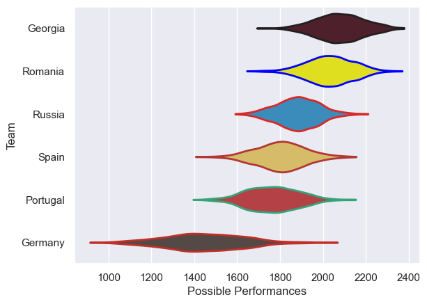

---  
title: "Rugby Europe Championship 2015 Status"  
date: 2025-07-28 6:00:00 -0500  
categories: model review projection  
layout: article  
aside:  
    toc: true  
---
# Current Team Rankings

# Standings

## Current Standings

| Club     |   Played |   Wins |   Point Differential |   Losing Bonus Points | Try Bonus Points   |   Competition Points |
|:---------|---------:|-------:|---------------------:|----------------------:|:-------------------|---------------------:|
| Georgia  |        5 |      5 |                  116 |                     0 |                    |                   20 |
| Romania  |        5 |      3 |                   41 |                     1 |                    |                   13 |
| Spain    |        5 |      3 |                   32 |                     0 |                    |                   12 |
| Russia   |        5 |      3 |                  -16 |                     0 |                    |                   12 |
| Portugal |        5 |      1 |                  -48 |                     1 |                    |                    5 |
| Germany  |        5 |      0 |                 -125 |                     1 |                    |                    1 |

# Completed Match Review

| Model | Percent Correct Predictions | Spread Error |
| ------ | ------ | ------ |
| Club Level | 60.0% | 14.8 |
| Player Level: Lineup | nan% | nan |
| Player Level: Minutes | nan% | nan |

