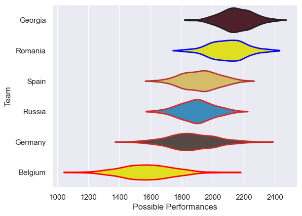

---  
title: "Rugby Europe Championship 2017"  
date: 2025-07-29 6:00:00 -0500  
categories: model review projection  
layout: article  
aside:  
    toc: true  
---
# Current Team Rankings

# Standings

## Current Standings

| Club    |   Played |   Wins |   Point Differential |   Losing Bonus Points | Try Bonus Points   |   Competition Points |
|:--------|---------:|-------:|---------------------:|----------------------:|:-------------------|---------------------:|
| Georgia |        5 |      4 |                   92 |                     1 |                    |                   17 |
| Romania |        5 |      4 |                   44 |                     1 |                    |                   17 |
| Spain   |        5 |      3 |                   37 |                     0 |                    |                   12 |
| Russia  |        5 |      2 |                  -10 |                     0 |                    |                    8 |
| Germany |        5 |      2 |                  -80 |                     0 |                    |                    8 |
| Belgium |        5 |      0 |                  -83 |                     2 |                    |                    2 |

# Completed Match Review

| Model | Percent Correct Predictions | Spread Error |
| ------ | ------ | ------ |
| Club Level | 86.7% | 10.4 |
| Player Level: Lineup | nan% | nan |
| Player Level: Minutes | nan% | nan |

