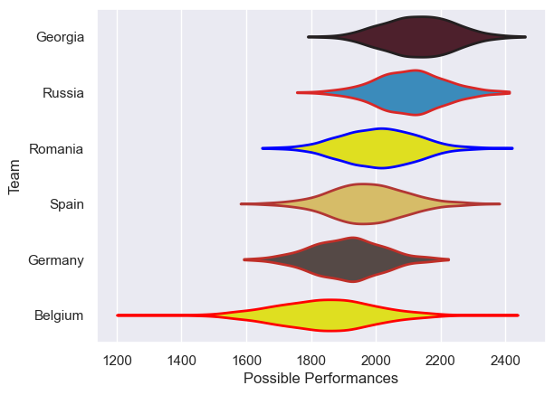

---  
title: "Rugby Europe Championship 2019"  
date: 2025-07-29 6:00:00 -0500  
categories: model review projection  
layout: article  
aside:  
    toc: true  
---
# Current Team Rankings

# Standings

## Current Standings

| Club    |   Played |   Wins |   Point Differential |   Losing Bonus Points | Try Bonus Points   |   Competition Points |
|:--------|---------:|-------:|---------------------:|----------------------:|:-------------------|---------------------:|
| Georgia |        5 |      5 |                  128 |                     0 |                    |                   20 |
| Spain   |        5 |      4 |                   52 |                     0 |                    |                   16 |
| Romania |        5 |      3 |                   44 |                     1 |                    |                   13 |
| Russia  |        5 |      2 |                   45 |                     2 |                    |                   10 |
| Belgium |        5 |      1 |                 -154 |                     0 |                    |                    4 |
| Germany |        5 |      0 |                 -115 |                     1 |                    |                    1 |

# Completed Match Review

| Model | Percent Correct Predictions | Spread Error |
| ------ | ------ | ------ |
| Club Level | 73.3% | 16.8 |
| Player Level: Lineup | nan% | nan |
| Player Level: Minutes | nan% | nan |

