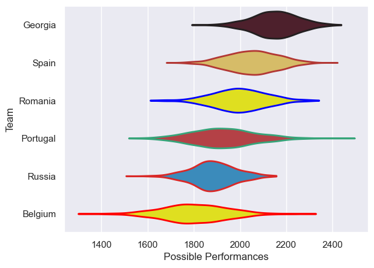

---  
title: "Rugby Europe Championship 2020"  
date: 2025-07-29 6:00:00 -0500  
categories: model review projection  
layout: article  
aside:  
    toc: true  
---
# Current Team Rankings

# Standings

## Current Standings

| Club     |   Played |   Wins |   Point Differential |   Losing Bonus Points | Try Bonus Points   |   Competition Points |
|:---------|---------:|-------:|---------------------:|----------------------:|:-------------------|---------------------:|
| Georgia  |        4 |      4 |                  128 |                     0 |                    |                   16 |
| Portugal |        4 |      2 |                    1 |                     1 |                    |                    9 |
| Spain    |        4 |      2 |                   -4 |                     0 |                    |                    8 |
| Russia   |        4 |      2 |                  -37 |                     0 |                    |                    8 |
| Belgium  |        4 |      1 |                  -59 |                     2 |                    |                    6 |
| Romania  |        4 |      1 |                  -29 |                     1 |                    |                    5 |

# Completed Match Review

| Model | Percent Correct Predictions | Spread Error |
| ------ | ------ | ------ |
| Club Level | 58.3% | 18.7 |
| Player Level: Lineup | nan% | nan |
| Player Level: Minutes | nan% | nan |

