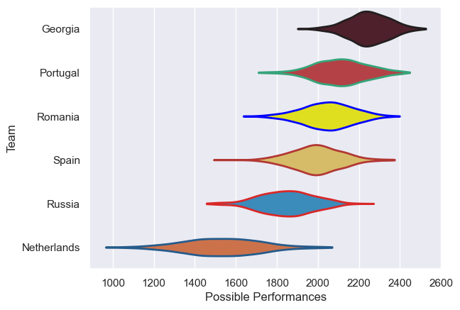

---  
title: "Rugby Europe Championship 2021 Status"  
date: 2025-07-28 6:00:00 -0500  
categories: model review projection  
layout: article  
aside:  
    toc: true  
---
# Current Team Rankings

# Standings

## Current Standings

| Club        |   Played |   Wins |   Point Differential |   Losing Bonus Points | Try Bonus Points   |   Competition Points |
|:------------|---------:|-------:|---------------------:|----------------------:|:-------------------|---------------------:|
| Georgia     |        6 |      6 |                   89 |                     0 |                    |                   24 |
| Spain       |        6 |      3 |                   69 |                     2 |                    |                   14 |
| Portugal    |        6 |      3 |                   43 |                     1 |                    |                   13 |
| Romania     |        5 |      3 |                   32 |                     1 |                    |                   13 |
| Russia      |        6 |      2 |                  -54 |                     0 |                    |                    8 |
| Netherlands |        5 |      0 |                 -179 |                     0 |                    |                    0 |

# Completed Match Review

| Model | Percent Correct Predictions | Spread Error |
| ------ | ------ | ------ |
| Club Level | 58.8% | 16.0 |
| Player Level: Lineup | nan% | nan |
| Player Level: Minutes | nan% | nan |

