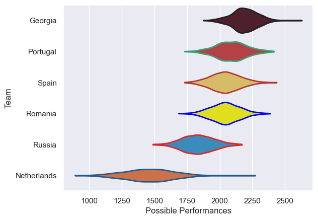

---  
title: "Rugby Europe Championship 2022"  
date: 2025-07-29 6:00:00 -0500  
categories: model review projection  
layout: article  
aside:  
    toc: true  
---
# Current Team Rankings

# Standings

## Current Standings

| Club        |   Played |   Wins |   Point Differential |   Losing Bonus Points |   Try Bonus Points |   Competition Points |
|:------------|---------:|-------:|---------------------:|----------------------:|-------------------:|---------------------:|
| Spain       |        5 |      4 |                   35 |                     0 |                  4 |                   20 |
| Georgia     |        4 |      3 |                   99 |                     0 |                  3 |                   17 |
| Romania     |        5 |      3 |                   25 |                     1 |                  3 |                   16 |
| Portugal    |        4 |      1 |                   41 |                     1 |                  2 |                    9 |
| Russia      |        2 |      0 |                  -13 |                     1 |                  1 |                    2 |
| Netherlands |        4 |      0 |                 -187 |                     0 |                    |                    0 |

# Completed Match Review

| Model | Percent Correct Predictions | Spread Error |
| ------ | ------ | ------ |
| Club Level | 91.7% | 10.6 |
| Player Level: Lineup | nan% | nan |
| Player Level: Minutes | nan% | nan |

