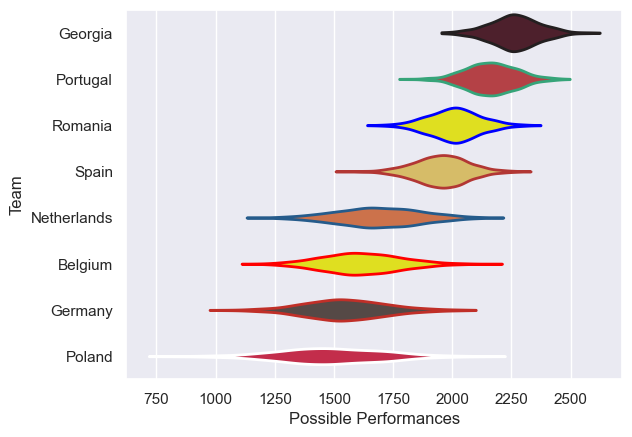

---  
title: "Rugby Europe Championship 2023 Status"  
date: 2025-07-28 6:00:00 -0500  
categories: model review projection  
layout: article  
aside:  
    toc: true  
---
# Current Team Rankings

# Standings

## Current Standings

| Club        |   Played |   Wins |   Point Differential |   Losing Bonus Points |   Try Bonus Points |   Competition Points |
|:------------|---------:|-------:|---------------------:|----------------------:|-------------------:|---------------------:|
| Georgia     |        5 |      5 |                  184 |                     0 |                  5 |                   25 |
| Portugal    |        5 |      4 |                  107 |                     0 |                  3 |                   19 |
| Romania     |        6 |      2 |                   49 |                     0 |                  3 |                   15 |
| Netherlands |        5 |      3 |                   -2 |                     0 |                  2 |                   14 |
| Spain       |        4 |      2 |                  -29 |                     0 |                  1 |                    9 |
| Germany     |        5 |      1 |                 -102 |                     1 |                  1 |                    6 |
| Poland      |        5 |      1 |                 -102 |                     2 |                    |                    6 |
| Belgium     |        5 |      1 |                 -105 |                     1 |                    |                    5 |

# Completed Match Review

| Model | Percent Correct Predictions | Spread Error |
| ------ | ------ | ------ |
| Club Level | 85.0% | 17.3 |
| Player Level: Lineup | nan% | nan |
| Player Level: Minutes | nan% | nan |

