---  
title: "Rugby Europe Championship 2023 Status"  
date: 2024-02-09 6:00:00 -0500  
categories: model review projection  
layout: article  
aside:  
    toc: true  
---
# Current Team Rankings

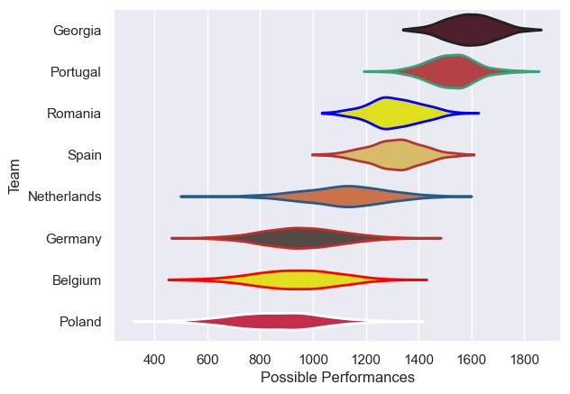
# Standings

## Current Standings

| Club        |   Played |   Wins |   Point Differential |   Losing Bonus Points |   Try Bonus Points |   Competition Points |
|:------------|---------:|-------:|---------------------:|----------------------:|-------------------:|---------------------:|
| Georgia     |        5 |      5 |                  184 |                     0 |                  5 |                   25 |
| Portugal    |        5 |      4 |                  107 |                     0 |                  3 |                   19 |
| Romania     |        5 |      3 |                   55 |                     0 |                  3 |                   15 |
| Netherlands |        5 |      3 |                   -2 |                     0 |                  2 |                   14 |
| Spain       |        5 |      2 |                  -35 |                     1 |                  1 |                   10 |
| Germany     |        5 |      1 |                 -102 |                     1 |                  1 |                    6 |
| Poland      |        5 |      1 |                 -102 |                     2 |                  0 |                    6 |
| Belgium     |        5 |      1 |                 -105 |                     1 |                  0 |                    5 |

## Projected Remaining Table

| Club        |   Matches Remaining |   Wins |   Point Differential |   Losing Bonus Points |   Try Bonus Points |   Competition Points |
|:------------|--------------------:|-------:|---------------------:|----------------------:|-------------------:|---------------------:|
| Georgia     |                   2 |    2   |             44.2801  |                   0   |                1.3 |                  9.2 |
| Portugal    |                   2 |    1.8 |             44.1876  |                   0.1 |                1.7 |                  9.2 |
| Romania     |                   2 |    1.2 |             14.9425  |                   0.3 |                0.8 |                  5.7 |
| Spain       |                   2 |    1   |              2.57015 |                   0.1 |                0.9 |                  5   |
| Netherlands |                   2 |    0.8 |            -16.5165  |                   0.1 |                0.6 |                  4.1 |
| Belgium     |                   2 |    0.7 |            -14.8162  |                   0.2 |                0.5 |                  3.7 |
| Poland      |                   2 |    0.3 |            -44.3138  |                   0.2 |                0.3 |                  1.6 |
| Germany     |                   2 |    0.2 |            -30.3337  |                   0.3 |                0.4 |                  1.4 |

## Projected Total Table

| Club        |   Total Matches |   Wins |   Point Differential |   Losing Bonus Points |   Try Bonus Points |   Competition Points |
|:------------|----------------:|-------:|---------------------:|----------------------:|-------------------:|---------------------:|
| Georgia     |               7 |    7   |             228.28   |                   0   |                6.3 |                 34.2 |
| Portugal    |               7 |    5.8 |             151.188  |                   0.1 |                4.7 |                 28.2 |
| Romania     |               7 |    4.2 |              69.9425 |                   0.3 |                3.8 |                 20.7 |
| Netherlands |               7 |    3.8 |             -18.5165 |                   0.1 |                2.6 |                 18.1 |
| Spain       |               7 |    3   |             -32.4298 |                   1.1 |                1.9 |                 15   |
| Belgium     |               7 |    1.7 |            -119.816  |                   1.2 |                0.5 |                  8.7 |
| Poland      |               7 |    1.3 |            -146.314  |                   2.2 |                0.3 |                  7.6 |
| Germany     |               7 |    1.2 |            -132.334  |                   1.3 |                1.4 |                  7.4 |

# Completed Match Review

| Model | Percent Correct Predictions | Spread Error |
| ------ | ------ | ------ |
| Club Level | 90.0% | 18.2 |
| Player Level: Lineup | 80.0% | 19.0 |
| Player Level: Minutes | 80.0% | 19.2 |

# Future Predictions

## Week 6

### Spain V Germany on 2024/02/10

Average Margin: Spain by 20.1

Average Scoreline: 41-21

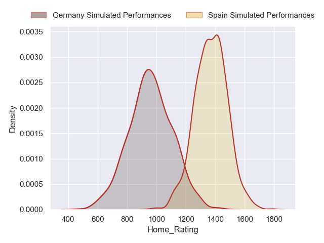
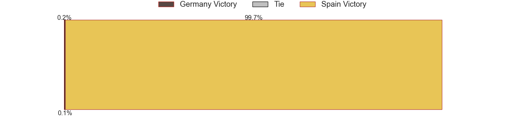
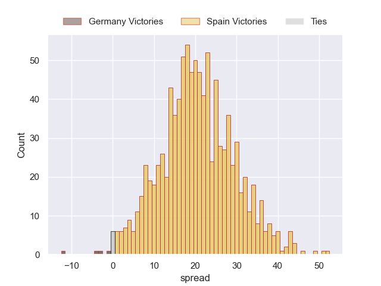

### Portugal V Poland on 2024/02/10

Average Margin: Portugal by 37.0

Average Scoreline: 49-12

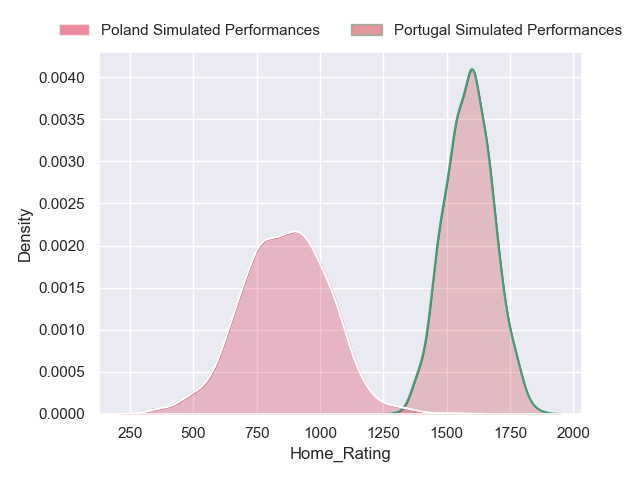

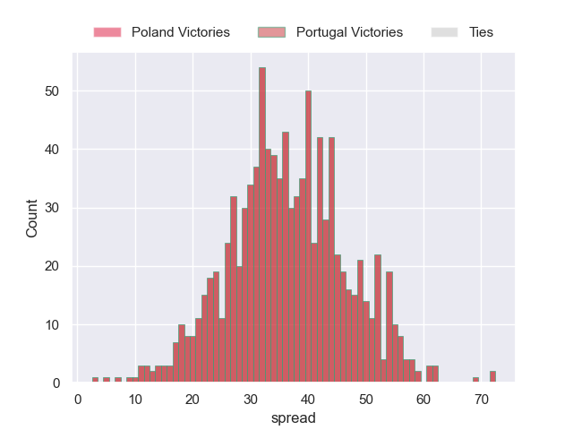

### Georgia V Netherlands on 2024/02/10

Average Margin: Georgia by 26.8

Average Scoreline: 45-18

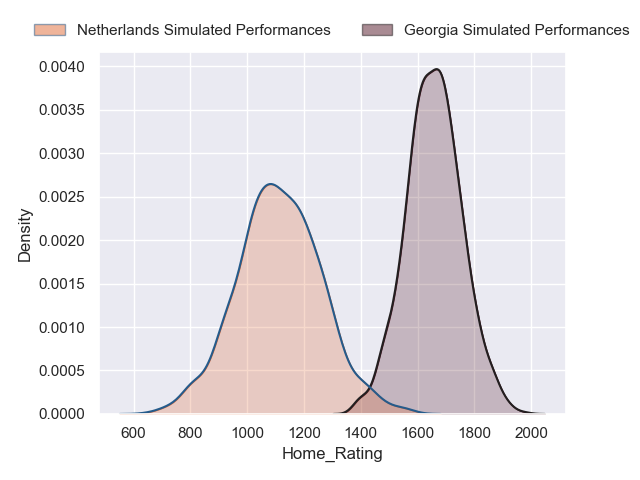

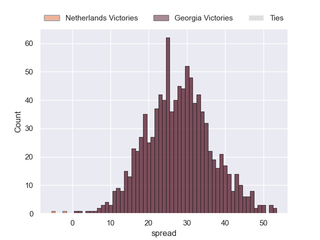

### Romania V Belgium on 2024/02/10

Average Margin: Romania by 22.2

Average Scoreline: 46-23

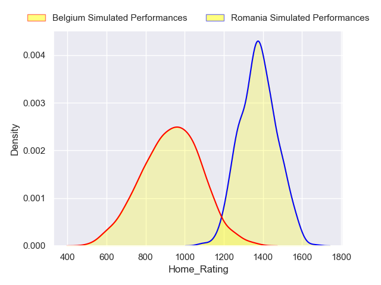
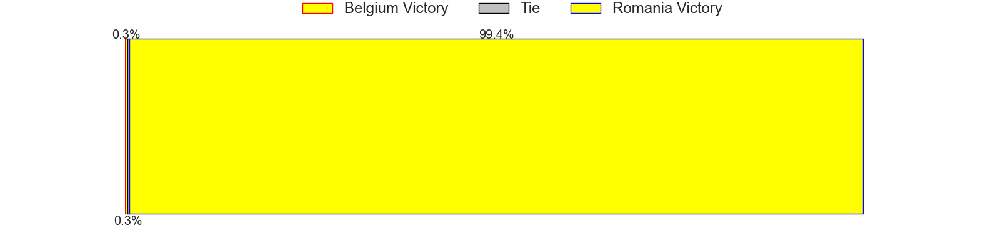
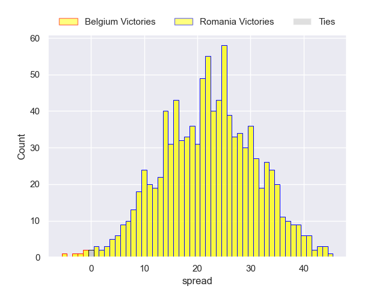

## Week 7

### Georgia V Spain on 2024/02/17

Average Margin: Georgia by 17.5

Average Scoreline: 38-20

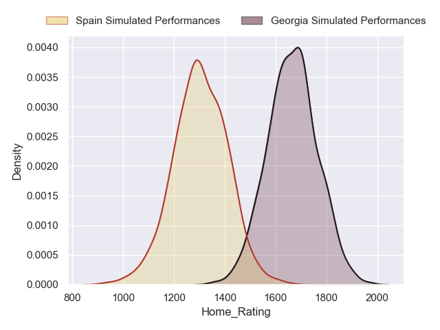

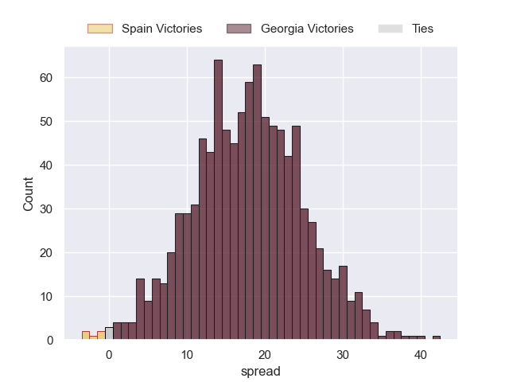

### Belgium V Poland on 2024/02/17

Average Margin: Belgium by 7.4

Average Scoreline: 27-20

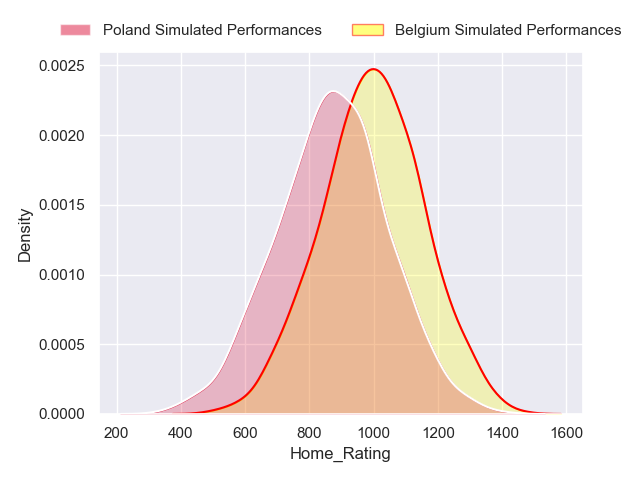
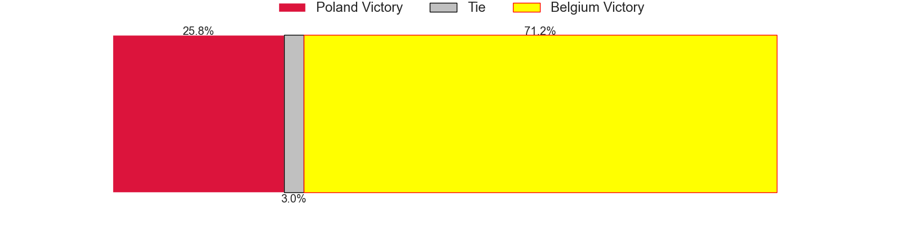

### Romania V Portugal on 2024/02/17

Average Margin: Portugal by 7.2

Average Scoreline: 34-27

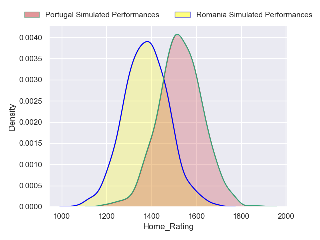
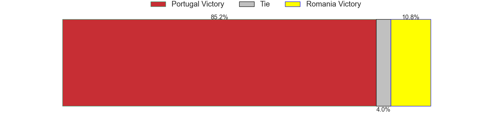
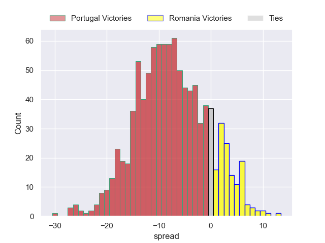

### Netherlands V Germany on 2024/02/17

Average Margin: Netherlands by 10.2

Average Scoreline: 32-22

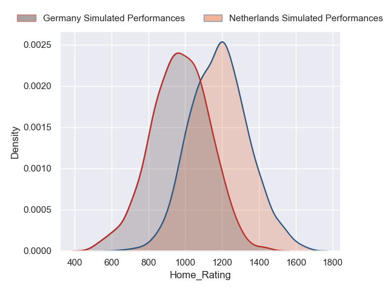

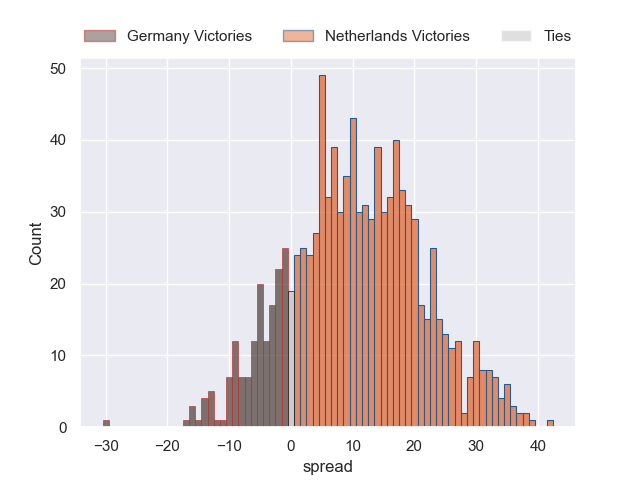

## Week 8

## Week 9
