---  
title: "Rugby Europe Championship 2023 Status"  
date: 2024-02-06 6:00:00 -0500  
categories: model review projection  
layout: article  
aside:  
    toc: true  
---
# Current Team Rankings

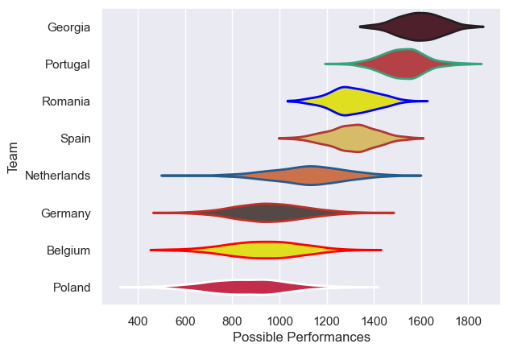
# Standings

## Current Standings

| Club        |   Played |   Wins |   Point Differential |   Losing Bonus Points |   Try Bonus Points |   Competition Points |
|:------------|---------:|-------:|---------------------:|----------------------:|-------------------:|---------------------:|
| Georgia     |        5 |      5 |                  184 |                     0 |                  5 |                   25 |
| Portugal    |        5 |      4 |                  107 |                     0 |                  3 |                   19 |
| Romania     |        5 |      3 |                   55 |                     0 |                  3 |                   15 |
| Netherlands |        5 |      3 |                   -2 |                     0 |                  2 |                   14 |
| Spain       |        5 |      2 |                  -35 |                     1 |                  1 |                   10 |
| Germany     |        5 |      1 |                 -102 |                     1 |                  1 |                    6 |
| Poland      |        5 |      1 |                 -102 |                     2 |                  0 |                    6 |
| Belgium     |        5 |      1 |                 -105 |                     1 |                  0 |                    5 |

## Projected Remaining Table

| Club        |   Matches Remaining |   Wins |   Point Differential |   Losing Bonus Points |   Try Bonus Points |   Competition Points |
|:------------|--------------------:|-------:|---------------------:|----------------------:|-------------------:|---------------------:|
| Georgia     |                   2 |    2   |             45.5957  |                   0   |                1.3 |                  9.3 |
| Portugal    |                   2 |    1.8 |             43.9779  |                   0.1 |                1.6 |                  9.1 |
| Romania     |                   2 |    1.2 |             14.7631  |                   0.3 |                0.8 |                  5.8 |
| Spain       |                   2 |    1   |              2.48941 |                   0.1 |                0.9 |                  4.9 |
| Netherlands |                   2 |    0.9 |            -16.5463  |                   0.1 |                0.7 |                  4.2 |
| Belgium     |                   2 |    0.7 |            -15.323   |                   0.2 |                0.4 |                  3.5 |
| Poland      |                   2 |    0.3 |            -43.418   |                   0.2 |                0.3 |                  1.6 |
| Germany     |                   2 |    0.2 |            -31.5388  |                   0.3 |                0.5 |                  1.4 |

## Projected Total Table

| Club        |   Total Matches |   Wins |   Point Differential |   Losing Bonus Points |   Try Bonus Points |   Competition Points |
|:------------|----------------:|-------:|---------------------:|----------------------:|-------------------:|---------------------:|
| Georgia     |               7 |    7   |             229.596  |                   0   |                6.3 |                 34.3 |
| Portugal    |               7 |    5.8 |             150.978  |                   0.1 |                4.6 |                 28.1 |
| Romania     |               7 |    4.2 |              69.7631 |                   0.3 |                3.8 |                 20.8 |
| Netherlands |               7 |    3.9 |             -18.5463 |                   0.1 |                2.7 |                 18.2 |
| Spain       |               7 |    3   |             -32.5106 |                   1.1 |                1.9 |                 14.9 |
| Belgium     |               7 |    1.7 |            -120.323  |                   1.2 |                0.4 |                  8.5 |
| Poland      |               7 |    1.3 |            -145.418  |                   2.2 |                0.3 |                  7.6 |
| Germany     |               7 |    1.2 |            -133.539  |                   1.3 |                1.5 |                  7.4 |

# Completed Match Review

| Model | Percent Correct Predictions | Spread Error |
| ------ | ------ | ------ |
| Club Level | 90.0% | 18.2 |
| Player Level: Lineup | 80.0% | 19.0 |
| Player Level: Minutes | 80.0% | 19.1 |

# Future Predictions

## Week 6

### Spain V Germany on 2024/02/10

Average Margin: Spain by 20.5

Average Scoreline: 38-17

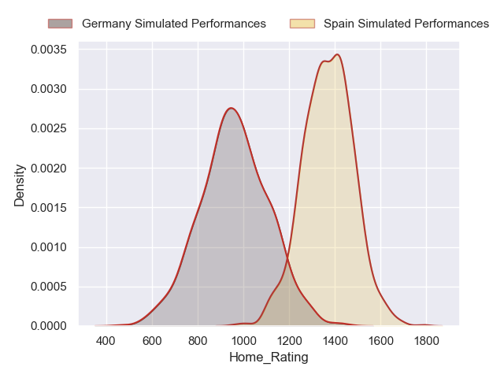
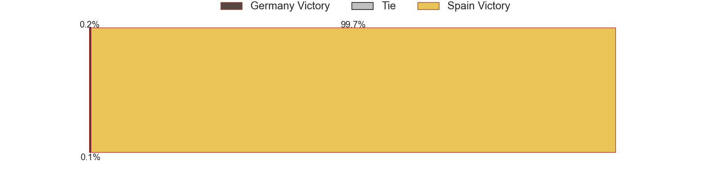
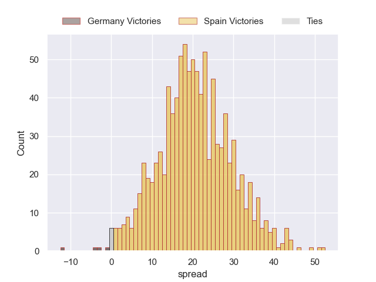

### Portugal V Poland on 2024/02/10

Average Margin: Portugal by 36.6

Average Scoreline: 45-8

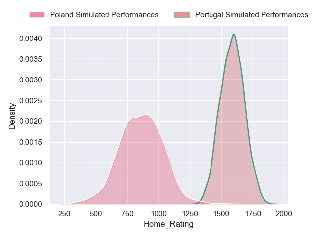

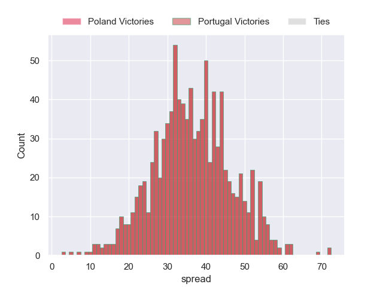

### Georgia V Netherlands on 2024/02/10

Average Margin: Georgia by 27.6

Average Scoreline: 44-17

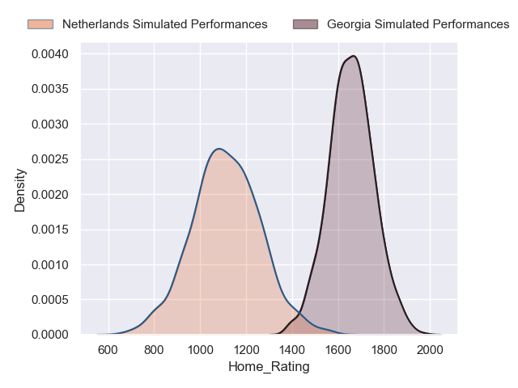

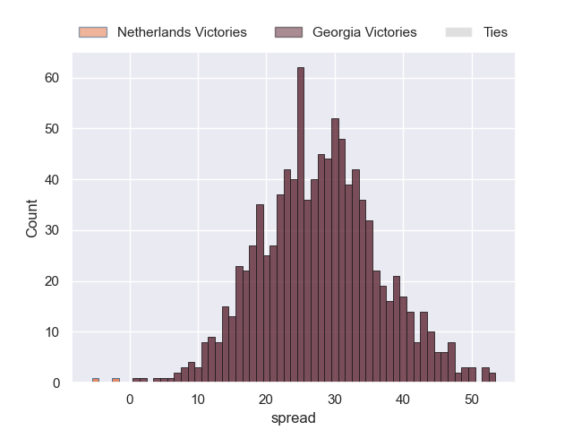

### Romania V Belgium on 2024/02/10

Average Margin: Romania by 22.1

Average Scoreline: 35-13

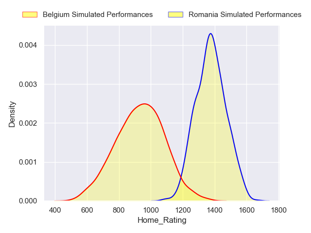
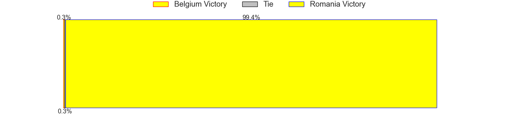
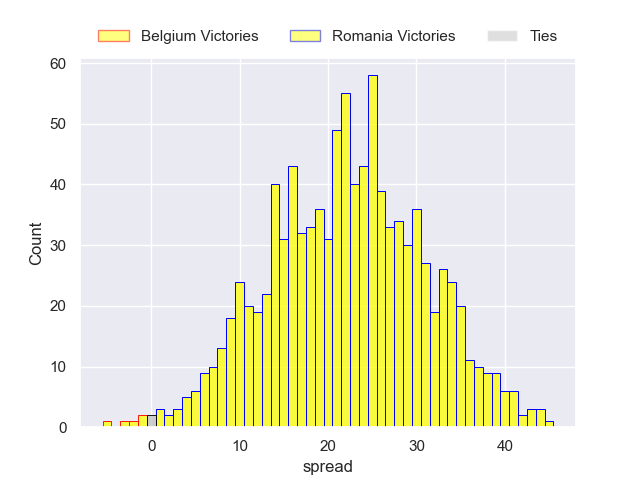

## Week 7

### Georgia V Spain on 2024/02/17

Average Margin: Georgia by 18.0

Average Scoreline: 38-20

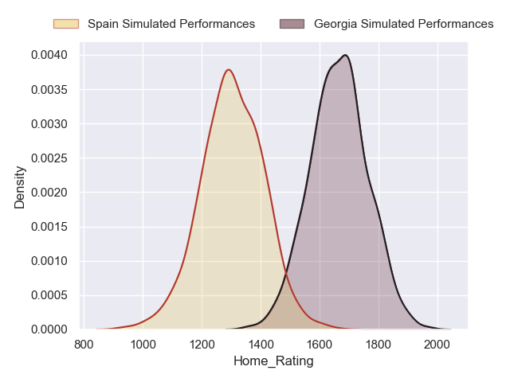
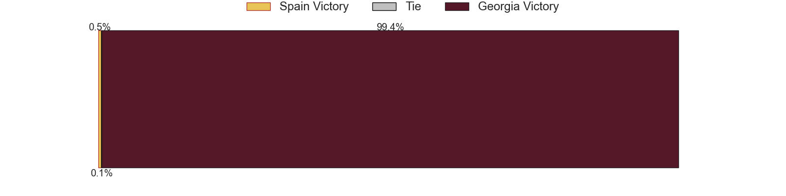
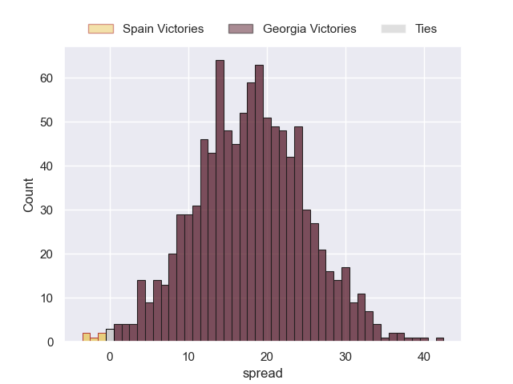

### Belgium V Poland on 2024/02/17

Average Margin: Belgium by 6.8

Average Scoreline: 27-21

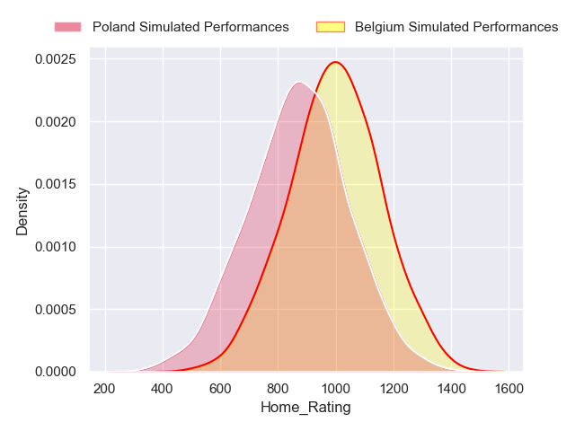
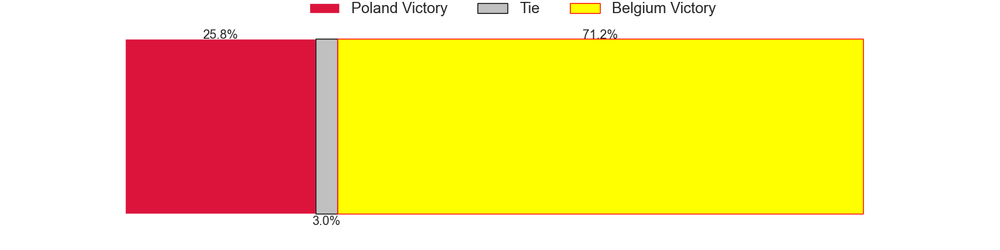
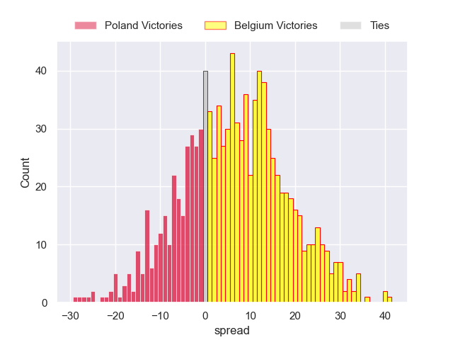

### Romania V Portugal on 2024/02/17

Average Margin: Portugal by 7.4

Average Scoreline: 32-25

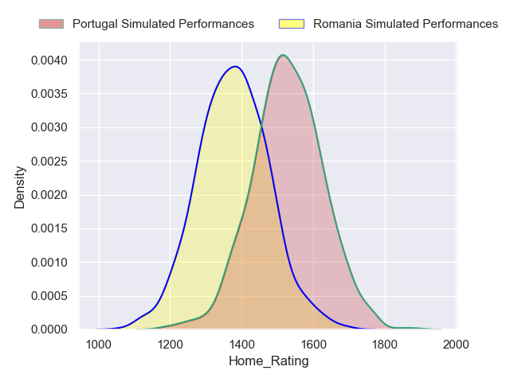
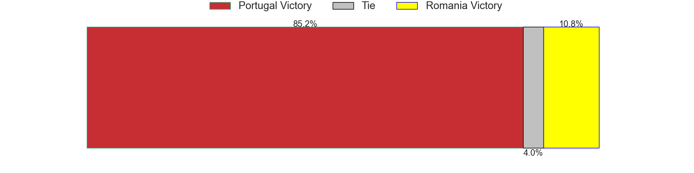
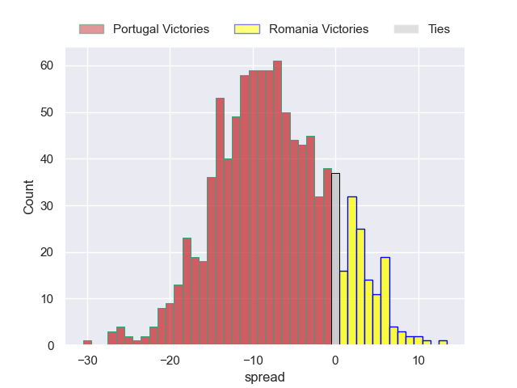

### Netherlands V Germany on 2024/02/17

Average Margin: Netherlands by 11.0

Average Scoreline: 30-19

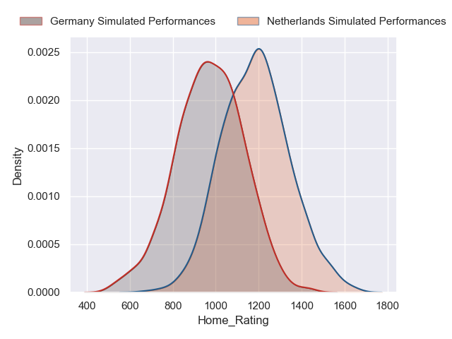
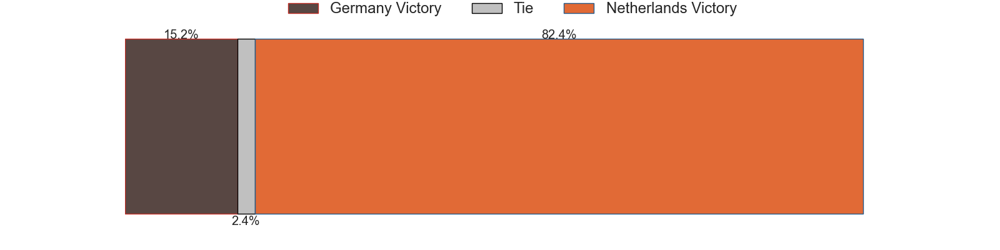
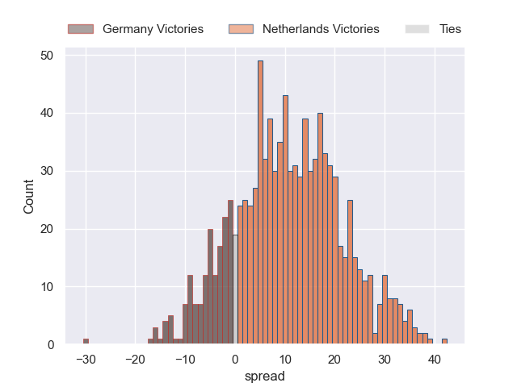

## Week 8

## Week 9
