---  
title: "Rugby Europe Championship 2023 Status"  
date: 2024-01-29 6:00:00 -0500  
categories: model review projection  
layout: article  
aside:  
    toc: true  
---
# Current Team Rankings

# Standings

## Current Standings

| Club        |   Played |   Wins |   Point Differential |   Losing Bonus Points |   Try Bonus Points |   Competition Points |
|:------------|---------:|-------:|---------------------:|----------------------:|-------------------:|---------------------:|
| Georgia     |        5 |      5 |                  184 |                     0 |                  5 |                   25 |
| Portugal    |        5 |      4 |                  107 |                     0 |                  3 |                   19 |
| Romania     |        5 |      3 |                   55 |                     0 |                  3 |                   15 |
| Netherlands |        5 |      3 |                   -2 |                     0 |                  2 |                   14 |
| Spain       |        5 |      2 |                  -35 |                     1 |                  1 |                   10 |
| Germany     |        5 |      1 |                 -102 |                     1 |                  1 |                    6 |
| Poland      |        5 |      1 |                 -102 |                     2 |                  0 |                    6 |
| Belgium     |        5 |      1 |                 -105 |                     1 |                  0 |                    5 |

## Projected Remaining Table

| Club        |   Matches Remaining |   Wins |   Point Differential |   Losing Bonus Points |   Try Bonus Points |   Competition Points |
|:------------|--------------------:|-------:|---------------------:|----------------------:|-------------------:|---------------------:|
| Romania     |                   4 |    3   |             51.6721  |                   0.4 |                1.8 |                 14.4 |
| Portugal    |                   3 |    2.9 |             69.833   |                   0.1 |                2.3 |                 13.9 |
| Georgia     |                   3 |    3   |             73.3584  |                   0   |                1.8 |                 13.8 |
| Spain       |                   3 |    1.8 |              9.73211 |                   0.2 |                1.4 |                  8.7 |
| Netherlands |                   3 |    1.1 |            -23.6757  |                   0.4 |                0.9 |                  5.5 |
| Belgium     |                   3 |    0.7 |            -40.9695  |                   0.2 |                0.6 |                  3.7 |
| Poland      |                   4 |    0.4 |            -80.5356  |                   0.4 |                0.9 |                  2.6 |
| Germany     |                   3 |    0.2 |            -59.4148  |                   0.3 |                0.6 |                  1.6 |

## Projected Total Table

| Club        |   Total Matches |   Wins |   Point Differential |   Losing Bonus Points |   Try Bonus Points |   Competition Points |
|:------------|----------------:|-------:|---------------------:|----------------------:|-------------------:|---------------------:|
| Georgia     |               8 |    8   |             257.358  |                   0   |                6.8 |                 38.8 |
| Portugal    |               8 |    6.9 |             176.833  |                   0.1 |                5.3 |                 32.9 |
| Romania     |               9 |    6   |             106.672  |                   0.4 |                4.8 |                 29.4 |
| Netherlands |               8 |    4.1 |             -25.6757 |                   0.4 |                2.9 |                 19.5 |
| Spain       |               8 |    3.8 |             -25.2679 |                   1.2 |                2.4 |                 18.7 |
| Belgium     |               8 |    1.7 |            -145.969  |                   1.2 |                0.6 |                  8.7 |
| Poland      |               9 |    1.4 |            -182.536  |                   2.4 |                0.9 |                  8.6 |
| Germany     |               8 |    1.2 |            -161.415  |                   1.3 |                1.6 |                  7.6 |

# Completed Match Review

| Model | Percent Correct Predictions | Spread Error |
| ------ | ------ | ------ |
| Club Level | 90.0% | 18.2 |
| Player Level: Lineup | 80.0% | 15.0 |
| Player Level: Minutes | 85.0% | 14.5 |

# Future Predictions

## Week 6

### Poland V Romania on 2024/02/03

Average Margin: Romania by 18.7

Average Scoreline: 39-20

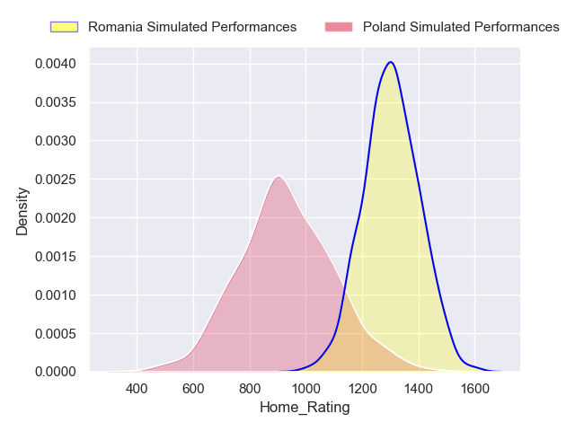
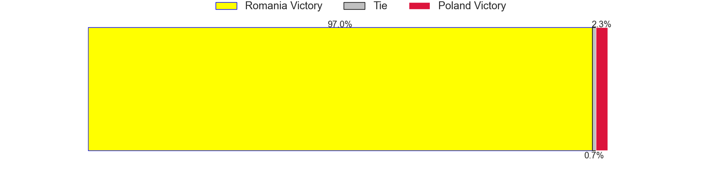
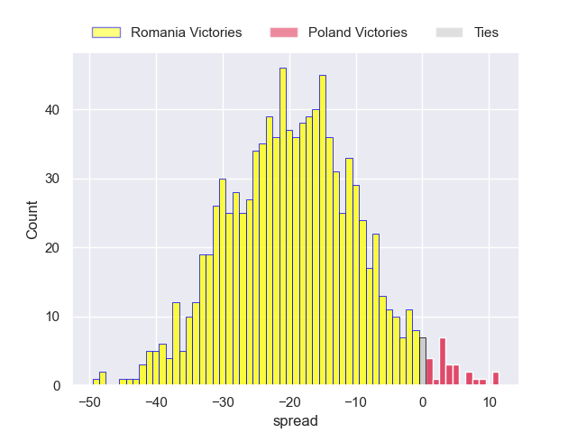

### Belgium V Portugal on 2024/02/03

Average Margin: Portugal by 26.1

Average Scoreline: 42-16

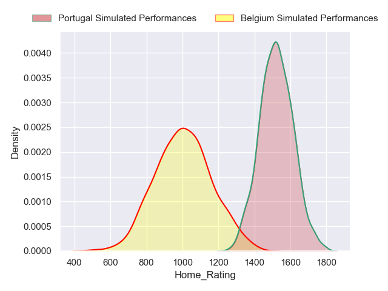

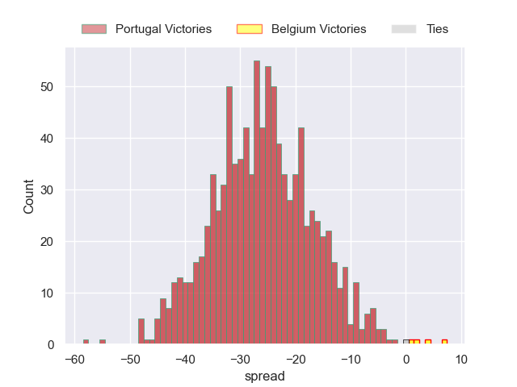

### Netherlands V Spain on 2024/02/03

Average Margin: Spain by 6.7

Average Scoreline: 28-22

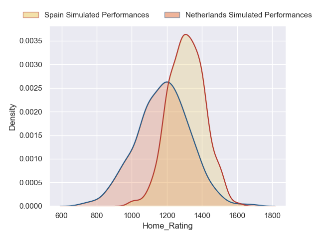
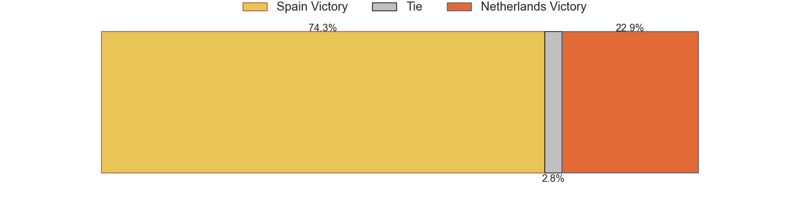
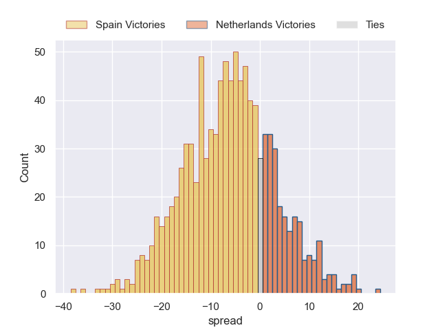

### Germany V Georgia on 2024/02/04

Average Margin: Georgia by 28.2

Average Scoreline: 46-18

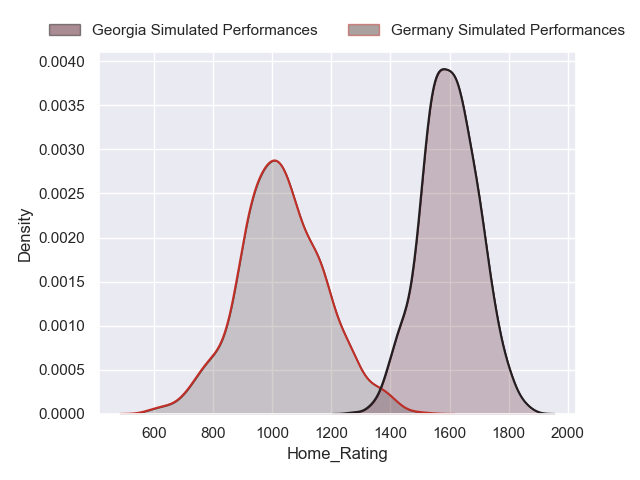

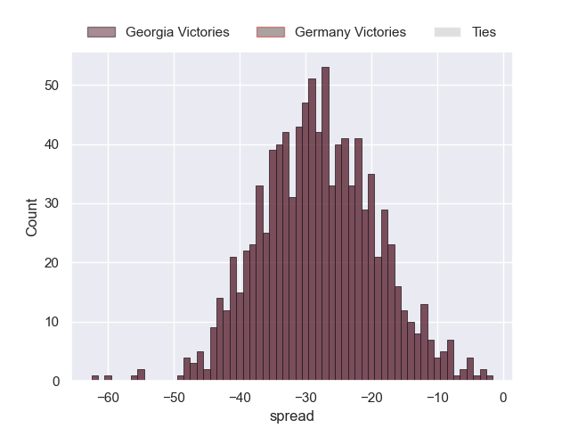

### Poland V Romania on 2024/02/04

Average Margin: Romania by 19.2

Average Scoreline: 39-20

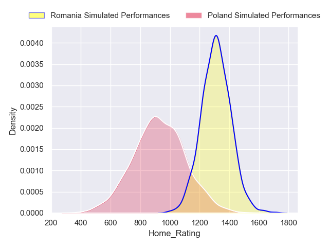
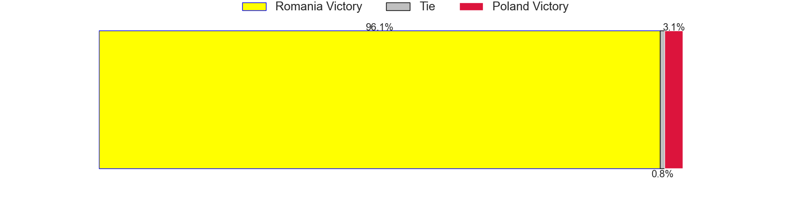
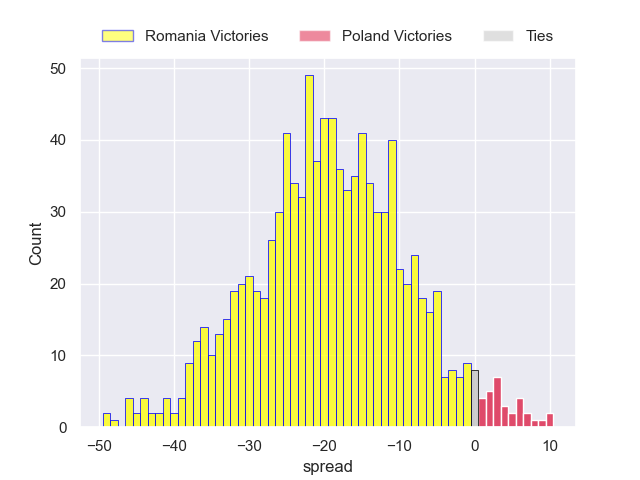

## Week 7

### Georgia V Netherlands on 2024/02/10

Average Margin: Georgia by 27.8

Average Scoreline: 46-19

### Portugal V Poland on 2024/02/10

Average Margin: Portugal by 35.8

Average Scoreline: 43-7

### Romania V Belgium on 2024/02/10

Average Margin: Romania by 21.7

Average Scoreline: 41-19

### Spain V Germany on 2024/02/10

Average Margin: Spain by 20.4

Average Scoreline: 40-19

## Week 8

### Georgia V Spain on 2024/02/17

Average Margin: Georgia by 17.4

Average Scoreline: 33-16

### Netherlands V Germany on 2024/02/17

Average Margin: Netherlands by 10.8

Average Scoreline: 32-21

### Romania V Portugal on 2024/02/17

Average Margin: Portugal by 7.9

Average Scoreline: 31-23

### Belgium V Poland on 2024/02/17

Average Margin: Belgium by 6.9

Average Scoreline: 29-22

## Week 9

## Week 10
