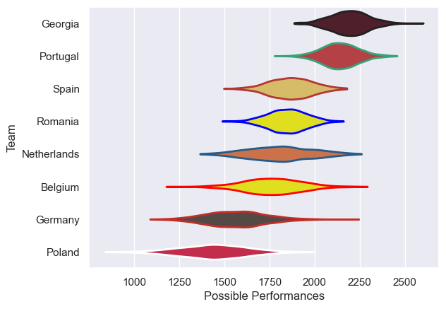

---  
title: "Rugby Europe Championship 2024 Status"  
date: 2025-07-28 6:00:00 -0500  
categories: model review projection  
layout: article  
aside:  
    toc: true  
---
# Current Team Rankings

# Standings

## Current Standings

| Club        |   Played |   Wins |   Point Differential |   Losing Bonus Points | Try Bonus Points   |   Competition Points |
|:------------|---------:|-------:|---------------------:|----------------------:|:-------------------|---------------------:|
| Georgia     |        5 |      5 |                  131 |                     0 |                    |                   20 |
| Netherlands |        5 |      3 |                   95 |                     1 |                    |                   13 |
| Portugal    |        5 |      3 |                   45 |                     1 |                    |                   13 |
| Spain       |        5 |      3 |                   -7 |                     1 |                    |                   13 |
| Belgium     |        5 |      3 |                   26 |                     0 |                    |                   12 |
| Romania     |        5 |      2 |                  -43 |                     1 |                    |                    9 |
| Germany     |        5 |      1 |                  -94 |                     0 |                    |                    4 |
| Poland      |        5 |      0 |                 -153 |                     0 |                    |                    0 |

# Completed Match Review

| Model | Percent Correct Predictions | Spread Error |
| ------ | ------ | ------ |
| Club Level | 85.0% | 14.2 |
| Player Level: Lineup | nan% | nan |
| Player Level: Minutes | nan% | nan |

