---  
title: "Rugby Europe Championship 2024 Status"  
date: 2025-01-27 6:00:00 -0500  
categories: model review projection  
layout: article  
aside:  
    toc: true  
---
# Current Team Rankings

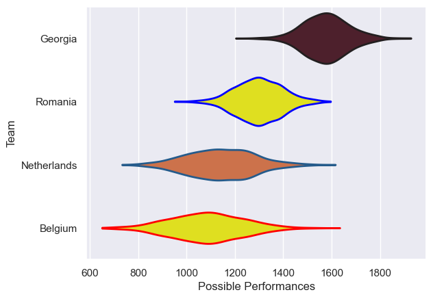
# Standings

## Current Standings

| Club        |   Played |   Wins |   Point Differential |   Losing Bonus Points |   Try Bonus Points |   Competition Points |
|:------------|---------:|-------:|---------------------:|----------------------:|-------------------:|---------------------:|
| Georgia     |        5 |      5 |                  131 |                     0 |                nan |                   20 |
| Netherlands |        5 |      3 |                   95 |                     1 |                nan |                   13 |
| Portugal    |        5 |      3 |                   45 |                     1 |                nan |                   13 |
| Spain       |        5 |      3 |                   -7 |                     1 |                nan |                   13 |
| Belgium     |        5 |      3 |                   26 |                     0 |                nan |                   12 |
| Romania     |        5 |      2 |                  -43 |                     1 |                nan |                    9 |
| Germany     |        5 |      1 |                  -94 |                     0 |                nan |                    4 |
| Poland      |        5 |      0 |                 -153 |                     0 |                nan |                    0 |

## Projected Remaining Table

| Club        |   Matches Remaining |   Wins |   Point Differential |   Losing Bonus Points |   Try Bonus Points |   Competition Points |
|:------------|--------------------:|-------:|---------------------:|----------------------:|-------------------:|---------------------:|
| Portugal    |                   1 |    0.9 |             16.2262  |                   0.1 |                0.7 |                  4.4 |
| Romania     |                   1 |    0.9 |             14.225   |                   0.1 |                0.5 |                  4.1 |
| Spain       |                   1 |    0.8 |             11.0581  |                   0.1 |                0.6 |                  4   |
| Switzerland |                   1 |    0.6 |              3.54106 |                   0.2 |                0.3 |                  3   |
| Georgia     |                   1 |    0.4 |             -3.54106 |                   0.2 |                0.2 |                  1.9 |
| Netherlands |                   1 |    0.2 |            -11.0581  |                   0.2 |                0.2 |                  1.1 |
| Germany     |                   1 |    0.1 |            -14.225   |                   0.2 |                0.2 |                  0.8 |
| Belgium     |                   1 |    0.1 |            -16.2262  |                   0.2 |                0.2 |                  0.7 |

## Projected Total Table

| Club        |   Total Matches |   Wins |   Point Differential |   Losing Bonus Points |   Try Bonus Points |   Competition Points |
|:------------|----------------:|-------:|---------------------:|----------------------:|-------------------:|---------------------:|
| Georgia     |               6 |    5.4 |            127.459   |                   0.2 |                0.2 |                 21.9 |
| Portugal    |               6 |    3.9 |             61.2262  |                   1.1 |                0.7 |                 17.4 |
| Spain       |               6 |    3.8 |              4.05806 |                   1.1 |                0.6 |                 17   |
| Netherlands |               6 |    3.2 |             83.9419  |                   1.2 |                0.2 |                 14.1 |
| Romania     |               6 |    2.9 |            -28.775   |                   1.1 |                0.5 |                 13.1 |
| Belgium     |               6 |    3.1 |              9.77382 |                   0.2 |                0.2 |                 12.7 |
| Germany     |               6 |    1.1 |           -108.225   |                   0.2 |                0.2 |                  4.8 |
| Switzerland |               1 |    0.6 |              3.54106 |                   0.2 |                0.3 |                  3   |
| Poland      |               5 |    0   |           -153       |                   0   |                0   |                  0   |

# Completed Match Review

| Model | Percent Correct Predictions | Spread Error |
| ------ | ------ | ------ |
| Club Level | 85.0% | 14.4 |
| Player Level: Lineup | 66.7% | 19.7 |
| Player Level: Minutes | 75.0% | 20.9 |

# Future Predictions

## Week 6

### Romania V Germany on 2025/01/31

Average Margin: Romania by 14.2

Average Scoreline: 34-20

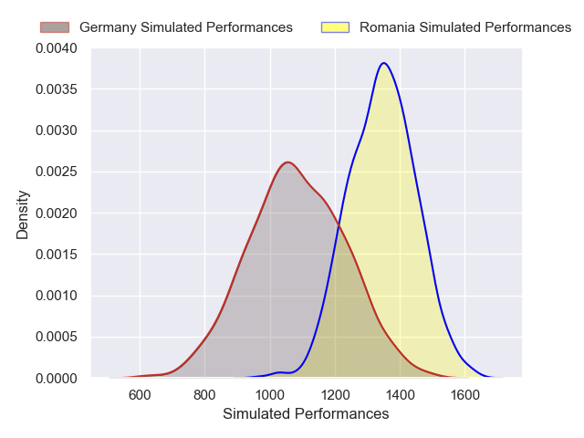
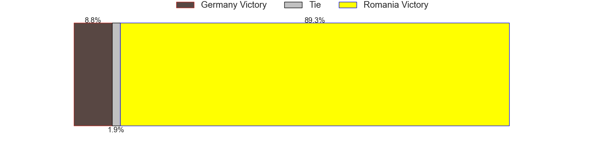
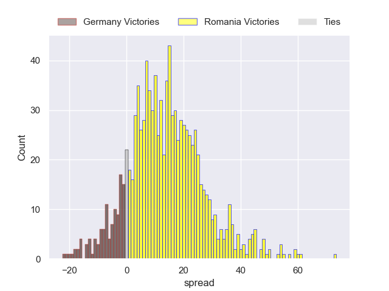

### Georgia V Switzerland on 2025/02/01

Average Margin: Switzerland by 3.5

Average Scoreline: 23-20

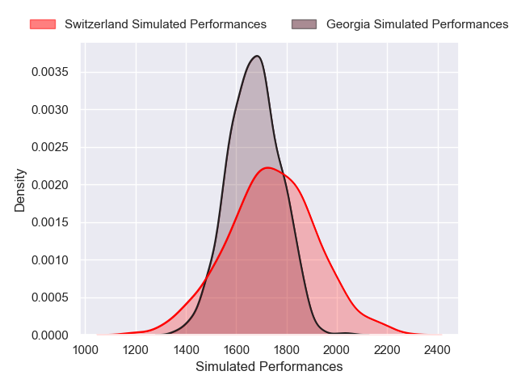

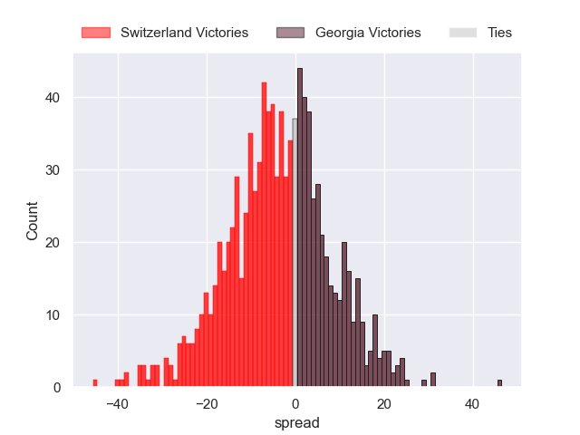

### Portugal V Belgium on 2025/02/01

Average Margin: Portugal by 16.2

Average Scoreline: 36-19

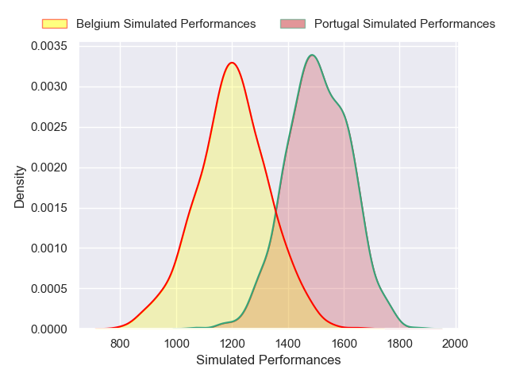
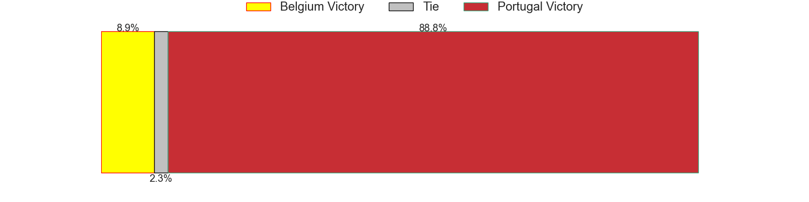

### Spain V Netherlands on 2025/02/02

Average Margin: Spain by 11.1

Average Scoreline: 34-22

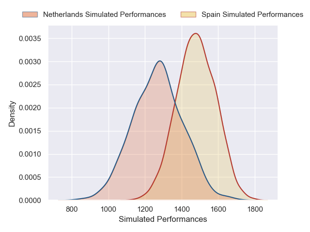
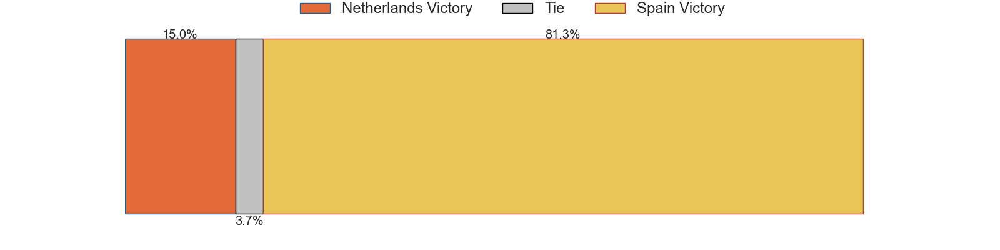
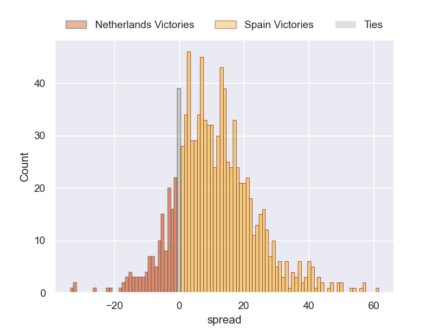

