---  
title: "Rugby Europe Championship 2024 Status"  
date: 2024-03-11 6:00:00 -0500  
categories: model review projection  
layout: article  
aside:  
    toc: true  
---
# Current Team Rankings

# Standings

## Projected Total Table

| Club        |   Total Matches |   Wins |   Point Differential |   Losing Bonus Points |   Try Bonus Points |   Competition Points |
|:------------|----------------:|-------:|---------------------:|----------------------:|-------------------:|---------------------:|
| Netherlands |               1 |    0.9 |            10.1359   |                   0.1 |                0.6 |                  4.1 |
| Georgia     |               1 |    0.9 |             9.20817  |                   0.1 |                0.2 |                  4   |
| Belgium     |               1 |    0.8 |             7.16733  |                   0.2 |                0.5 |                  3.7 |
| Romania     |               1 |    0.5 |             0.382034 |                   0.4 |                0.3 |                  2.7 |
| Spain       |               1 |    0.5 |            -0.382034 |                   0.3 |                0.4 |                  2.6 |
| Poland      |               1 |    0.2 |            -7.16733  |                   0.2 |                0.3 |                  1.5 |
| Germany     |               1 |    0.1 |           -10.1359   |                   0.2 |                0.3 |                  1.1 |
| Portugal    |               1 |    0.1 |            -9.20817  |                   0.3 |                0.2 |                  0.8 |

# Future Predictions

## Week 1

### Romania V Spain on 2024/03/17

Average Margin: Romania by 0.4

Average Scoreline: 32-31

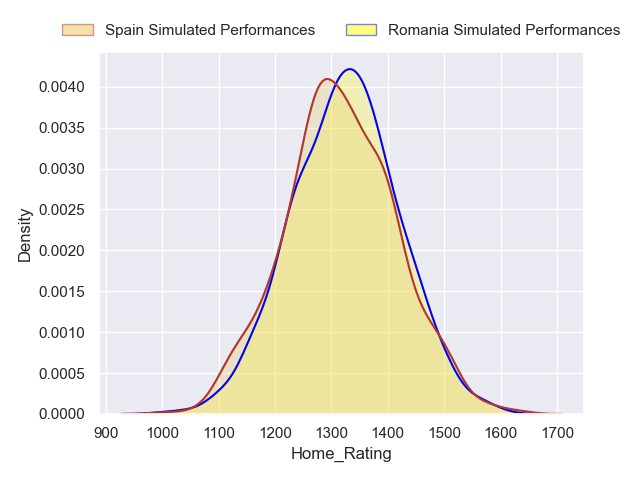

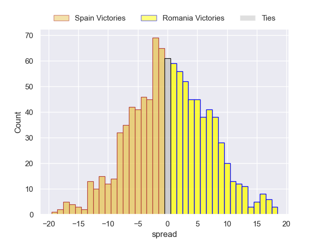

### Netherlands V Germany on 2024/03/17

Average Margin: Netherlands by 10.1

Average Scoreline: 28-17

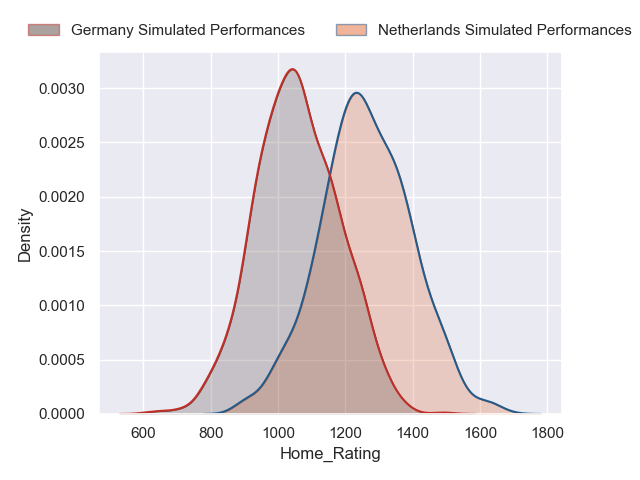
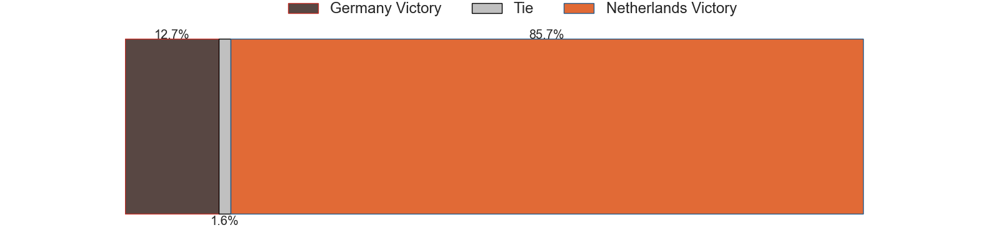
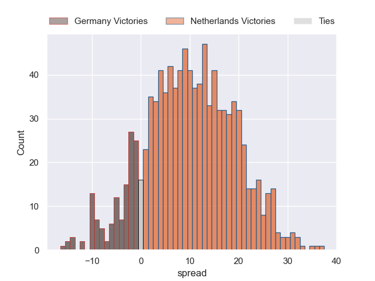

### Poland V Belgium on 2024/03/17

Average Margin: Belgium by 7.2

Average Scoreline: 24-16

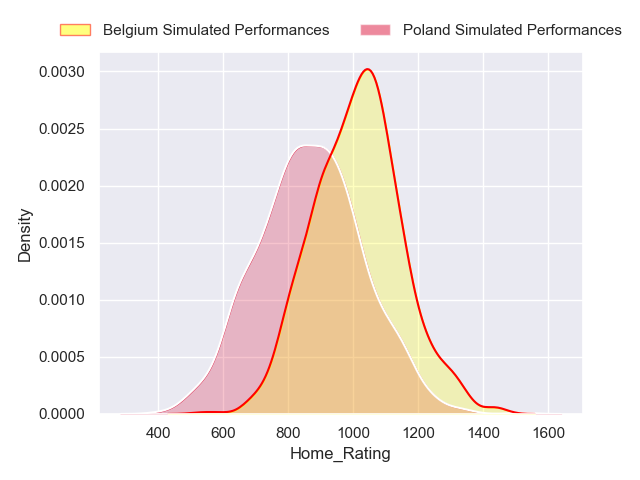
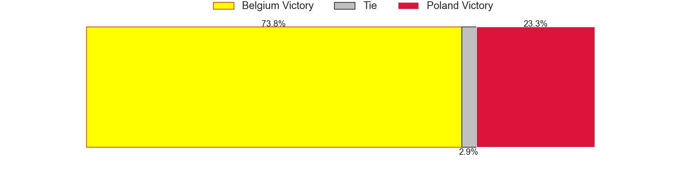
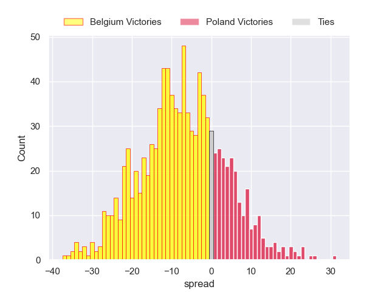

### Georgia V Portugal on 2024/03/17

Average Margin: Georgia by 9.2

Average Scoreline: 27-18

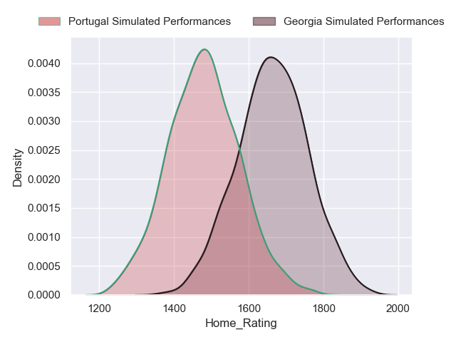
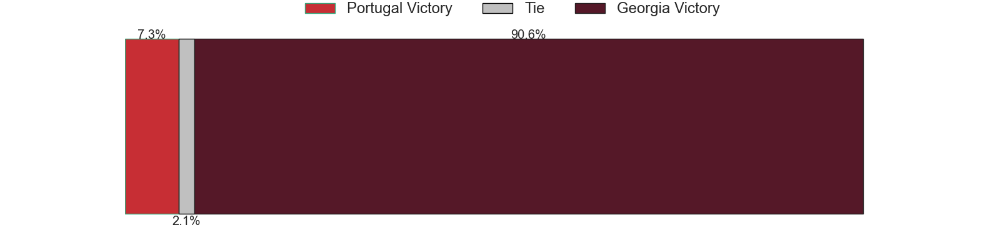
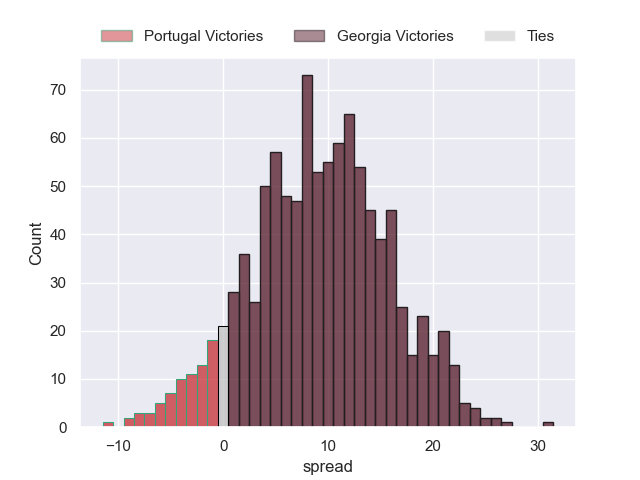

