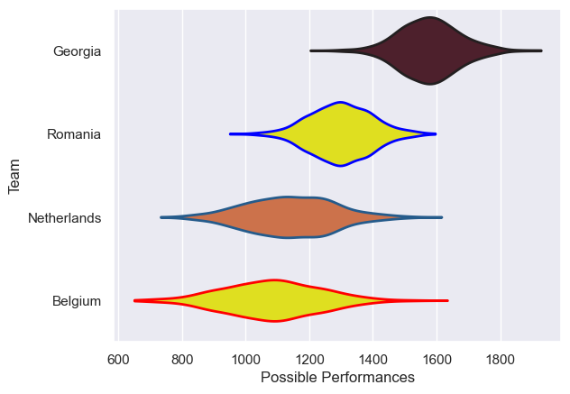

---  
title: "Rugby Europe Championship 2024 Status"  
date: 2024-02-05 6:00:00 -0500  
categories: model review projection  
layout: article  
aside:  
    toc: true  
---
# Current Team Rankings

# Standings

## Projected Total Table

| Club        |   Total Matches |   Wins |   Point Differential |   Losing Bonus Points |   Try Bonus Points |   Competition Points |
|:------------|----------------:|-------:|---------------------:|----------------------:|-------------------:|---------------------:|
| Spain       |               3 |    2   |             19.9498  |                   0.1 |                1.5 |                  9.5 |
| Georgia     |               2 |    2   |             43.0044  |                   0   |                1.1 |                  9   |
| Portugal    |               2 |    1.7 |             37.0681  |                   0.2 |                1.5 |                  8.7 |
| Romania     |               2 |    1.2 |              9.45089 |                   0.4 |                0.6 |                  5.8 |
| Belgium     |               2 |    0.9 |             -2.20076 |                   0.3 |                0.5 |                  4.5 |
| Netherlands |               2 |    0.8 |            -16.3014  |                   0.1 |                0.7 |                  4.1 |
| Germany     |               3 |    0.2 |            -46.6529  |                   0.4 |                0.8 |                  2   |
| Poland      |               2 |    0.1 |            -44.3183  |                   0.2 |                0.4 |                  1.1 |

# Future Predictions

## Week 1

### Spain V Germany on 2024/02/10

Average Margin: Spain by 18.2

Average Scoreline: 35-17

### Romania V Belgium on 2024/02/10

Average Margin: Romania by 14.2

Average Scoreline: 32-18

### Portugal V Poland on 2024/02/10

Average Margin: Portugal by 32.4

Average Scoreline: 39-7

### Georgia V Netherlands on 2024/02/10

Average Margin: Georgia by 26.0

Average Scoreline: 37-11

### Spain V Germany on 2024/02/11

Average Margin: Spain by 18.8

Average Scoreline: 35-16

## Week 2

### Belgium V Poland on 2024/02/17

Average Margin: Belgium by 12.0

Average Scoreline: 30-18

### Georgia V Spain on 2024/02/17

Average Margin: Georgia by 17.0

Average Scoreline: 32-15

### Netherlands V Germany on 2024/02/17

Average Margin: Netherlands by 9.7

Average Scoreline: 28-18

### Romania V Portugal on 2024/02/17

Average Margin: Portugal by 4.7

Average Scoreline: 31-27

## Week 3

## Week 4
