---  
title: "Rugby Europe Championship 2024 Status"  
date: 2024-02-26 6:00:00 -0500  
categories: model review projection  
layout: article  
aside:  
    toc: true  
---
# Current Team Rankings

# Standings

## Projected Total Table

| Club        |   Total Matches |   Wins |   Point Differential |   Losing Bonus Points |   Try Bonus Points |   Competition Points |
|:------------|----------------:|-------:|---------------------:|----------------------:|-------------------:|---------------------:|
| Netherlands |               1 |    1   |              20.5907 |                   0   |                0.7 |                  4.7 |
| Georgia     |               1 |    1   |              18.8843 |                   0   |                0.7 |                  4.7 |
| Portugal    |               1 |    1   |              14.1239 |                   0   |                0.6 |                  4.5 |
| Belgium     |               1 |    0.9 |              10.8014 |                   0.1 |                0.3 |                  3.9 |
| Germany     |               1 |    0.1 |             -10.8014 |                   0.2 |                0.3 |                  1.1 |
| Poland      |               1 |    0   |             -20.5907 |                   0.1 |                0.3 |                  0.5 |
| Spain       |               1 |    0   |             -14.1239 |                   0.1 |                0.2 |                  0.4 |
| Romania     |               1 |    0   |             -18.8843 |                   0   |                0.2 |                  0.2 |

# Future Predictions

## Week 1

### Netherlands V Poland on 2024/03/02

Average Margin: Netherlands by 20.6

Average Scoreline: 32-12

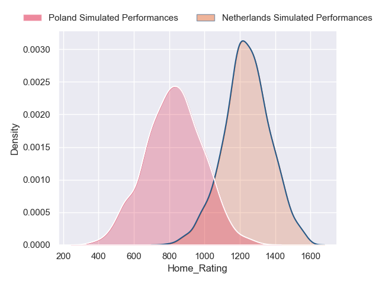
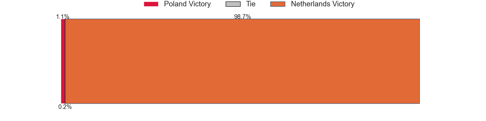
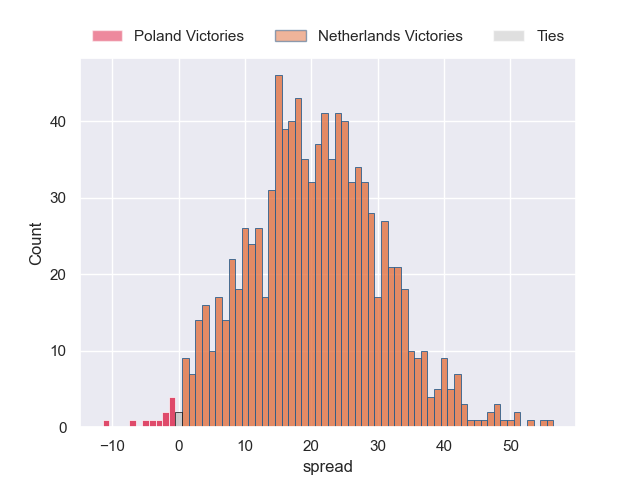

### Georgia V Romania on 2024/03/02

Average Margin: Georgia by 18.9

Average Scoreline: 31-12

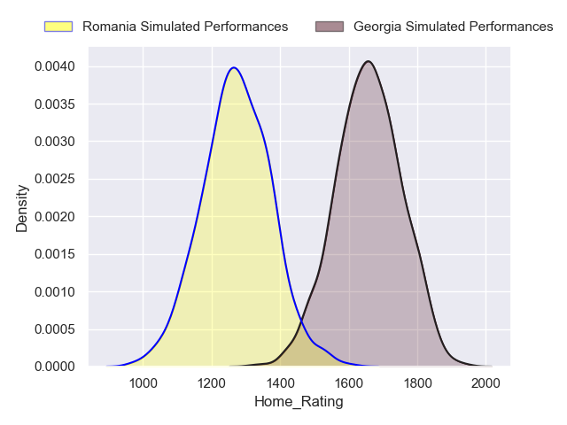

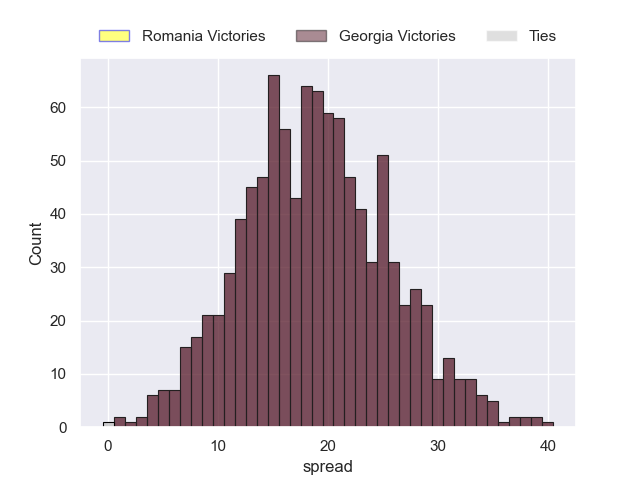

### Belgium V Germany on 2024/03/02

Average Margin: Belgium by 10.8

Average Scoreline: 27-16

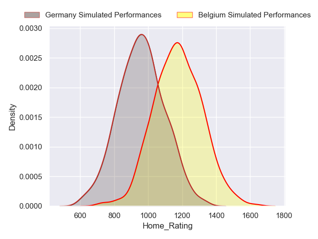
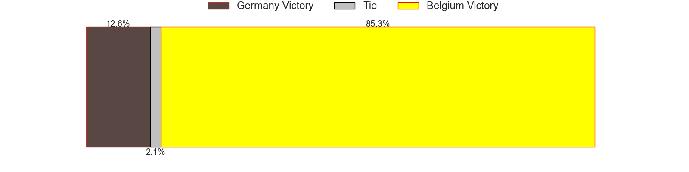
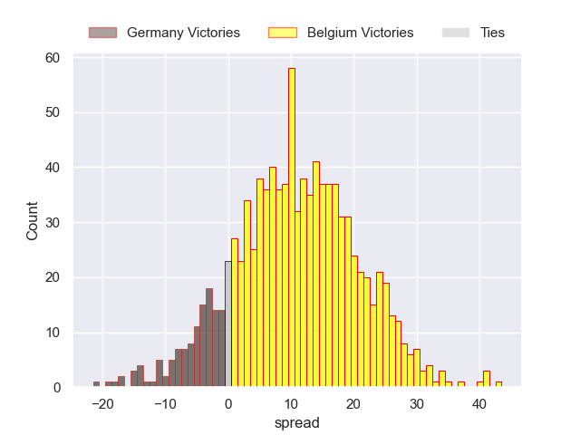

### Portugal V Spain on 2024/03/03

Average Margin: Portugal by 14.1

Average Scoreline: 26-12

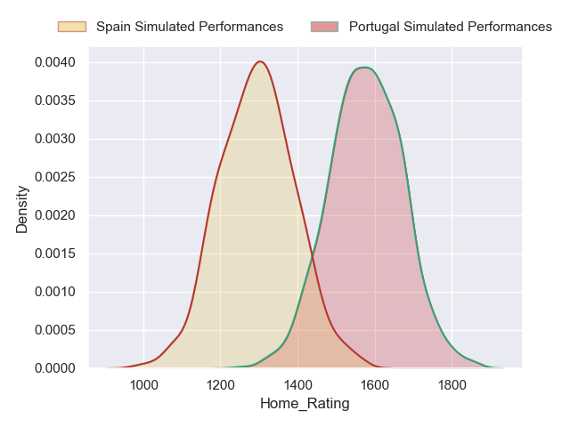
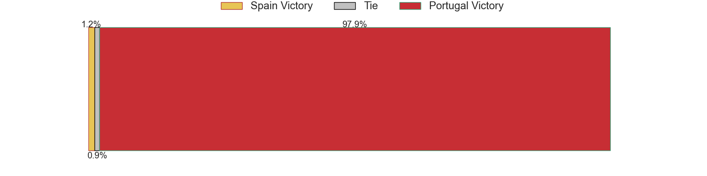
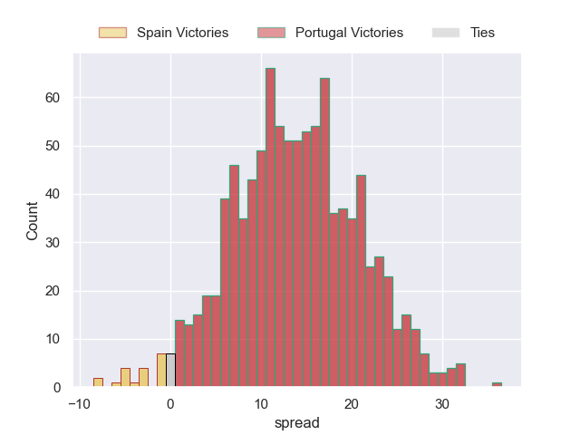

## Week 2
