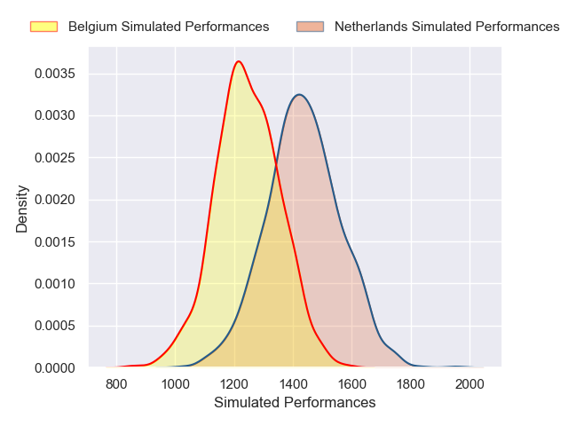
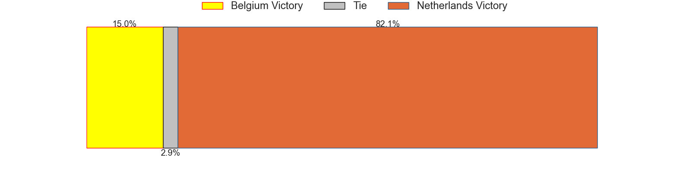
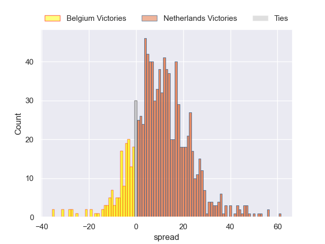
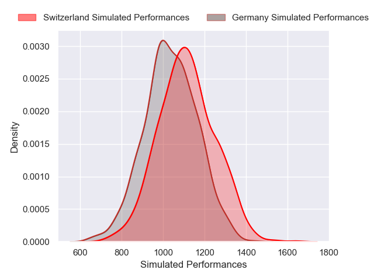
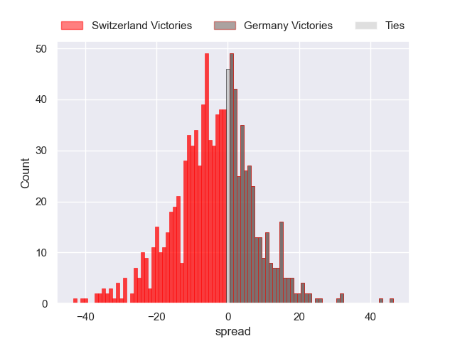
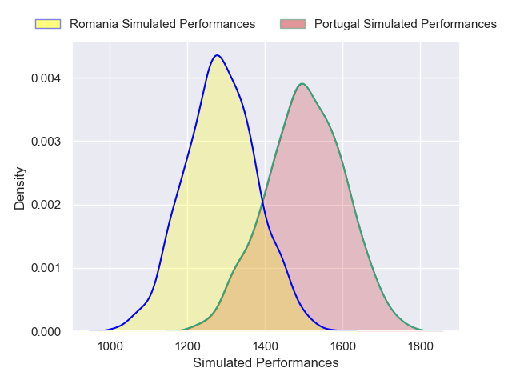
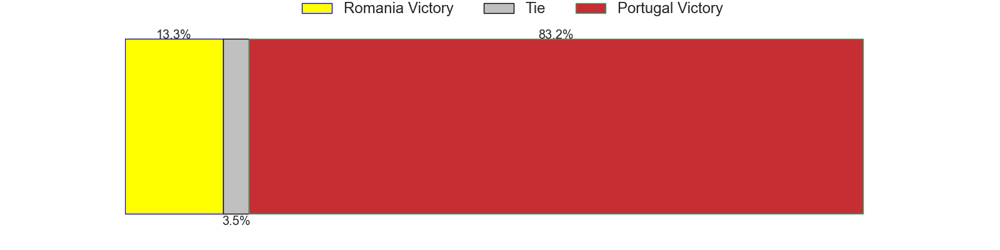
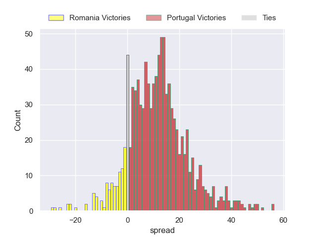
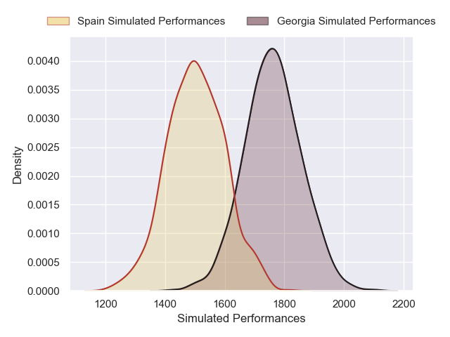
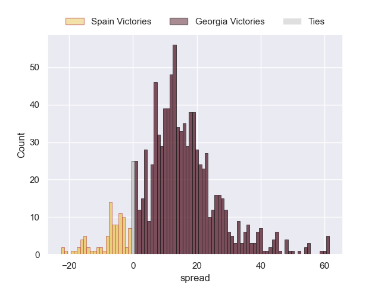

---  
title: "Rugby Europe Championship 2025 Status"  
date: 2025-03-14 6:00:00 -0500  
categories: model review projection  
layout: article  
aside:  
    toc: true  
---
# Current Team Rankings

# Standings

## Current Standings

| Club        |   Played |   Wins |   Point Differential |   Losing Bonus Points |   Try Bonus Points |   Competition Points |
|:------------|---------:|-------:|---------------------:|----------------------:|-------------------:|---------------------:|
| Georgia     |        4 |      4 |                  211 |                     0 |                nan |                   16 |
| Portugal    |        4 |      3 |                   69 |                     0 |                nan |                   12 |
| Spain       |        4 |      3 |                   40 |                     0 |                nan |                   12 |
| Netherlands |        4 |      2 |                   40 |                     0 |                nan |                    8 |
| Belgium     |        4 |      2 |                   26 |                     0 |                nan |                    8 |
| Romania     |        4 |      2 |                  -11 |                     0 |                nan |                    8 |
| Germany     |        4 |      0 |                 -129 |                     0 |                nan |                    0 |
| Switzerland |        4 |      0 |                 -246 |                     0 |                nan |                    0 |

## Projected Remaining Table

| Club        |   Matches Remaining |   Wins |   Point Differential |   Losing Bonus Points |   Try Bonus Points |   Competition Points |
|:------------|--------------------:|-------:|---------------------:|----------------------:|-------------------:|---------------------:|
| Portugal    |                   1 |    0.9 |             10.8702  |                   0.1 |                0.6 |                  4.2 |
| Georgia     |                   1 |    0.9 |             13.5683  |                   0.1 |                0.4 |                  4.1 |
| Netherlands |                   1 |    0.8 |             10.776   |                   0.1 |                0.5 |                  4   |
| Switzerland |                   1 |    0.6 |              3.82432 |                   0.2 |                0.5 |                  3.2 |
| Germany     |                   1 |    0.4 |             -3.82432 |                   0.2 |                0.4 |                  2.1 |
| Belgium     |                   1 |    0.2 |            -10.776   |                   0.2 |                0.2 |                  1.1 |
| Romania     |                   1 |    0.1 |            -10.8702  |                   0.2 |                0.1 |                  0.9 |
| Spain       |                   1 |    0.1 |            -13.5683  |                   0.2 |                0.2 |                  0.8 |

## Projected Total Table

| Club        |   Total Matches |   Wins |   Point Differential |   Losing Bonus Points |   Try Bonus Points |   Competition Points |
|:------------|----------------:|-------:|---------------------:|----------------------:|-------------------:|---------------------:|
| Georgia     |               5 |    4.9 |             224.568  |                   0.1 |                0.4 |                 20.1 |
| Portugal    |               5 |    3.9 |              79.8702 |                   0.1 |                0.6 |                 16.2 |
| Spain       |               5 |    3.1 |              26.4317 |                   0.2 |                0.2 |                 12.8 |
| Netherlands |               5 |    2.8 |              50.776  |                   0.1 |                0.5 |                 12   |
| Belgium     |               5 |    2.2 |              15.224  |                   0.2 |                0.2 |                  9.1 |
| Romania     |               5 |    2.1 |             -21.8702 |                   0.2 |                0.1 |                  8.9 |
| Switzerland |               5 |    0.6 |            -242.176  |                   0.2 |                0.5 |                  3.2 |
| Germany     |               5 |    0.4 |            -132.824  |                   0.2 |                0.4 |                  2.1 |

# Completed Match Review

| Model | Percent Correct Predictions | Spread Error |
| ------ | ------ | ------ |
| Club Level | 75.0% | 30.0 |
| Player Level: Lineup | 85.7% | 33.1 |
| Player Level: Minutes | 85.7% | 31.9 |

# Future Predictions

## Week 5

### Netherlands V Belgium on 2025/03/15

Average Margin: Netherlands by 10.8

Average Scoreline: 34-23

### Germany V Switzerland on 2025/03/15

Average Margin: Switzerland by 3.8

Average Scoreline: 30-26

### Portugal V Romania on 2025/03/16

Average Margin: Portugal by 10.9

Average Scoreline: 33-22

### Georgia V Spain on 2025/03/16

Average Margin: Georgia by 13.6

Average Scoreline: 35-21

