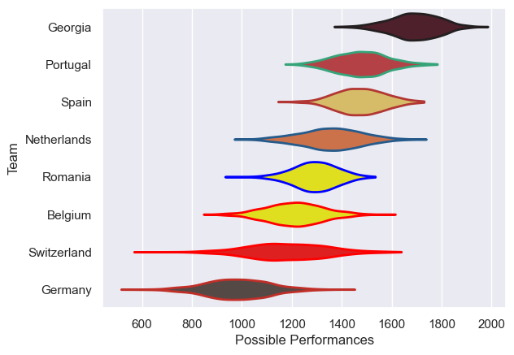

---  
title: "Rugby Europe Championship 2025 Status"  
date: 2025-07-28 6:00:00 -0500  
categories: model review projection  
layout: article  
aside:  
    toc: true  
---
# Current Team Rankings

# Standings

## Current Standings

| Club        |   Played |   Wins |   Point Differential |   Losing Bonus Points |   Try Bonus Points |   Competition Points |
|:------------|---------:|-------:|---------------------:|----------------------:|-------------------:|---------------------:|
| Georgia     |        5 |      5 |                  229 |                     0 |                  5 |                   25 |
| Portugal    |        5 |      3 |                   55 |                     0 |                  4 |                   16 |
| Belgium     |        5 |      3 |                   47 |                     0 |                  3 |                   15 |
| Spain       |        5 |      3 |                   22 |                     0 |                  3 |                   15 |
| Romania     |        5 |      3 |                    3 |                     0 |                  1 |                   13 |
| Netherlands |        5 |      2 |                   19 |                     0 |                  2 |                   10 |
| Switzerland |        5 |      1 |                 -243 |                     0 |                    |                    4 |
| Germany     |        5 |      0 |                 -132 |                     1 |                    |                    1 |

# Completed Match Review

| Model | Percent Correct Predictions | Spread Error |
| ------ | ------ | ------ |
| Club Level | 65.0% | 27.4 |
| Player Level: Lineup | nan% | nan |
| Player Level: Minutes | nan% | nan |

