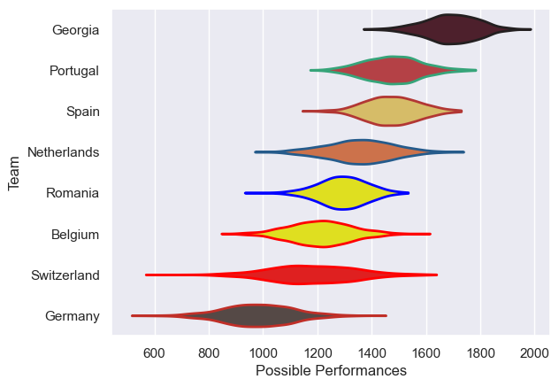
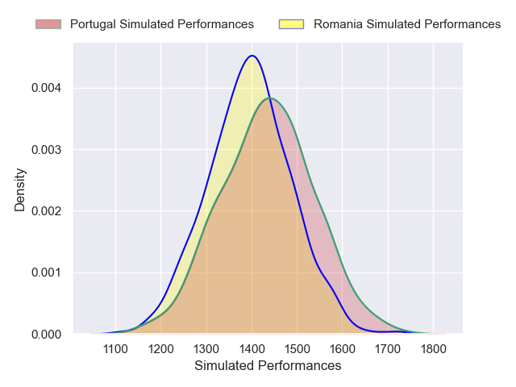
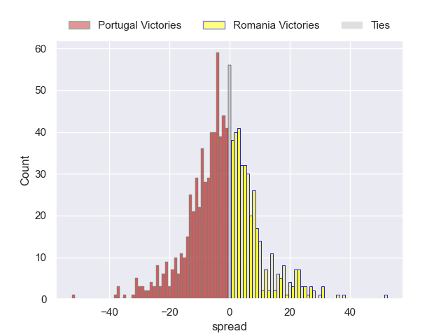
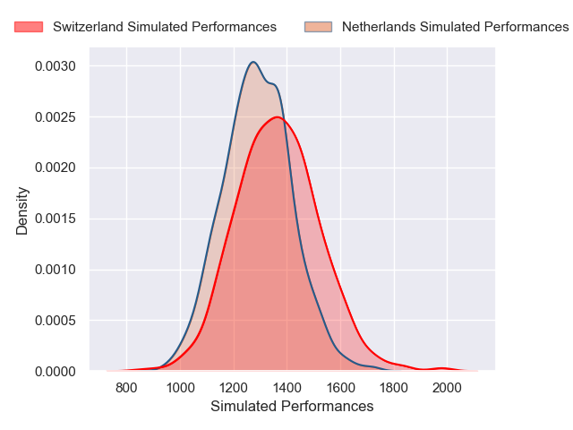
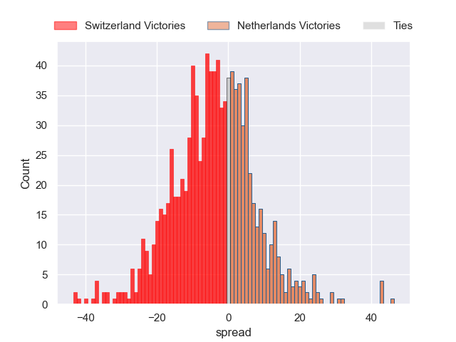
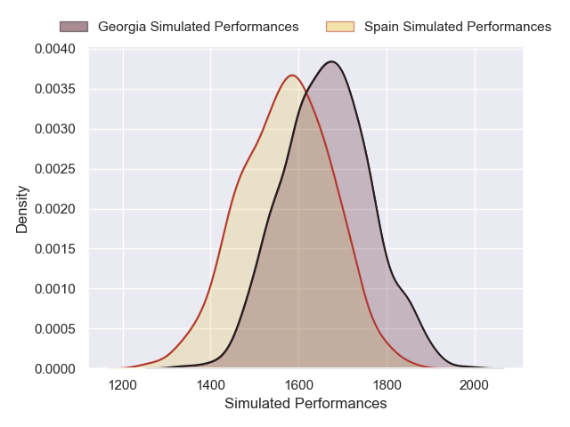
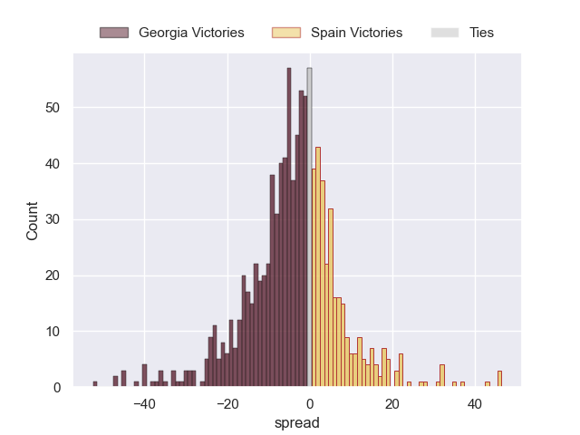
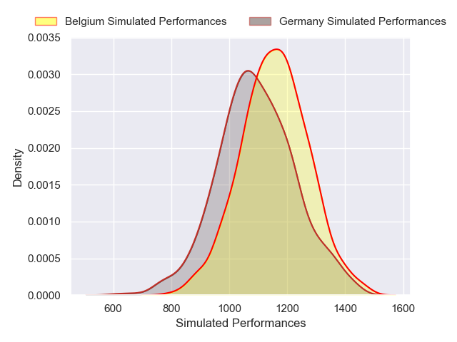
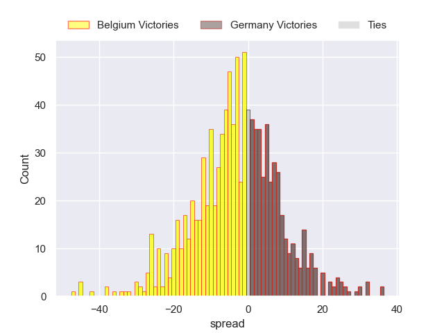

---  
title: "Rugby Europe Championship 2025 Status"  
date: 2025-02-10 6:00:00 -0500  
categories: model review projection  
layout: article  
aside:  
    toc: true  
---
# Current Team Rankings

# Standings

## Current Standings

| Club        |   Played |   Wins |   Point Differential |   Losing Bonus Points |   Try Bonus Points |   Competition Points |
|:------------|---------:|-------:|---------------------:|----------------------:|-------------------:|---------------------:|
| Georgia     |        2 |      2 |                  143 |                     0 |                nan |                    8 |
| Spain       |        2 |      2 |                   59 |                     0 |                nan |                    8 |
| Romania     |        2 |      2 |                   55 |                     0 |                nan |                    8 |
| Portugal    |        2 |      2 |                   52 |                     0 |                nan |                    8 |
| Belgium     |        2 |      0 |                  -27 |                     0 |                nan |                    0 |
| Netherlands |        2 |      0 |                  -62 |                     0 |                nan |                    0 |
| Germany     |        2 |      0 |                  -80 |                     0 |                nan |                    0 |
| Switzerland |        2 |      0 |                 -140 |                     0 |                nan |                    0 |

## Projected Remaining Table

| Club        |   Matches Remaining |   Wins |   Point Differential |   Losing Bonus Points |   Try Bonus Points |   Competition Points |
|:------------|--------------------:|-------:|---------------------:|----------------------:|-------------------:|---------------------:|
| Switzerland |                   1 |    0.6 |              3.99177 |                   0.2 |                0.6 |                  3.4 |
| Georgia     |                   1 |    0.7 |              5.06771 |                   0.2 |                0.3 |                  3.3 |
| Belgium     |                   1 |    0.6 |              2.97723 |                   0.2 |                0.6 |                  3.2 |
| Portugal    |                   1 |    0.6 |              2.65335 |                   0.2 |                0.4 |                  3.2 |
| Germany     |                   1 |    0.4 |             -2.97723 |                   0.3 |                0.3 |                  2.2 |
| Netherlands |                   1 |    0.4 |             -3.99177 |                   0.3 |                0.4 |                  2.1 |
| Romania     |                   1 |    0.4 |             -2.65335 |                   0.3 |                0.1 |                  1.9 |
| Spain       |                   1 |    0.3 |             -5.06771 |                   0.3 |                0.2 |                  1.8 |

## Projected Total Table

| Club        |   Total Matches |   Wins |   Point Differential |   Losing Bonus Points |   Try Bonus Points |   Competition Points |
|:------------|----------------:|-------:|---------------------:|----------------------:|-------------------:|---------------------:|
| Georgia     |               3 |    2.7 |             148.068  |                   0.2 |                0.3 |                 11.3 |
| Portugal    |               3 |    2.6 |              54.6533 |                   0.2 |                0.4 |                 11.2 |
| Romania     |               3 |    2.4 |              52.3467 |                   0.3 |                0.1 |                  9.9 |
| Spain       |               3 |    2.3 |              53.9323 |                   0.3 |                0.2 |                  9.8 |
| Switzerland |               3 |    0.6 |            -136.008  |                   0.2 |                0.6 |                  3.4 |
| Belgium     |               3 |    0.6 |             -24.0228 |                   0.2 |                0.6 |                  3.2 |
| Germany     |               3 |    0.4 |             -82.9772 |                   0.3 |                0.3 |                  2.2 |
| Netherlands |               3 |    0.4 |             -65.9918 |                   0.3 |                0.4 |                  2.1 |

# Completed Match Review

| Model | Percent Correct Predictions | Spread Error |
| ------ | ------ | ------ |
| Club Level | 75.0% | 32.3 |
| Player Level: Lineup | 100.0% | 51.8 |
| Player Level: Minutes | 100.0% | 52.9 |

# Future Predictions

## Week 3

### Romania V Portugal on 2025/02/15

Average Margin: Portugal by 2.7

Average Scoreline: 31-29

### Netherlands V Switzerland on 2025/02/15

Average Margin: Switzerland by 4.0

Average Scoreline: 28-24

### Spain V Georgia on 2025/02/16

Average Margin: Georgia by 5.1

Average Scoreline: 32-27

### Germany V Belgium on 2025/02/16

Average Margin: Belgium by 3.0

Average Scoreline: 31-28

