---  
title: "Rugby Europe Championship 2025 Status"  
date: 2025-02-03 6:00:00 -0500  
categories: model review projection  
layout: article  
aside:  
    toc: true  
---
# Current Team Rankings

# Standings

## Current Standings

| Club        |   Played |   Wins |   Point Differential |   Losing Bonus Points |   Try Bonus Points |   Competition Points |
|:------------|---------:|-------:|---------------------:|----------------------:|-------------------:|---------------------:|
| Georgia     |        1 |      1 |                  110 |                     0 |                nan |                    4 |
| Romania     |        1 |      1 |                   38 |                     0 |                nan |                    4 |
| Spain       |        1 |      1 |                   29 |                     0 |                nan |                    4 |
| Portugal    |        1 |      1 |                   10 |                     0 |                nan |                    4 |
| Belgium     |        1 |      0 |                  -10 |                     0 |                nan |                    0 |
| Netherlands |        1 |      0 |                  -29 |                     0 |                nan |                    0 |
| Germany     |        1 |      0 |                  -38 |                     0 |                nan |                    0 |
| Switzerland |        1 |      0 |                 -110 |                     0 |                nan |                    0 |

## Projected Remaining Table

| Club        |   Matches Remaining |   Wins |   Point Differential |   Losing Bonus Points |   Try Bonus Points |   Competition Points |
|:------------|--------------------:|-------:|---------------------:|----------------------:|-------------------:|---------------------:|
| Portugal    |                   1 |    0.9 |             22.8094  |                   0   |                0.8 |                  4.5 |
| Georgia     |                   1 |    0.9 |             24.4802  |                   0   |                0.6 |                  4.4 |
| Switzerland |                   1 |    0.9 |             13.6073  |                   0.1 |                0.4 |                  3.9 |
| Romania     |                   1 |    0.5 |              1.29189 |                   0.3 |                0.3 |                  2.7 |
| Belgium     |                   1 |    0.5 |             -1.29189 |                   0.3 |                0.3 |                  2.4 |
| Spain       |                   1 |    0.1 |            -13.6073  |                   0.2 |                0.2 |                  1   |
| Germany     |                   1 |    0.1 |            -22.8094  |                   0.1 |                0.2 |                  0.6 |
| Netherlands |                   1 |    0.1 |            -24.4802  |                   0   |                0.2 |                  0.5 |

## Projected Total Table

| Club        |   Total Matches |   Wins |   Point Differential |   Losing Bonus Points |   Try Bonus Points |   Competition Points |
|:------------|----------------:|-------:|---------------------:|----------------------:|-------------------:|---------------------:|
| Portugal    |               2 |    1.9 |              32.8094 |                   0   |                0.8 |                  8.5 |
| Georgia     |               2 |    1.9 |             134.48   |                   0   |                0.6 |                  8.4 |
| Romania     |               2 |    1.5 |              39.2919 |                   0.3 |                0.3 |                  6.7 |
| Spain       |               2 |    1.1 |              15.3927 |                   0.2 |                0.2 |                  5   |
| Switzerland |               2 |    0.9 |             -96.3927 |                   0.1 |                0.4 |                  3.9 |
| Belgium     |               2 |    0.5 |             -11.2919 |                   0.3 |                0.3 |                  2.4 |
| Germany     |               2 |    0.1 |             -60.8094 |                   0.1 |                0.2 |                  0.6 |
| Netherlands |               2 |    0.1 |             -53.4802 |                   0   |                0.2 |                  0.5 |

# Completed Match Review

| Model | Percent Correct Predictions | Spread Error |
| ------ | ------ | ------ |
| Club Level | 75.0% | 40.0 |
| Player Level: Lineup | nan% | nan |
| Player Level: Minutes | nan% | nan |

# Future Predictions

## Week 2

### Georgia V Netherlands on 2025/02/08

Average Margin: Georgia by 24.5

Average Scoreline: 44-19

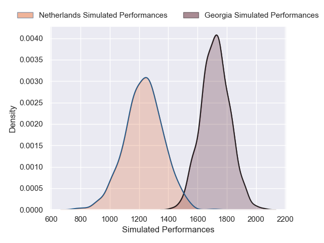

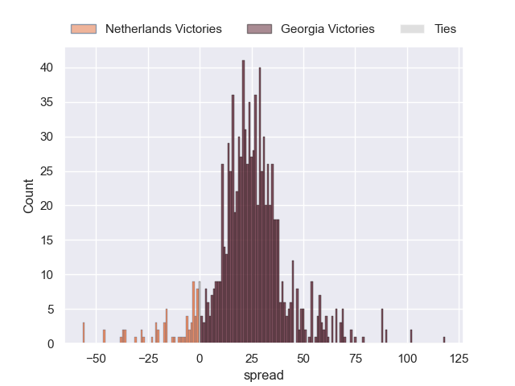

### Belgium V Romania on 2025/02/08

Average Margin: Romania by 1.3

Average Scoreline: 23-22

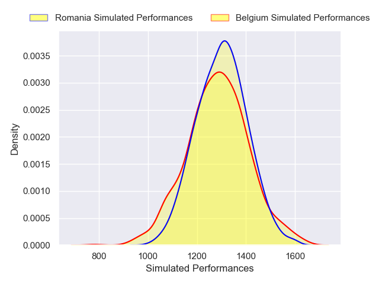
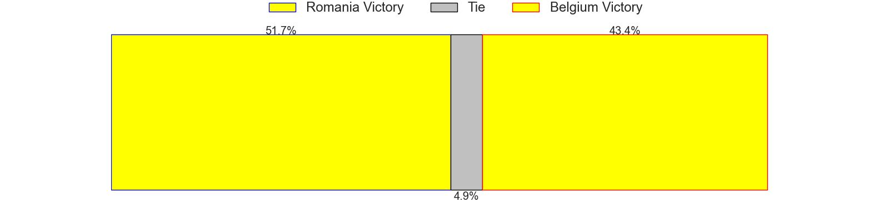
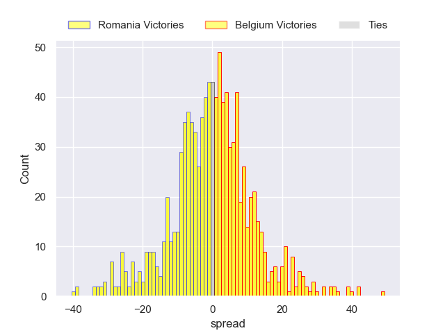

### Switzerland V Spain on 2025/02/09

Average Margin: Switzerland by 13.6

Average Scoreline: 36-22

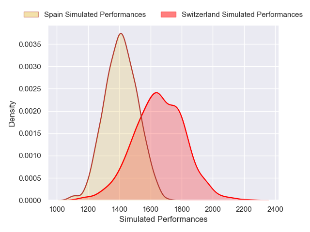
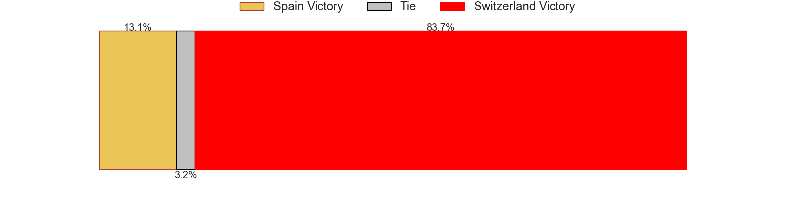
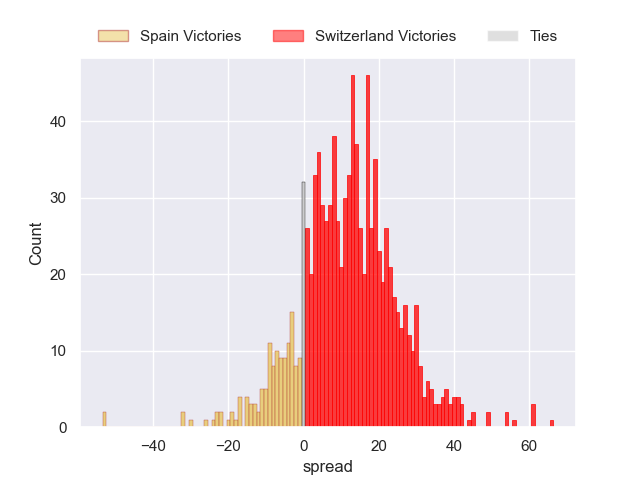

### Portugal V Germany on 2025/02/09

Average Margin: Portugal by 22.8

Average Scoreline: 45-22

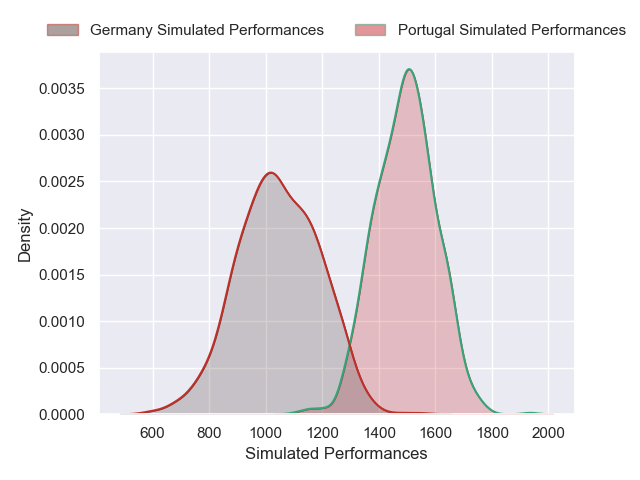
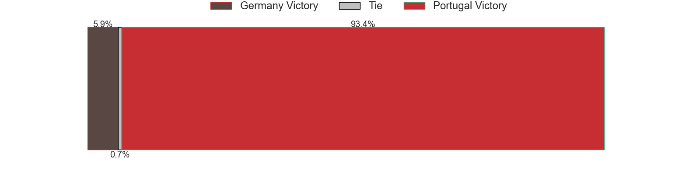
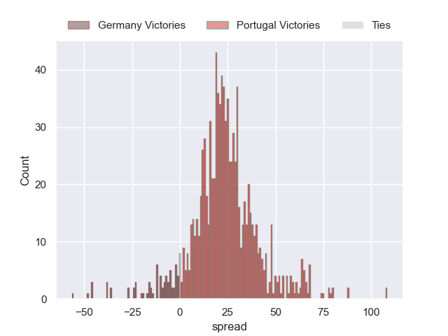

