---  
title: "Rugby Europe Championship 2025 Status"  
date: 2025-01-31 6:00:00 -0500  
categories: model review projection  
layout: article  
aside:  
    toc: true  
---
# Current Team Rankings

# Standings

## Current Standings

| Club    |   Played |   Wins |   Point Differential |   Losing Bonus Points |   Try Bonus Points |   Competition Points |
|:--------|---------:|-------:|---------------------:|----------------------:|-------------------:|---------------------:|
| Romania |        1 |      1 |                   38 |                     0 |                nan |                    4 |
| Germany |        1 |      0 |                  -38 |                     0 |                nan |                    0 |

## Projected Remaining Table

| Club        |   Matches Remaining |   Wins |   Point Differential |   Losing Bonus Points |   Try Bonus Points |   Competition Points |
|:------------|--------------------:|-------:|---------------------:|----------------------:|-------------------:|---------------------:|
| Portugal    |                   1 |    0.9 |             16.8558  |                   0.1 |                0.7 |                  4.4 |
| Romania     |                   1 |    0.9 |             16.2509  |                   0.1 |                0.4 |                  4.1 |
| Spain       |                   1 |    0.8 |             11.5051  |                   0.1 |                0.6 |                  4.1 |
| Switzerland |                   1 |    0.6 |              4.20915 |                   0.2 |                0.3 |                  3.1 |
| Georgia     |                   1 |    0.4 |             -4.20915 |                   0.3 |                0.1 |                  1.8 |
| Netherlands |                   1 |    0.2 |            -11.5051  |                   0.2 |                0.2 |                  1.1 |
| Germany     |                   1 |    0.1 |            -16.2509  |                   0.1 |                0.2 |                  0.7 |
| Belgium     |                   1 |    0.1 |            -16.8558  |                   0.1 |                0.2 |                  0.6 |

## Projected Total Table

| Club        |   Total Matches |   Wins |   Point Differential |   Losing Bonus Points |   Try Bonus Points |   Competition Points |
|:------------|----------------:|-------:|---------------------:|----------------------:|-------------------:|---------------------:|
| Romania     |               2 |    1.9 |             54.2509  |                   0.1 |                0.4 |                  8.1 |
| Portugal    |               1 |    0.9 |             16.8558  |                   0.1 |                0.7 |                  4.4 |
| Spain       |               1 |    0.8 |             11.5051  |                   0.1 |                0.6 |                  4.1 |
| Switzerland |               1 |    0.6 |              4.20915 |                   0.2 |                0.3 |                  3.1 |
| Georgia     |               1 |    0.4 |             -4.20915 |                   0.3 |                0.1 |                  1.8 |
| Netherlands |               1 |    0.2 |            -11.5051  |                   0.2 |                0.2 |                  1.1 |
| Germany     |               2 |    0.1 |            -54.2509  |                   0.1 |                0.2 |                  0.7 |
| Belgium     |               1 |    0.1 |            -16.8558  |                   0.1 |                0.2 |                  0.6 |

# Completed Match Review

| Model | Percent Correct Predictions | Spread Error |
| ------ | ------ | ------ |
| Club Level | 100.0% | 23.6 |
| Player Level: Lineup | nan% | nan |
| Player Level: Minutes | nan% | nan |

# Future Predictions

## Week 2

### Romania V Germany on 2025/01/31

Average Margin: Romania by 16.3

Average Scoreline: 39-22

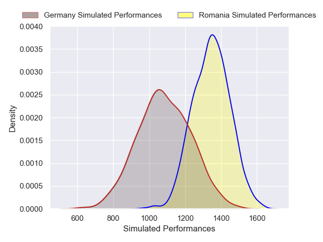
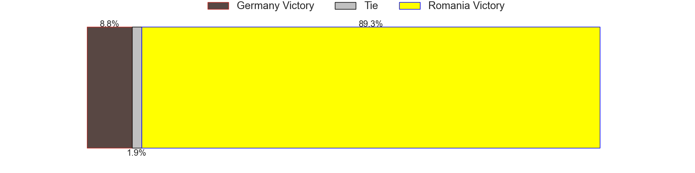
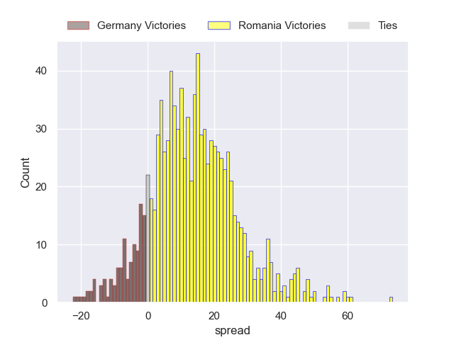

### Portugal V Belgium on 2025/02/01

Average Margin: Portugal by 16.9

Average Scoreline: 36-19

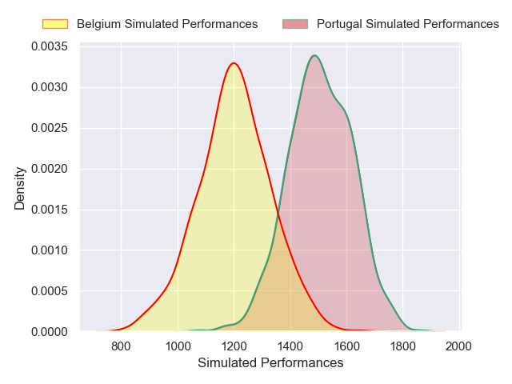
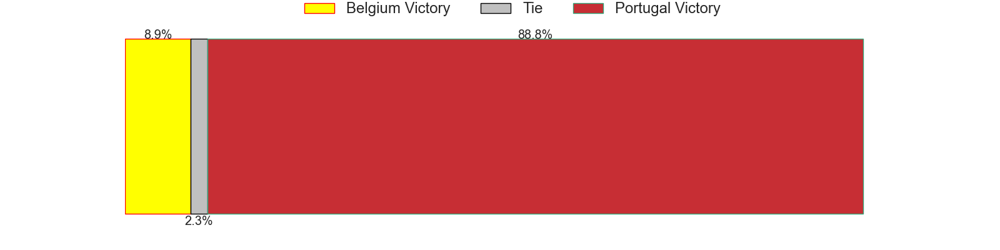
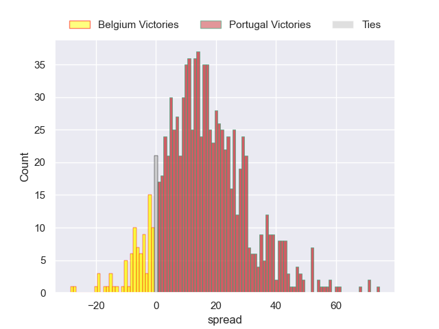

### Georgia V Switzerland on 2025/02/01

Average Margin: Switzerland by 4.2

Average Scoreline: 27-23

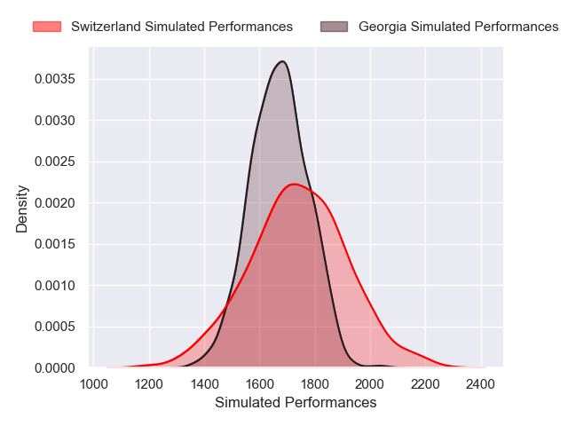

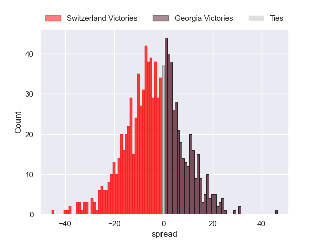

### Spain V Netherlands on 2025/02/02

Average Margin: Spain by 11.5

Average Scoreline: 35-23

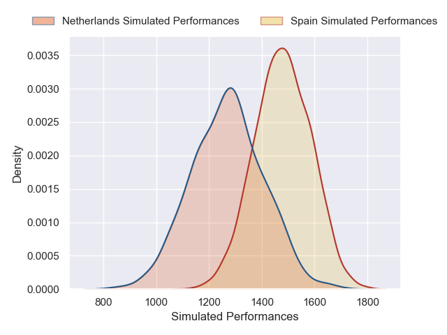
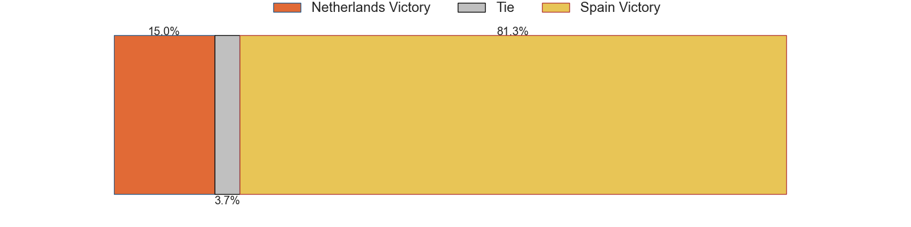
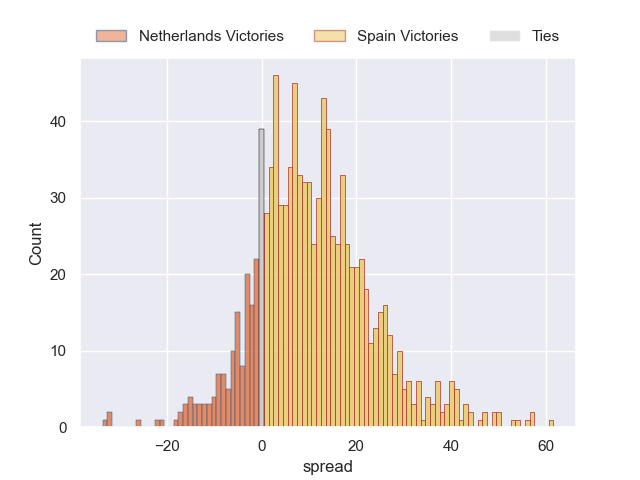

