---  
title: "Rugby Europe Championship 2025 Status"  
date: 2025-02-24 6:00:00 -0500  
categories: model review projection  
layout: article  
aside:  
    toc: true  
---
# Current Team Rankings

# Standings

## Current Standings

| Club        |   Played |   Wins |   Point Differential |   Losing Bonus Points |   Try Bonus Points |   Competition Points |
|:------------|---------:|-------:|---------------------:|----------------------:|-------------------:|---------------------:|
| Georgia     |        3 |      3 |                  173 |                     0 |                nan |                   12 |
| Portugal    |        3 |      3 |                   80 |                     0 |                nan |                   12 |
| Spain       |        3 |      2 |                   29 |                     0 |                nan |                    8 |
| Romania     |        3 |      2 |                   27 |                     0 |                nan |                    8 |
| Netherlands |        3 |      1 |                   11 |                     0 |                nan |                    4 |
| Belgium     |        3 |      1 |                   -7 |                     0 |                nan |                    4 |
| Germany     |        3 |      0 |                 -100 |                     0 |                nan |                    0 |
| Switzerland |        3 |      0 |                 -213 |                     0 |                nan |                    0 |

## Projected Remaining Table

| Club        |   Matches Remaining |   Wins |   Point Differential |   Losing Bonus Points |   Try Bonus Points |   Competition Points |
|:------------|--------------------:|-------:|---------------------:|----------------------:|-------------------:|---------------------:|
| Georgia     |                   1 |    0.9 |             24.3765  |                   0   |                0.7 |                  4.5 |
| Netherlands |                   1 |    0.9 |             22.3608  |                   0   |                0.7 |                  4.5 |
| Portugal    |                   1 |    0.7 |              3.83154 |                   0.2 |                0.4 |                  3.3 |
| Belgium     |                   1 |    0.7 |              5.25887 |                   0.2 |                0.4 |                  3.2 |
| Spain       |                   1 |    0.3 |             -3.83154 |                   0.4 |                0.4 |                  2   |
| Switzerland |                   1 |    0.3 |             -5.25887 |                   0.2 |                0.3 |                  1.9 |
| Germany     |                   1 |    0.1 |            -22.3608  |                   0.1 |                0.3 |                  0.7 |
| Romania     |                   1 |    0.1 |            -24.3765  |                   0   |                0.1 |                  0.3 |

## Projected Total Table

| Club        |   Total Matches |   Wins |   Point Differential |   Losing Bonus Points |   Try Bonus Points |   Competition Points |
|:------------|----------------:|-------:|---------------------:|----------------------:|-------------------:|---------------------:|
| Georgia     |               4 |    3.9 |            197.377   |                   0   |                0.7 |                 16.5 |
| Portugal    |               4 |    3.7 |             83.8315  |                   0.2 |                0.4 |                 15.3 |
| Spain       |               4 |    2.3 |             25.1685  |                   0.4 |                0.4 |                 10   |
| Netherlands |               4 |    1.9 |             33.3608  |                   0   |                0.7 |                  8.5 |
| Romania     |               4 |    2.1 |              2.62347 |                   0   |                0.1 |                  8.3 |
| Belgium     |               4 |    1.7 |             -1.74113 |                   0.2 |                0.4 |                  7.2 |
| Switzerland |               4 |    0.3 |           -218.259   |                   0.2 |                0.3 |                  1.9 |
| Germany     |               4 |    0.1 |           -122.361   |                   0.1 |                0.3 |                  0.7 |

# Completed Match Review

| Model | Percent Correct Predictions | Spread Error |
| ------ | ------ | ------ |
| Club Level | 75.0% | 34.8 |
| Player Level: Lineup | 75.0% | 33.1 |
| Player Level: Minutes | 62.5% | 33.9 |

# Future Predictions

## Week 4

### Netherlands V Germany on 2025/03/01

Average Margin: Netherlands by 22.4

Average Scoreline: 41-19

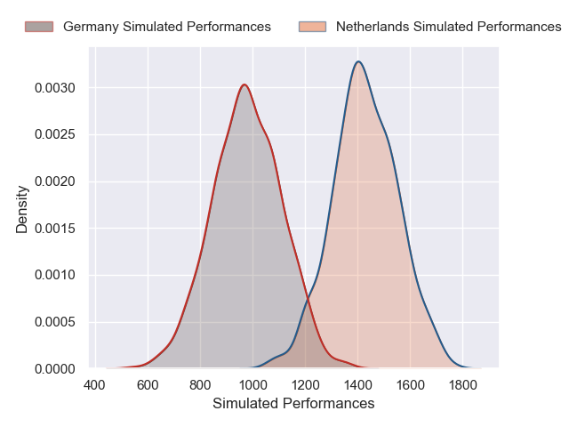
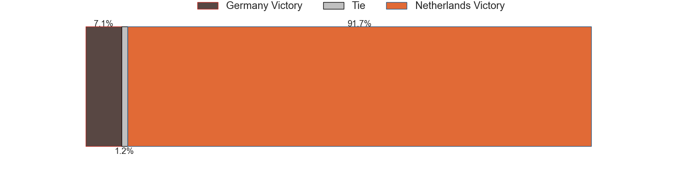
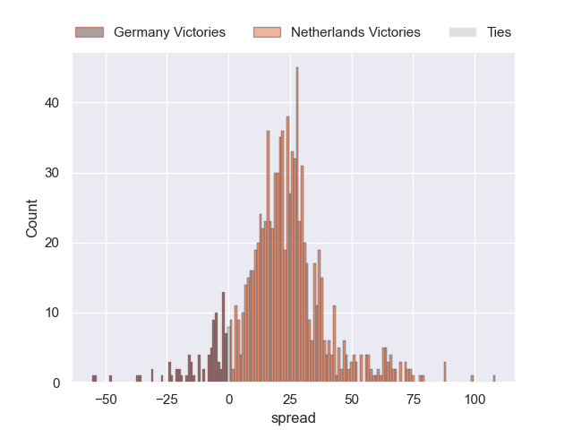

### Portugal V Spain on 2025/03/01

Average Margin: Portugal by 3.8

Average Scoreline: 29-25

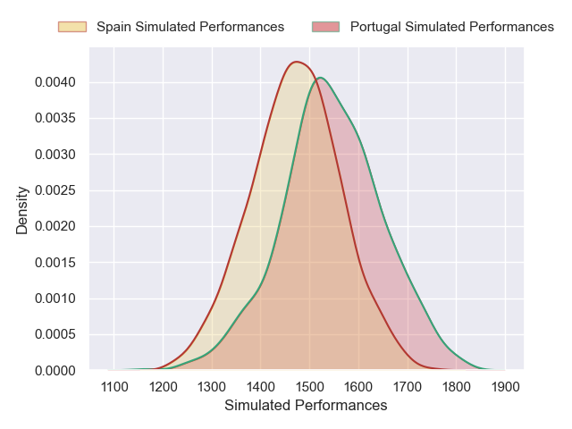
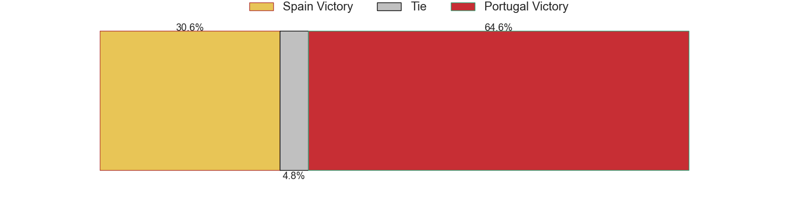
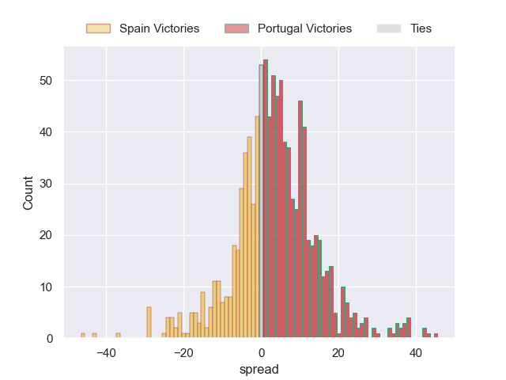

### Belgium V Switzerland on 2025/03/01

Average Margin: Belgium by 5.3

Average Scoreline: 34-29

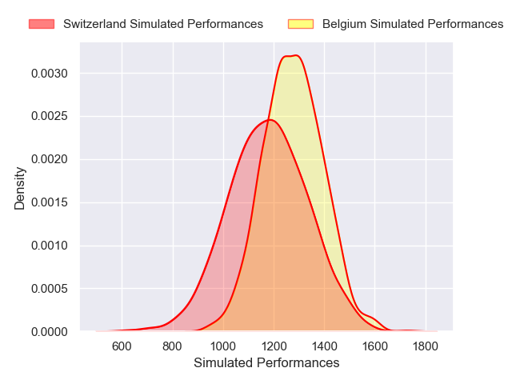
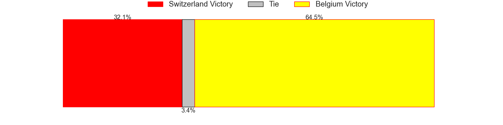
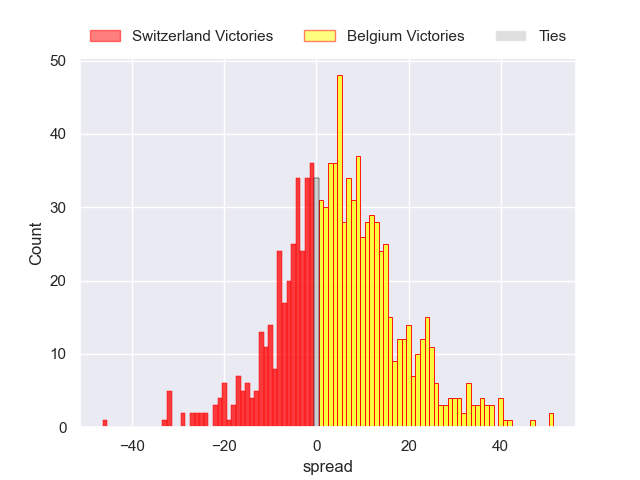

### Georgia V Romania on 2025/03/02

Average Margin: Georgia by 24.4

Average Scoreline: 46-22

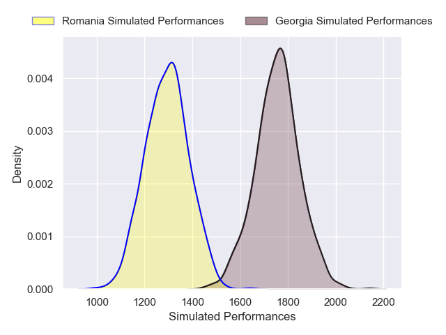

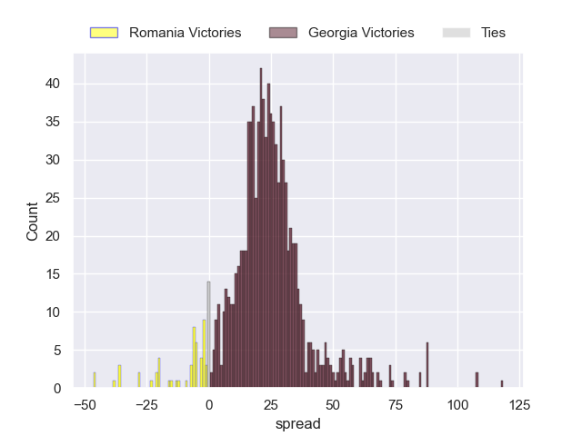

