# Team Rankings

# Standings

## Projected Remaining Table

| Club        |   To Play |   Projected Wins |   Projected Differential |   Projected Losing Bonus Points | Projected Try Bonus Points   |   Projected Competition Points |
|:------------|----------:|-----------------:|-------------------------:|--------------------------------:|:-----------------------------|-------------------------------:|
| Georgia     |         3 |            1.931 |                   20.816 |                           0.481 |                              |                          8.455 |
| Portugal    |         3 |            1.701 |                    9.474 |                           0.557 |                              |                          7.625 |
| Belgium     |         3 |            1.597 |                    8.015 |                           0.598 |                              |                          7.24  |
| Spain       |         3 |            1.532 |                    6.128 |                           0.531 |                              |                          6.909 |
| Romania     |         3 |            1.494 |                    2.909 |                           0.63  |                              |                          6.886 |
| Netherlands |         3 |            1.34  |                   -3.428 |                           0.594 |                              |                          6.216 |
| Germany     |         3 |            0.953 |                  -20.398 |                           0.6   |                              |                          4.634 |
| Switzerland |         3 |            0.948 |                  -23.516 |                           0.532 |                              |                          4.558 |

## Projected Total Table

| Club        |   Played |   Wins |   Point Differential |   Losing Bonus Points | Try Bonus Points   |   Competition Points |
|:------------|---------:|-------:|---------------------:|----------------------:|:-------------------|---------------------:|
| Georgia     |        3 |  1.931 |               20.816 |                 0.481 |                    |                8.455 |
| Portugal    |        3 |  1.701 |                9.474 |                 0.557 |                    |                7.625 |
| Belgium     |        3 |  1.597 |                8.015 |                 0.598 |                    |                7.24  |
| Spain       |        3 |  1.532 |                6.128 |                 0.531 |                    |                6.909 |
| Romania     |        3 |  1.494 |                2.909 |                 0.63  |                    |                6.886 |
| Netherlands |        3 |  1.34  |               -3.428 |                 0.594 |                    |                6.216 |
| Germany     |        3 |  0.953 |              -20.398 |                 0.6   |                    |                4.634 |
| Switzerland |        3 |  0.948 |              -23.516 |                 0.532 |                    |                4.558 |

# Future Predictions

## Week 1

### Belgium V Portugal on 2026/02/07

Average Margin: Belgium by 0.3

### Netherlands V Spain on 2026/02/07

Average Margin: Spain by 1.1

### Switzerland V Georgia on 2026/02/08

Average Margin: Georgia by 10.2

### Germany V Romania on 2026/02/08

Average Margin: Romania by 4.7

## Week 2

### Spain V Switzerland on 2026/02/14

Average Margin: Spain by 11.2

### Germany V Portugal on 2026/02/14

Average Margin: Portugal by 6.1

### Netherlands V Georgia on 2026/02/15

Average Margin: Georgia by 4.6

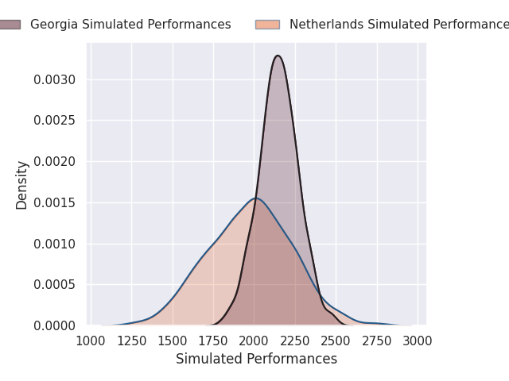

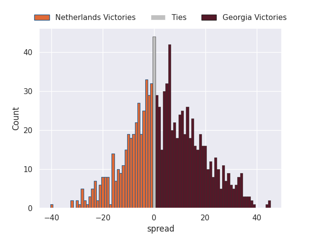

### Romania V Belgium on 2026/02/15

Average Margin: Romania by 1.9

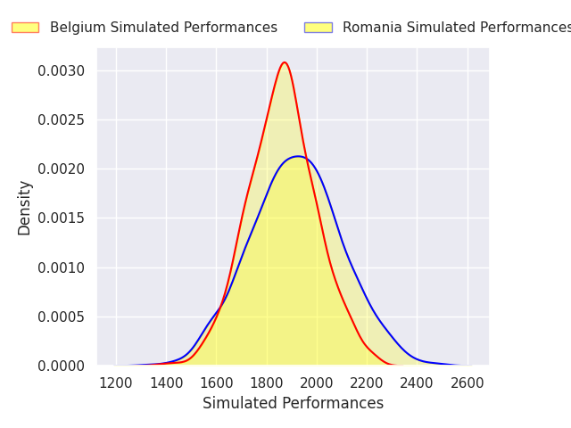

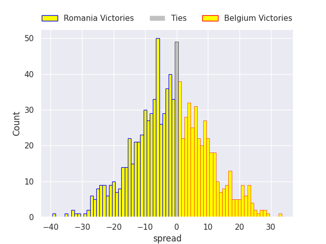

## Week 3

### Georgia V Spain on 2026/02/21

Average Margin: Georgia by 6.1

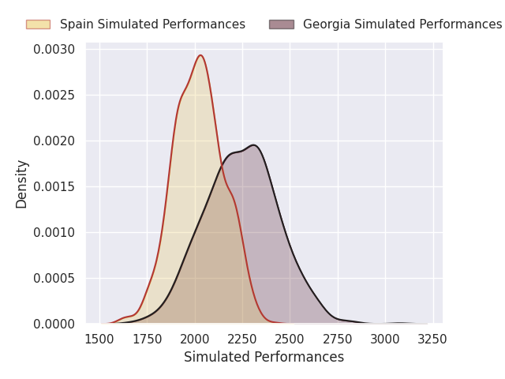

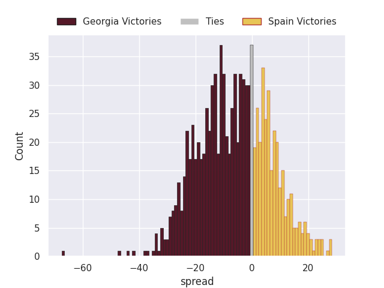

### Belgium V Germany on 2026/02/21

Average Margin: Belgium by 9.6

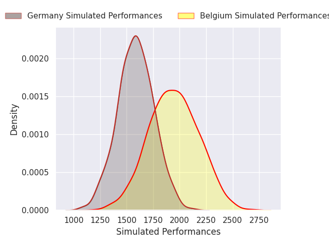
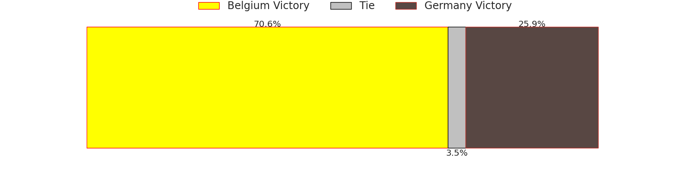
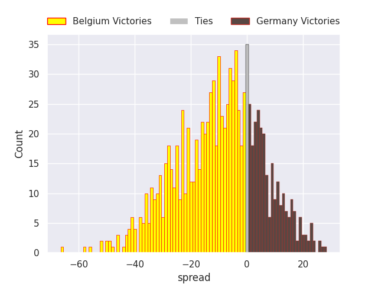

### Switzerland V Netherlands on 2026/02/22

Average Margin: Netherlands by 2.2

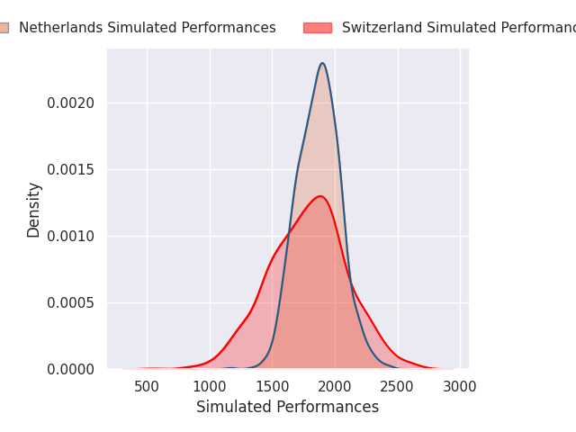

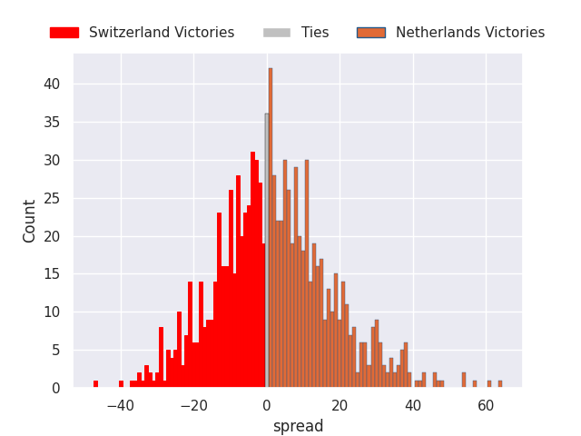

### Portugal V Romania on 2026/02/22

Average Margin: Portugal by 3.7

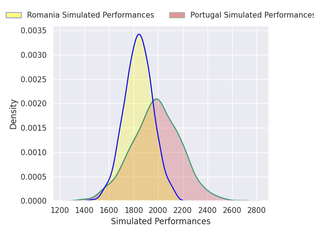

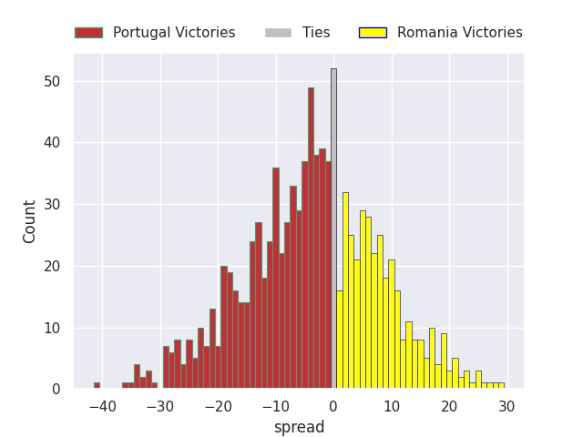

