# Team Rankings

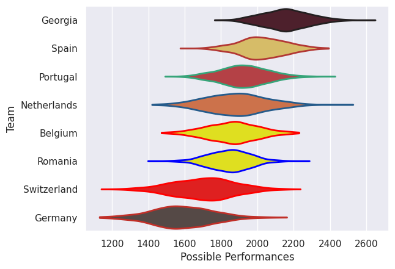
# Standings

## Projected Remaining Table

| Club        |   To Play |   Projected Wins |   Projected Differential |   Projected Losing Bonus Points | Projected Try Bonus Points   |   Projected Competition Points |
|:------------|----------:|-----------------:|-------------------------:|--------------------------------:|:-----------------------------|-------------------------------:|
| Spain       |         2 |            1.301 |                   14.792 |                           0.317 |                              |                          5.671 |
| Portugal    |         2 |            1.08  |                    6.022 |                           0.389 |                              |                          4.923 |
| Germany     |         2 |            0.629 |                  -12.834 |                           0.392 |                              |                          3.078 |
| Georgia     |         1 |            0.679 |                    9.894 |                           0.148 |                              |                          2.916 |
| Romania     |         1 |            0.627 |                    5.547 |                           0.173 |                              |                          2.753 |
| Switzerland |         2 |            0.535 |                  -21.463 |                           0.318 |                              |                          2.582 |
| Belgium     |         1 |            0.521 |                    1.265 |                           0.217 |                              |                          2.417 |
| Netherlands |         1 |            0.384 |                   -3.223 |                           0.233 |                              |                          1.847 |

## Projected Total Table

| Club        |   Played |   Wins |   Point Differential |   Losing Bonus Points | Try Bonus Points   |   Competition Points |
|:------------|---------:|-------:|---------------------:|----------------------:|:-------------------|---------------------:|
| Spain       |        2 |  1.301 |               14.792 |                 0.317 |                    |                5.671 |
| Portugal    |        2 |  1.08  |                6.022 |                 0.389 |                    |                4.923 |
| Germany     |        2 |  0.629 |              -12.834 |                 0.392 |                    |                3.078 |
| Georgia     |        1 |  0.679 |                9.894 |                 0.148 |                    |                2.916 |
| Romania     |        1 |  0.627 |                5.547 |                 0.173 |                    |                2.753 |
| Switzerland |        2 |  0.535 |              -21.463 |                 0.318 |                    |                2.582 |
| Belgium     |        1 |  0.521 |                1.265 |                 0.217 |                    |                2.417 |
| Netherlands |        1 |  0.384 |               -3.223 |                 0.233 |                    |                1.847 |

# Future Predictions

## Week 1

### Netherlands V Spain on 2026/02/07

Average Margin: Spain by 3.2

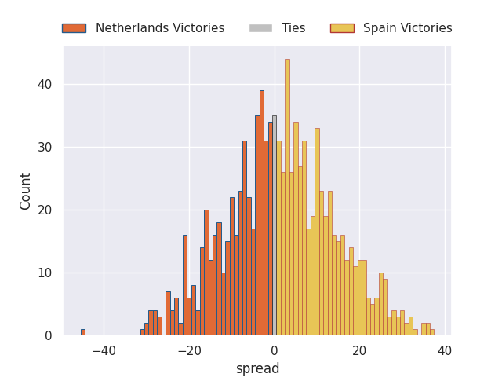

### Belgium V Portugal on 2026/02/07

Average Margin: Belgium by 1.3

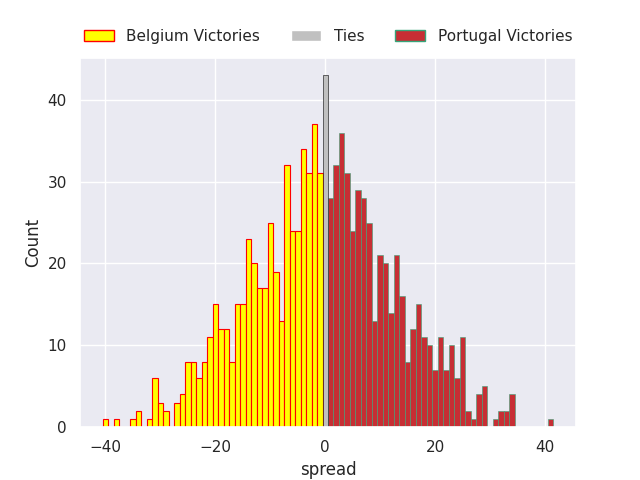

### Germany V Romania on 2026/02/08

Average Margin: Romania by 5.5

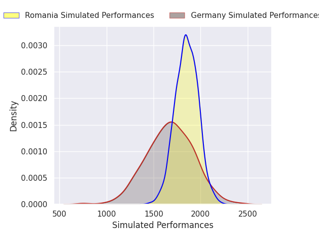
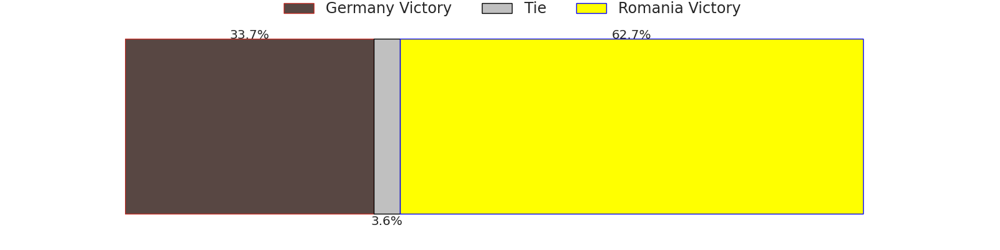

### Switzerland V Georgia on 2026/02/08

Average Margin: Georgia by 9.9

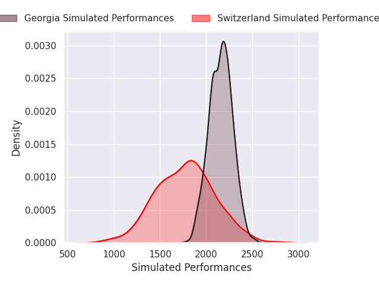

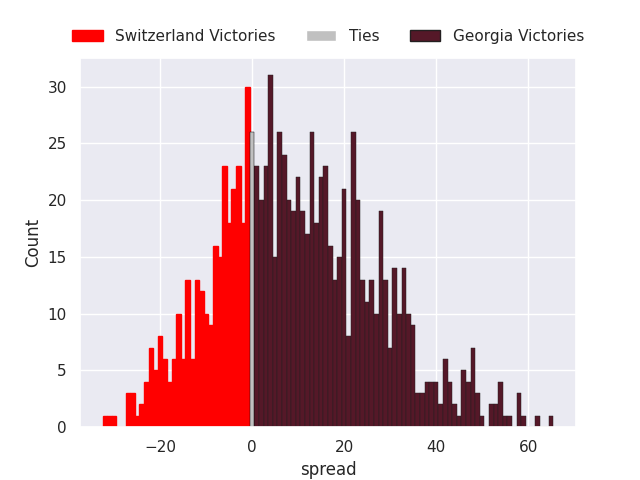

## Week 2

### Spain V Switzerland on 2026/02/14

Average Margin: Spain by 11.6

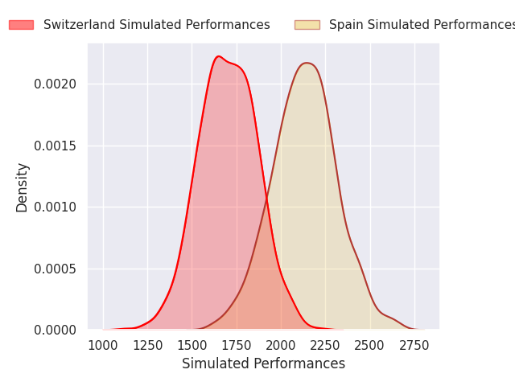
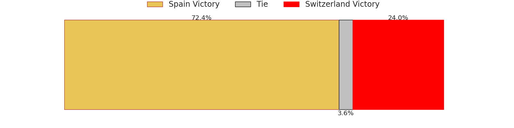
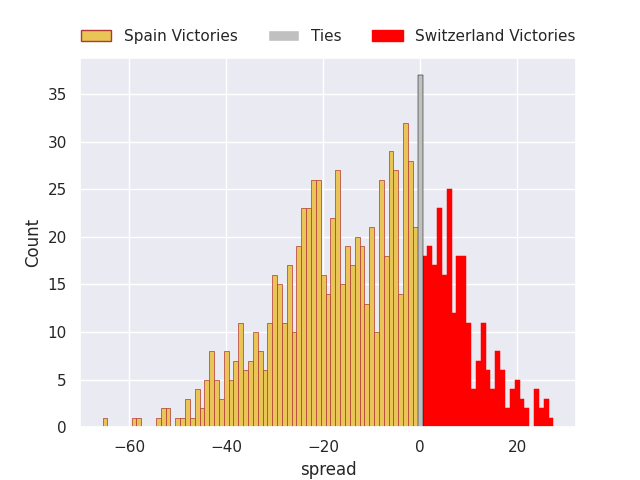

### Germany V Portugal on 2026/02/14

Average Margin: Portugal by 7.3

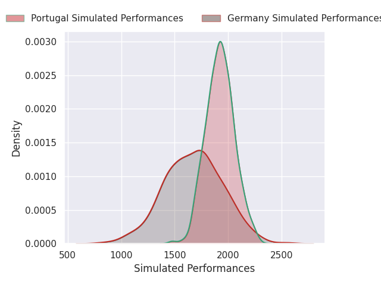

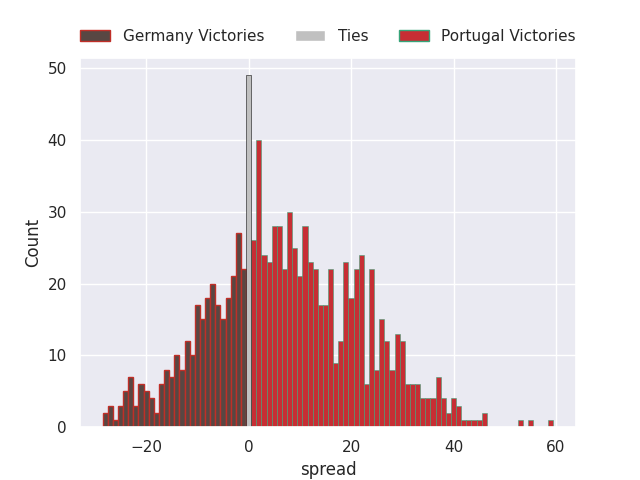

