# Team Rankings

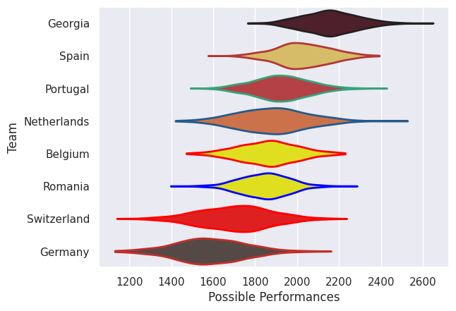
# Standings

## Current Standings

| Club        |   Played |   Wins |   Point Differential |   Losing Bonus Points | Try Bonus Points   |   Competition Points |
|:------------|---------:|-------:|---------------------:|----------------------:|:-------------------|---------------------:|
| Georgia     |        1 |      1 |                   51 |                     0 |                    |                    4 |
| Portugal    |        1 |      1 |                   30 |                     0 |                    |                    4 |
| Spain       |        1 |      1 |                   18 |                     0 |                    |                    4 |
| Germany     |        1 |      1 |                    6 |                     0 |                    |                    4 |
| Romania     |        1 |      0 |                   -6 |                     1 |                    |                    1 |
| Netherlands |        1 |      0 |                  -18 |                     0 |                    |                    0 |
| Belgium     |        1 |      0 |                  -30 |                     0 |                    |                    0 |
| Switzerland |        1 |      0 |                  -51 |                     0 |                    |                    0 |

## Projected Remaining Table

| Club        |   To Play |   Projected Wins |   Projected Differential |   Projected Losing Bonus Points | Projected Try Bonus Points   |   Projected Competition Points |
|:------------|----------:|-----------------:|-------------------------:|--------------------------------:|:-----------------------------|-------------------------------:|
| Portugal    |         2 |            1.322 |                   12.042 |                           0.323 |                              |                          5.747 |
| Georgia     |         2 |            1.292 |                   12.512 |                           0.326 |                              |                          5.66  |
| Spain       |         2 |            1.1   |                    9.369 |                           0.29  |                              |                          4.852 |
| Belgium     |         2 |            0.987 |                    1.799 |                           0.409 |                              |                          4.525 |
| Romania     |         2 |            0.869 |                   -2.904 |                           0.414 |                              |                          4.04  |
| Netherlands |         2 |            0.825 |                   -5.652 |                           0.368 |                              |                          3.824 |
| Germany     |         2 |            0.67  |                  -10.937 |                           0.438 |                              |                          3.272 |
| Switzerland |         2 |            0.624 |                  -16.229 |                           0.349 |                              |                          2.997 |

## Projected Total Table

| Club        |   Played |   Wins |   Point Differential |   Losing Bonus Points | Try Bonus Points   |   Competition Points |
|:------------|---------:|-------:|---------------------:|----------------------:|:-------------------|---------------------:|
| Portugal    |        3 |  2.322 |               42.042 |                 0.323 |                    |                9.747 |
| Georgia     |        3 |  2.292 |               63.512 |                 0.326 |                    |                9.66  |
| Spain       |        3 |  2.1   |               27.369 |                 0.29  |                    |                8.852 |
| Germany     |        3 |  1.67  |               -4.937 |                 0.438 |                    |                7.272 |
| Romania     |        3 |  0.869 |               -8.904 |                 1.414 |                    |                5.04  |
| Belgium     |        3 |  0.987 |              -28.201 |                 0.409 |                    |                4.525 |
| Netherlands |        3 |  0.825 |              -23.652 |                 0.368 |                    |                3.824 |
| Switzerland |        3 |  0.624 |              -67.229 |                 0.349 |                    |                2.997 |

# Completed Match Review

| Model | Percent Correct Predictions | Spread Error |
| ------ | ------ | ------ |
| Club Level | 66.7% | 14.5 |
| Player Level: Lineup | nan% | nan |
| Player Level: Minutes | nan% | nan |

# Future Predictions

## Week 2

### Spain V Switzerland on 2026/02/14

Average Margin: Spain by 14.7

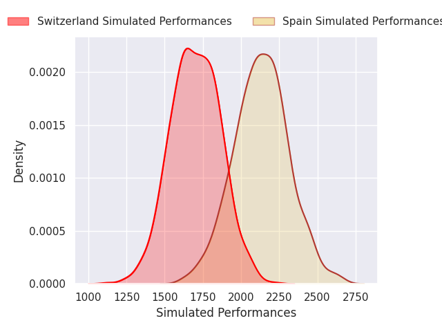
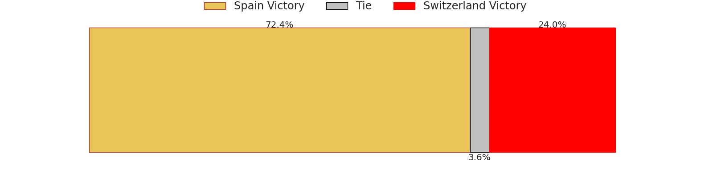
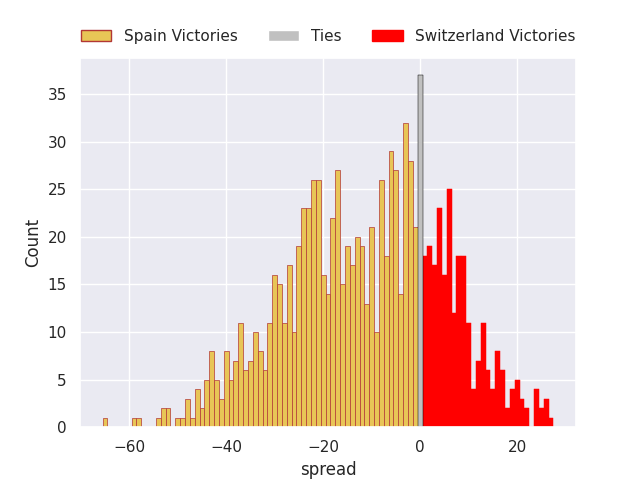

### Germany V Portugal on 2026/02/14

Average Margin: Portugal by 5.6

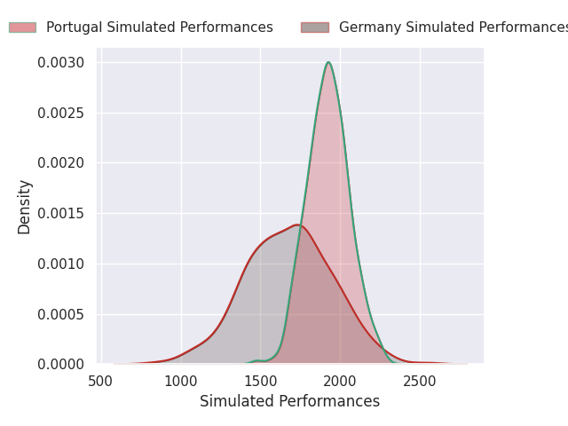

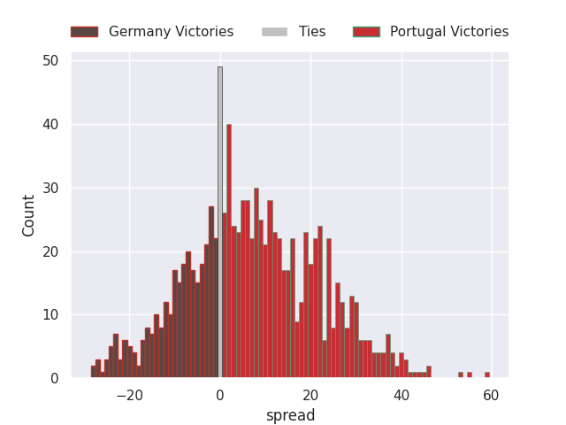

### Romania V Belgium on 2026/02/15

Average Margin: Romania by 3.5

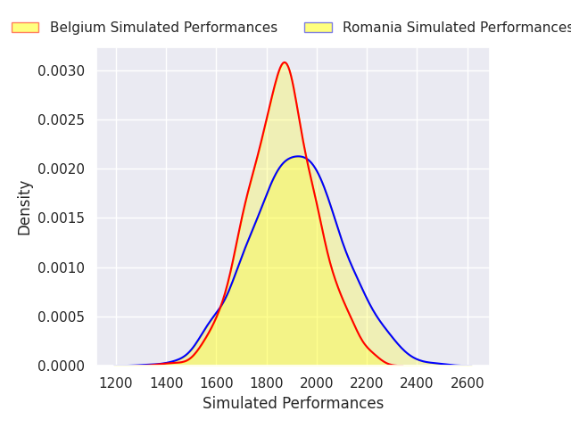
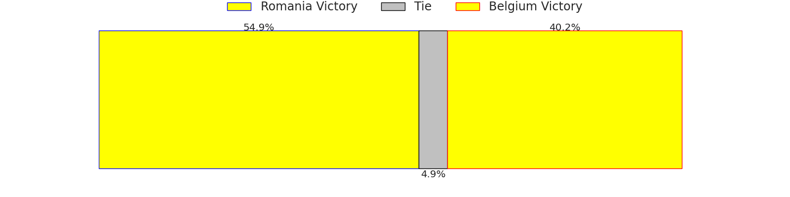
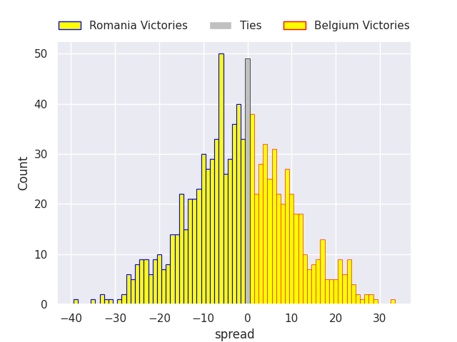

### Netherlands V Georgia on 2026/02/15

Average Margin: Georgia by 7.1

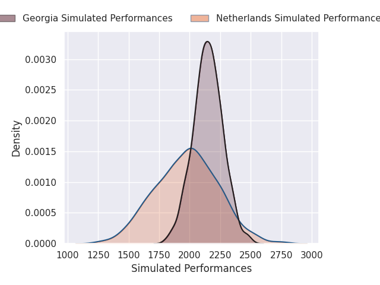

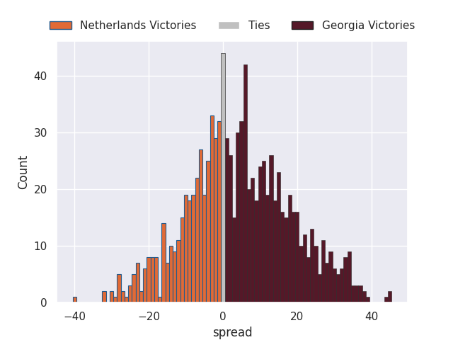

## Week 3

### Belgium V Germany on 2026/02/21

Average Margin: Belgium by 5.3

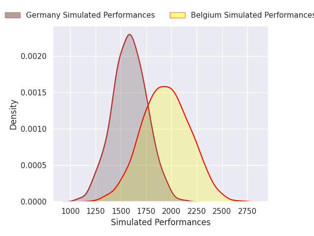
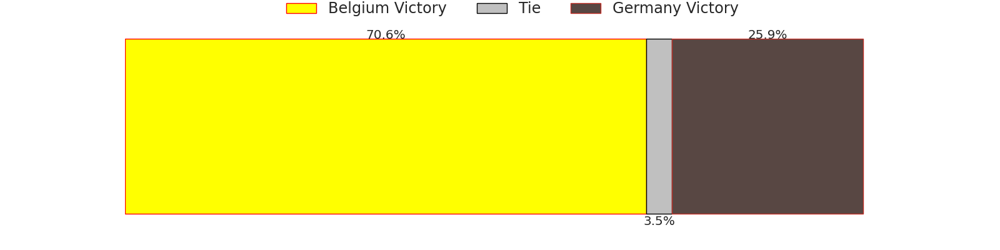
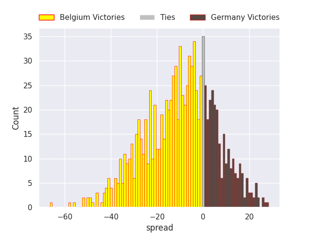

### Georgia V Spain on 2026/02/21

Average Margin: Georgia by 5.4

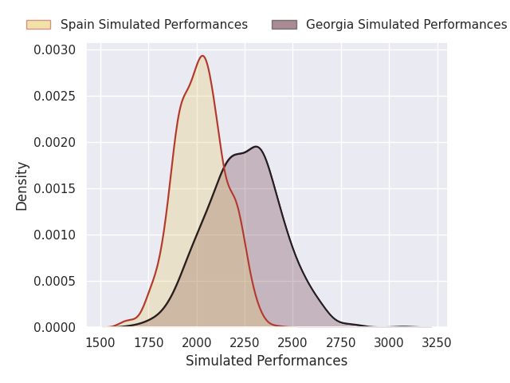

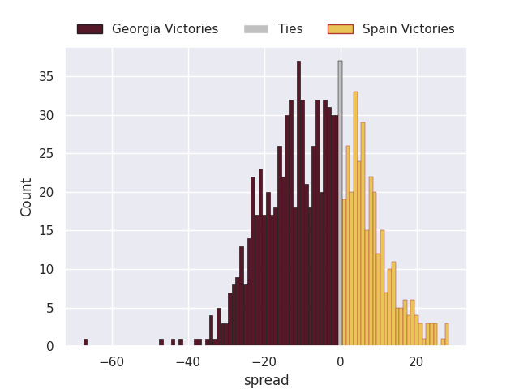

### Portugal V Romania on 2026/02/22

Average Margin: Portugal by 6.4

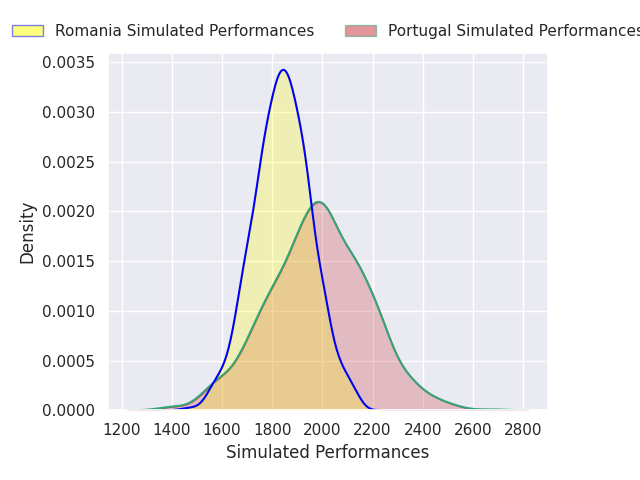

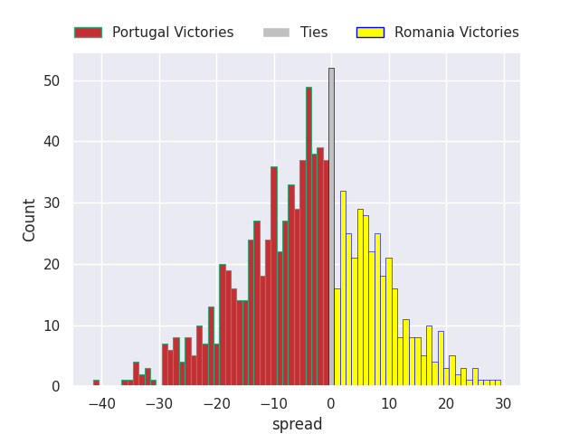

### Switzerland V Netherlands on 2026/02/22

Average Margin: Netherlands by 1.5

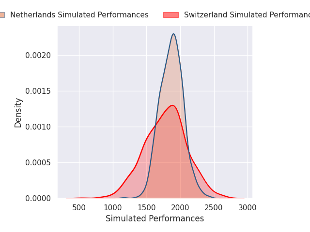

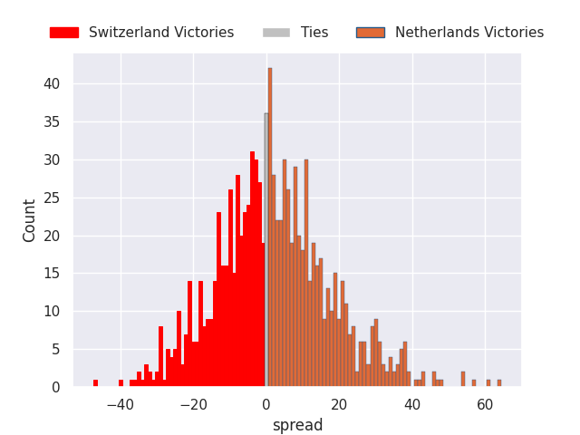

