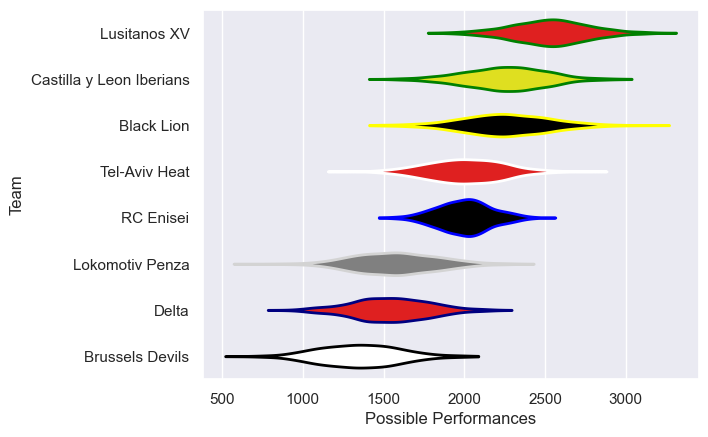

---  
title: "Rugby Europe Super Cup 2021"  
date: 2025-07-29 6:00:00 -0500  
categories: model review projection  
layout: article  
aside:  
    toc: true  
---
# Current Team Rankings

# Standings

## Current Standings

| Club                     |   Played |   Wins |   Point Differential |   Losing Bonus Points | Try Bonus Points   |   Competition Points |
|:-------------------------|---------:|-------:|---------------------:|----------------------:|:-------------------|---------------------:|
| Lusitanos XV             |        6 |      6 |                  184 |                     0 |                    |                   24 |
| Castilla y Leon Iberians |        6 |      4 |                  104 |                     1 |                    |                   17 |
| Black Lion               |        5 |      4 |                   67 |                     1 |                    |                   17 |
| RC Enisei                |        5 |      3 |                   32 |                     2 |                    |                   14 |
| Tel-Aviv Heat            |        6 |      3 |                  -22 |                     1 |                    |                   13 |
| Delta                    |        6 |      1 |                 -119 |                     2 |                    |                    6 |
| Lokomotiv Penza          |        6 |      1 |                  -77 |                     1 |                    |                    5 |
| Brussels Devils          |        6 |      1 |                 -169 |                     0 |                    |                    4 |

# Completed Match Review

| Model | Percent Correct Predictions | Spread Error |
| ------ | ------ | ------ |
| Club Level | 56.5% | 29.1 |
| Player Level: Lineup | nan% | nan |
| Player Level: Minutes | nan% | nan |

