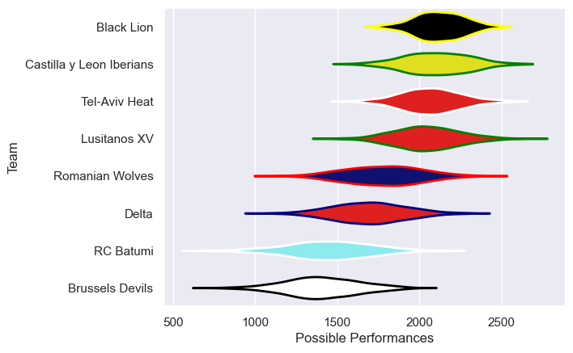

---  
title: "Rugby Europe Super Cup 2022 Status"  
date: 2025-07-28 6:00:00 -0500  
categories: model review projection  
layout: article  
aside:  
    toc: true  
---
# Current Team Rankings

# Standings

## Current Standings

| Club                     |   Played |   Wins |   Point Differential |   Losing Bonus Points |   Try Bonus Points |   Competition Points |
|:-------------------------|---------:|-------:|---------------------:|----------------------:|-------------------:|---------------------:|
| Black Lion               |       10 |      8 |                  172 |                     1 |                  6 |                   41 |
| Lusitanos XV             |        9 |      6 |                  236 |                     2 |                  5 |                   31 |
| Castilla y Leon Iberians |        8 |      5 |                   83 |                     2 |                  3 |                   25 |
| Tel-Aviv Heat            |        9 |      5 |                   50 |                     0 |                  1 |                   23 |
| RC Batumi                |        6 |      2 |                  -74 |                     0 |                    |                    8 |
| Romanian Wolves          |        6 |      1 |                 -118 |                     1 |                  1 |                    6 |
| Brussels Devils          |        6 |      1 |                 -247 |                     1 |                  1 |                    6 |
| Delta                    |        6 |      1 |                 -102 |                     1 |                    |                    5 |

# Completed Match Review

| Model | Percent Correct Predictions | Spread Error |
| ------ | ------ | ------ |
| Club Level | 70.0% | 21.5 |
| Player Level: Lineup | nan% | nan |
| Player Level: Minutes | nan% | nan |

