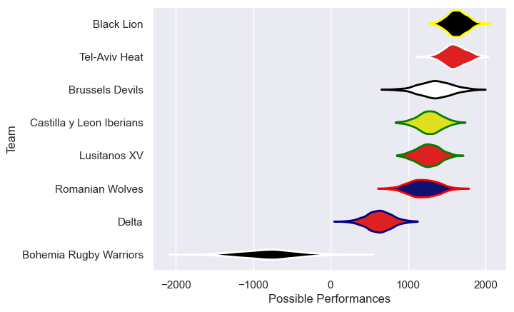
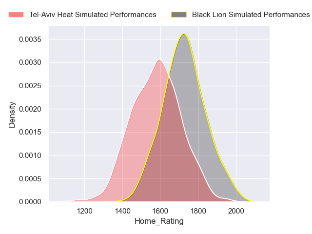
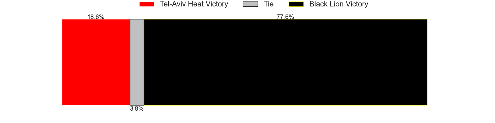
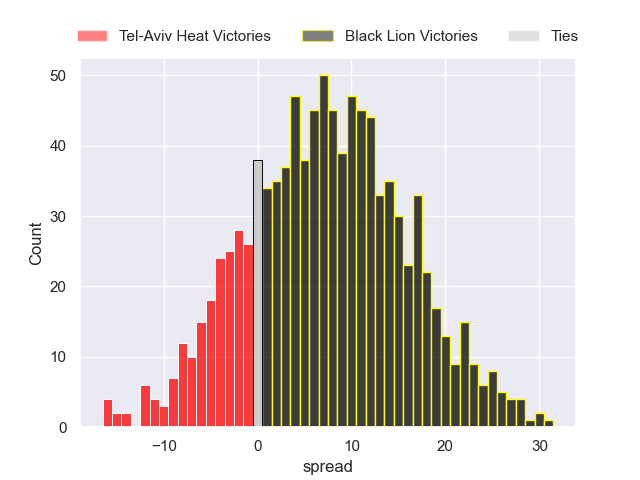

---  
title: "Rugby Europe Super Cup 2023 Status"  
date: 2023-12-18 6:00:00 -0500  
categories: model review projection  
layout: article  
aside:  
    toc: true  
---
# Current Team Rankings

# Standings

## Current Standings

| Club                     |   Played |   Wins |   Point Differential |   Losing Bonus Points |   Try Bonus Points |   Competition Points |
|:-------------------------|---------:|-------:|---------------------:|----------------------:|-------------------:|---------------------:|
| Black Lion               |        4 |      4 |                   85 |                     0 |                nan |                   16 |
| Tel-Aviv Heat            |        4 |      3 |                   49 |                     1 |                nan |                   13 |
| Romanian Wolves          |        4 |      3 |                   94 |                     0 |                nan |                   12 |
| Brussels Devils          |        4 |      3 |                   79 |                     0 |                nan |                   12 |
| Lusitanos XV             |        5 |      2 |                   27 |                     1 |                nan |                    9 |
| Delta                    |        5 |      2 |                   26 |                     0 |                nan |                    8 |
| Castilla y Leon Iberians |        5 |      1 |                  -98 |                     0 |                nan |                    4 |
| Bohemia Rugby Warriors   |        5 |      0 |                 -262 |                     0 |                nan |                    0 |

## Projected Remaining Table

| Club          |   Matches Remaining |   Wins |   Point Differential |   Losing Bonus Points |   Try Bonus Points |   Competition Points |
|:--------------|--------------------:|-------:|---------------------:|----------------------:|-------------------:|---------------------:|
| Black Lion    |                   1 |    0.8 |              7.30681 |                   0.2 |                0.8 |                  4.1 |
| Tel-Aviv Heat |                   1 |    0.2 |             -7.30681 |                   0.3 |                0.2 |                  1.3 |

## Projected Total Table

| Club                     |   Total Matches |   Wins |   Point Differential |   Losing Bonus Points |   Try Bonus Points |   Competition Points |
|:-------------------------|----------------:|-------:|---------------------:|----------------------:|-------------------:|---------------------:|
| Black Lion               |               5 |    4.8 |              92.3068 |                   0.2 |                0.8 |                 20.1 |
| Tel-Aviv Heat            |               5 |    3.2 |              41.6932 |                   1.3 |                0.2 |                 14.3 |
| Romanian Wolves          |               4 |    3   |              94      |                   0   |                0   |                 12   |
| Brussels Devils          |               4 |    3   |              79      |                   0   |                0   |                 12   |
| Lusitanos XV             |               5 |    2   |              27      |                   1   |                0   |                  9   |
| Delta                    |               5 |    2   |              26      |                   0   |                0   |                  8   |
| Castilla y Leon Iberians |               5 |    1   |             -98      |                   0   |                0   |                  4   |
| Bohemia Rugby Warriors   |               5 |    0   |            -262      |                   0   |                0   |                  0   |

# Completed Match Review

| Model | Percent Correct Predictions | Spread Error |
| ------ | ------ | ------ |
| Club Level | 61.1% | 38.4 |
| Player Level: Lineup | nan% | nan |
| Player Level: Minutes | nan% | nan |

# Future Predictions

## Week 6

### Black Lion V Tel-Aviv Heat on 2023/12/22

Average Margin: Black Lion by 7.3

