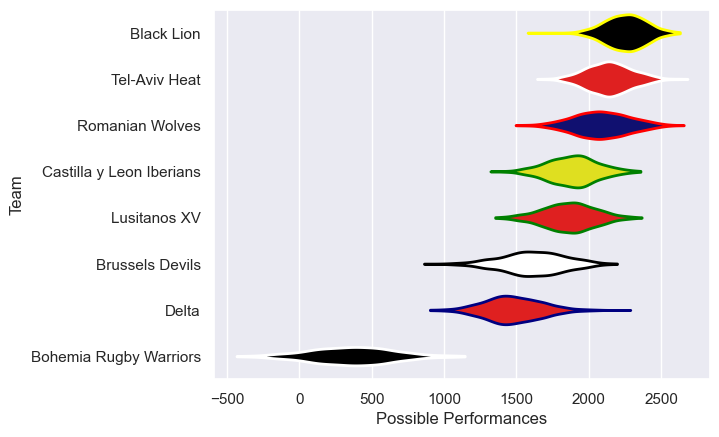

---  
title: "Rugby Europe Super Cup 2023 Status"  
date: 2025-07-28 6:00:00 -0500  
categories: model review projection  
layout: article  
aside:  
    toc: true  
---
# Current Team Rankings

# Standings

## Current Standings

| Club                     |   Played |   Wins |   Point Differential |   Losing Bonus Points |   Try Bonus Points |   Competition Points |
|:-------------------------|---------:|-------:|---------------------:|----------------------:|-------------------:|---------------------:|
| Black Lion               |        5 |      5 |                   95 |                     0 |                  3 |                   23 |
| Romanian Wolves          |        5 |      4 |                  149 |                     0 |                  4 |                   20 |
| Tel-Aviv Heat            |        5 |      3 |                   39 |                     1 |                  3 |                   16 |
| Brussels Devils          |        5 |      3 |                   24 |                     0 |                  4 |                   16 |
| Lusitanos XV             |        5 |      2 |                   27 |                     1 |                  2 |                   11 |
| Delta                    |        5 |      2 |                   26 |                     0 |                  2 |                   10 |
| Castilla y Leon Iberians |        5 |      1 |                  -98 |                     0 |                    |                    4 |
| Bohemia Rugby Warriors   |        5 |      0 |                 -262 |                     0 |                    |                    0 |

# Completed Match Review

| Model | Percent Correct Predictions | Spread Error |
| ------ | ------ | ------ |
| Club Level | 70.0% | 28.2 |
| Player Level: Lineup | nan% | nan |
| Player Level: Minutes | nan% | nan |

