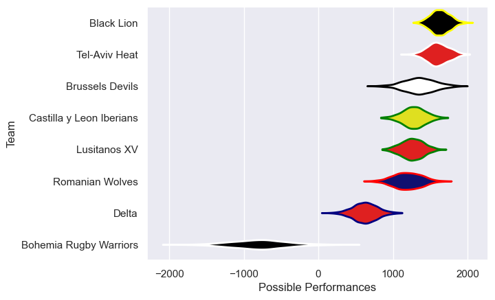
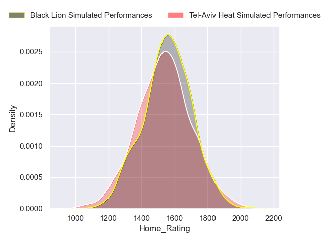
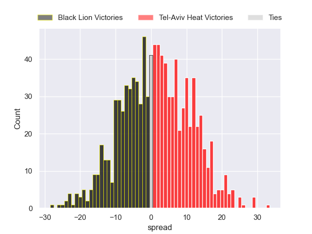
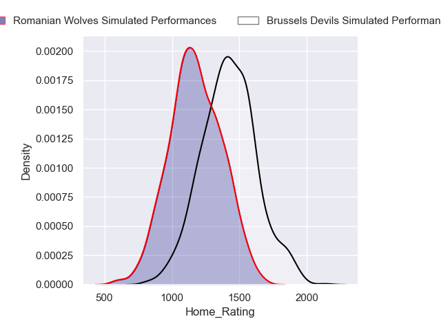
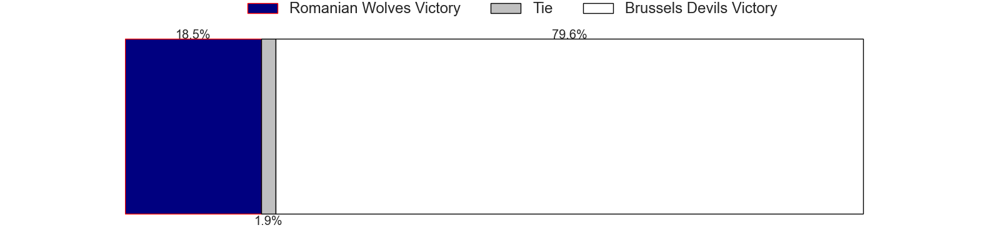
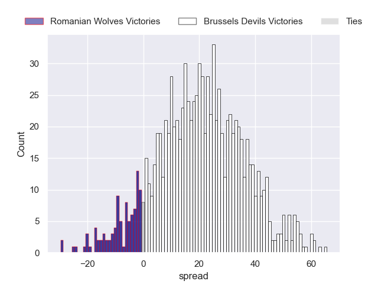
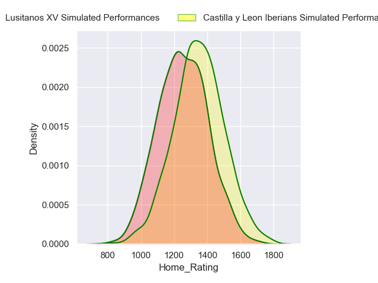
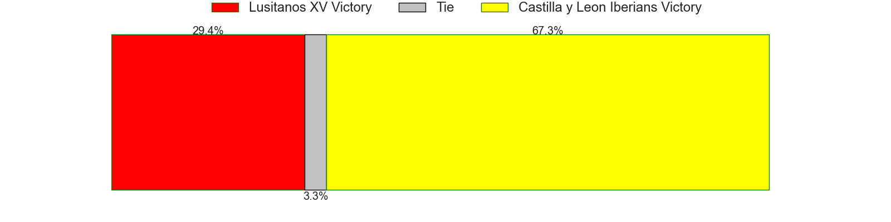
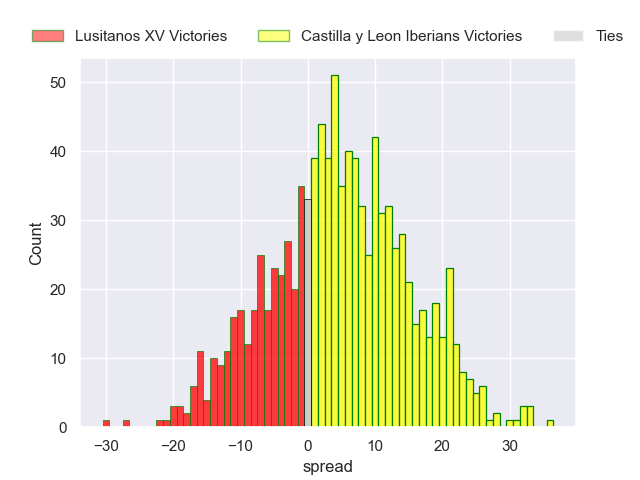

---  
title: "Rugby Europe Super Cup 2023 Status"  
date: 2023-11-16 6:00:00 -0500  
categories: model review projection  
layout: article  
aside:  
    toc: true  
---
# Current Team Rankings

# Standings

## Current Standings

| Club                     |   Played |   Wins |   Point Differential |   Losing Bonus Points |   Try Bonus Points |   Competition Points |
|:-------------------------|---------:|-------:|---------------------:|----------------------:|-------------------:|---------------------:|
| Romanian Wolves          |        2 |      2 |                   95 |                     0 |                nan |                    8 |
| Brussels Devils          |        2 |      2 |                   62 |                     0 |                nan |                    8 |
| Black Lion               |        2 |      2 |                   42 |                     0 |                nan |                    8 |
| Tel-Aviv Heat            |        2 |      2 |                   26 |                     0 |                nan |                    8 |
| Delta                    |        3 |      1 |                   19 |                     0 |                nan |                    4 |
| Lusitanos XV             |        2 |      0 |                  -30 |                     0 |                nan |                    0 |
| Castilla y Leon Iberians |        2 |      0 |                  -38 |                     0 |                nan |                    0 |
| Bohemia Rugby Warriors   |        3 |      0 |                 -176 |                     0 |                nan |                    0 |

## Projected Remaining Table

| Club                     |   Matches Remaining |   Wins |   Point Differential |   Losing Bonus Points |   Try Bonus Points |   Competition Points |
|:-------------------------|--------------------:|-------:|---------------------:|----------------------:|-------------------:|---------------------:|
| Brussels Devils          |                   1 |    0.8 |             12.3726  |                   0.1 |                0.8 |                  4.1 |
| Castilla y Leon Iberians |                   1 |    0.6 |              3.79566 |                   0.2 |                0.6 |                  3.3 |
| Tel-Aviv Heat            |                   1 |    0.6 |              1.46464 |                   0.2 |                0.5 |                  3   |
| Black Lion               |                   1 |    0.4 |             -1.46464 |                   0.3 |                0.4 |                  2.4 |
| Lusitanos XV             |                   1 |    0.4 |             -3.79566 |                   0.2 |                0.4 |                  2.1 |
| Romanian Wolves          |                   1 |    0.2 |            -12.3726  |                   0.2 |                0.2 |                  1.1 |

## Projected Total Table

| Club                     |   Total Matches |   Wins |   Point Differential |   Losing Bonus Points |   Try Bonus Points |   Competition Points |
|:-------------------------|----------------:|-------:|---------------------:|----------------------:|-------------------:|---------------------:|
| Brussels Devils          |               3 |    2.8 |              74.3726 |                   0.1 |                0.8 |                 12.1 |
| Tel-Aviv Heat            |               3 |    2.6 |              27.4646 |                   0.2 |                0.5 |                 11   |
| Black Lion               |               3 |    2.4 |              40.5354 |                   0.3 |                0.4 |                 10.4 |
| Romanian Wolves          |               3 |    2.2 |              82.6274 |                   0.2 |                0.2 |                  9.1 |
| Delta                    |               3 |    1   |              19      |                   0   |                0   |                  4   |
| Castilla y Leon Iberians |               3 |    0.6 |             -34.2043 |                   0.2 |                0.6 |                  3.3 |
| Lusitanos XV             |               3 |    0.4 |             -33.7957 |                   0.2 |                0.4 |                  2.1 |
| Bohemia Rugby Warriors   |               3 |    0   |            -176      |                   0   |                0   |                  0   |

# Completed Match Review

| Model | Percent Correct Predictions | Spread Error |
| ------ | ------ | ------ |
| Club Level | 44.4% | 42.0 |
| Player Level: Lineup | nan% | nan |
| Player Level: Minutes | nan% | nan |

# Future Predictions

## Week 4

### Tel-Aviv Heat V Black Lion on 2023/11/18

Average Margin: Tel-Aviv Heat by 1.5

### Brussels Devils V Romanian Wolves on 2023/11/18

Average Margin: Brussels Devils by 12.4

### Castilla y Leon Iberians V Lusitanos XV on 2023/11/19

Average Margin: Castilla y Leon Iberians by 3.8

