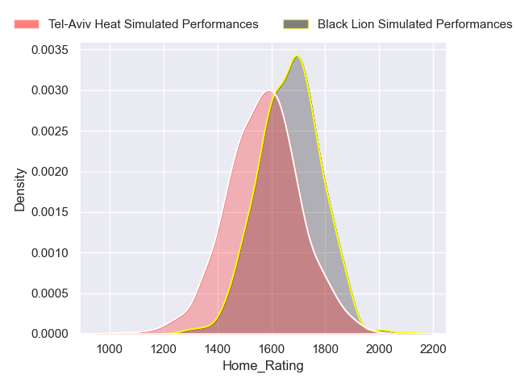
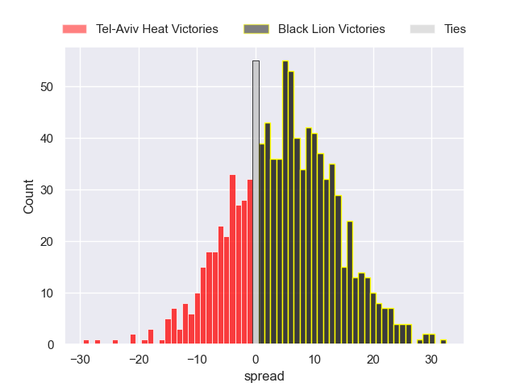
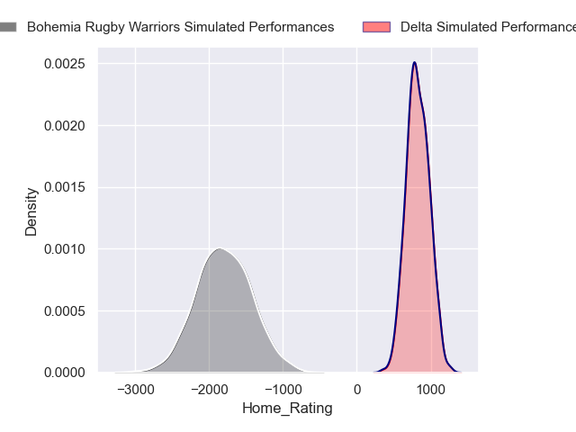
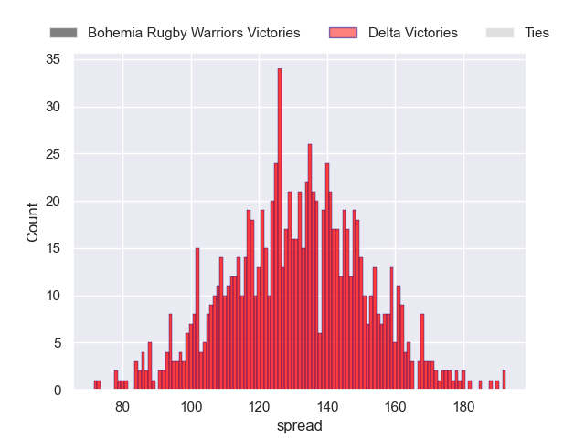
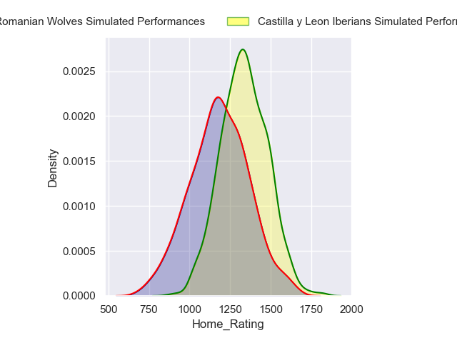
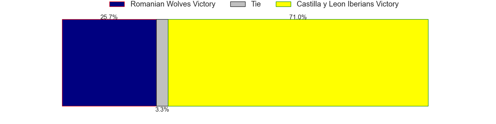
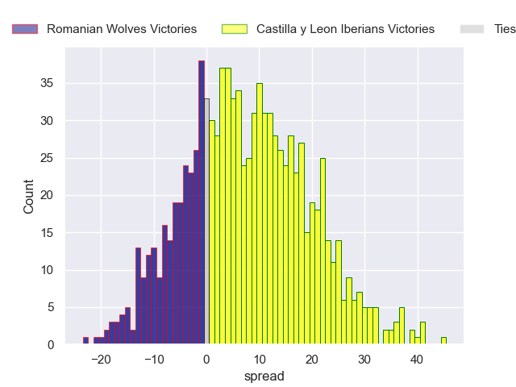
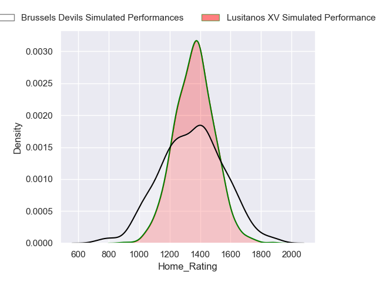
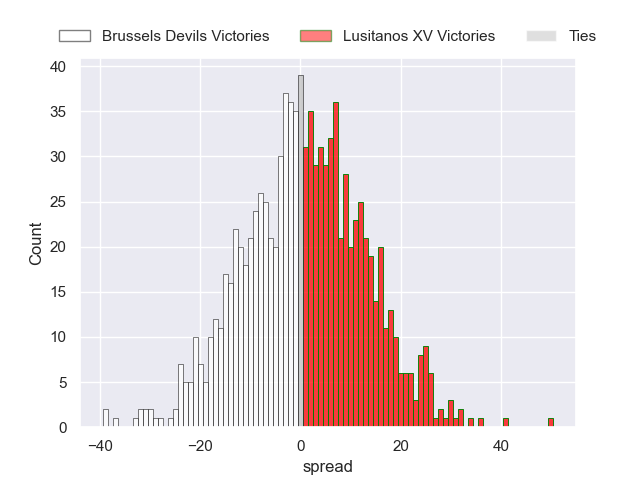

---  
title: "Rugby Europe Super Cup 2023 Status"  
date: 2023-12-11 6:00:00 -0500  
categories: model review projection  
layout: article  
aside:  
    toc: true  
---
# Current Team Rankings

# Standings

## Current Standings

| Club                     |   Played |   Wins |   Point Differential |   Losing Bonus Points |   Try Bonus Points |   Competition Points |
|:-------------------------|---------:|-------:|---------------------:|----------------------:|-------------------:|---------------------:|
| Black Lion               |        4 |      4 |                   85 |                     0 |                nan |                   16 |
| Tel-Aviv Heat            |        4 |      3 |                   49 |                     1 |                nan |                   13 |
| Brussels Devils          |        3 |      3 |                   96 |                     0 |                nan |                   12 |
| Romanian Wolves          |        3 |      2 |                   70 |                     0 |                nan |                    8 |
| Lusitanos XV             |        4 |      1 |                   10 |                     1 |                nan |                    5 |
| Delta                    |        4 |      1 |                  -26 |                     0 |                nan |                    4 |
| Castilla y Leon Iberians |        4 |      1 |                  -74 |                     0 |                nan |                    4 |
| Bohemia Rugby Warriors   |        4 |      0 |                 -210 |                     0 |                nan |                    0 |

## Projected Remaining Table

| Club                     |   Matches Remaining |   Wins |   Point Differential |   Losing Bonus Points |   Try Bonus Points |   Competition Points |
|:-------------------------|--------------------:|-------:|---------------------:|----------------------:|-------------------:|---------------------:|
| Delta                    |                   1 |    1   |           131.144    |                   0   |                1   |                  5   |
| Castilla y Leon Iberians |                   1 |    0.7 |             7.6434   |                   0.2 |                0.7 |                  3.8 |
| Black Lion               |                   1 |    0.7 |             4.82191  |                   0.2 |                0.7 |                  3.7 |
| Lusitanos XV             |                   1 |    0.5 |             0.790976 |                   0.2 |                0.5 |                  2.8 |
| Brussels Devils          |                   1 |    0.5 |            -0.790976 |                   0.2 |                0.4 |                  2.6 |
| Tel-Aviv Heat            |                   1 |    0.3 |            -4.82191  |                   0.3 |                0.3 |                  1.7 |
| Romanian Wolves          |                   1 |    0.3 |            -7.6434   |                   0.2 |                0.3 |                  1.6 |
| Bohemia Rugby Warriors   |                   1 |    0   |          -131.144    |                   0   |                0   |                  0   |

## Projected Total Table

| Club                     |   Total Matches |   Wins |   Point Differential |   Losing Bonus Points |   Try Bonus Points |   Competition Points |
|:-------------------------|----------------:|-------:|---------------------:|----------------------:|-------------------:|---------------------:|
| Black Lion               |               5 |    4.7 |              89.8219 |                   0.2 |                0.7 |                 19.7 |
| Tel-Aviv Heat            |               5 |    3.3 |              44.1781 |                   1.3 |                0.3 |                 14.7 |
| Brussels Devils          |               4 |    3.5 |              95.209  |                   0.2 |                0.4 |                 14.6 |
| Romanian Wolves          |               4 |    2.3 |              62.3566 |                   0.2 |                0.3 |                  9.6 |
| Delta                    |               5 |    2   |             105.144  |                   0   |                1   |                  9   |
| Lusitanos XV             |               5 |    1.5 |              10.791  |                   1.2 |                0.5 |                  7.8 |
| Castilla y Leon Iberians |               5 |    1.7 |             -66.3566 |                   0.2 |                0.7 |                  7.8 |
| Bohemia Rugby Warriors   |               5 |    0   |            -341.144  |                   0   |                0   |                  0   |

# Completed Match Review

| Model | Percent Correct Predictions | Spread Error |
| ------ | ------ | ------ |
| Club Level | 60.0% | 37.2 |
| Player Level: Lineup | nan% | nan |
| Player Level: Minutes | nan% | nan |

# Future Predictions

## Week 5

### Black Lion V Tel-Aviv Heat on 2023/12/16

Average Margin: Black Lion by 4.8

### Delta V Bohemia Rugby Warriors on 2023/12/16

Average Margin: Delta by 131.1

### Castilla y Leon Iberians V Romanian Wolves on 2023/12/16

Average Margin: Castilla y Leon Iberians by 7.6

### Lusitanos XV V Brussels Devils on 2023/12/16

Average Margin: Lusitanos XV by 0.8

