---  
title: "Rugby Europe Super Cup 2023 Status"  
date: 2023-11-01 6:00:00 -0500  
categories: model review projection  
layout: article  
aside:  
    toc: true  
---
# Current Team Rankings

# Standings

## Projected Total Table

| Club                     |   Total Matches |   Wins |   Point Differential |   Losing Bonus Points |   Try Bonus Points |   Competition Points |
|:-------------------------|----------------:|-------:|---------------------:|----------------------:|-------------------:|---------------------:|
| Bohemia Rugby Warriors   |               3 |    3   |                126   |                   0   |                3   |                 15   |
| Black Lion               |               3 |    2   |                 15.8 |                   0.5 |                1.9 |                 10.6 |
| Brussels Devils          |               3 |    1.7 |                  0.4 |                   0.2 |                1.6 |                  8.7 |
| Tel-Aviv Heat            |               3 |    1.5 |                 -0.7 |                   0.7 |                1.4 |                  7.9 |
| Castilla y Leon Iberians |               3 |    1.5 |                 -2   |                   0.5 |                1.4 |                  7.7 |
| Lusitanos XV             |               3 |    1   |                -13.1 |                   0.7 |                1   |                  5.8 |
| Delta                    |               3 |    0.9 |                -51.2 |                   0.3 |                0.8 |                  4.6 |
| Romanian Wolves          |               3 |    0.4 |                -74.7 |                   0.3 |                0.4 |                  2.1 |

# Future Predictions

## Week 1

### Black Lion V Castilla y Leon Iberians on 2023/11/04

Average Margin: Black Lion by 9.4

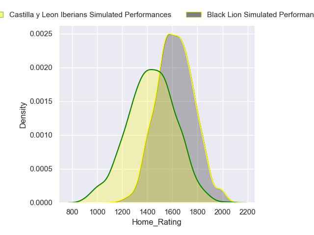
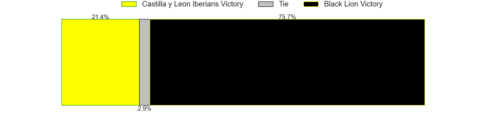
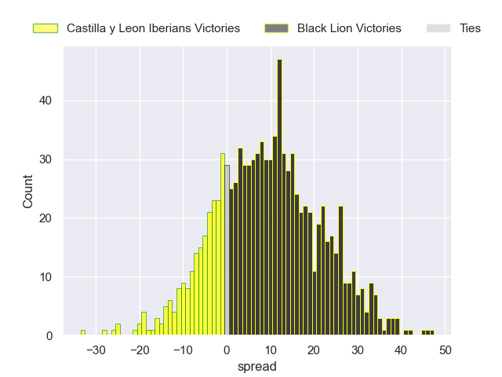

### Lusitanos XV V Tel-Aviv Heat on 2023/11/04

Average Margin: Tel-Aviv Heat by 1.5

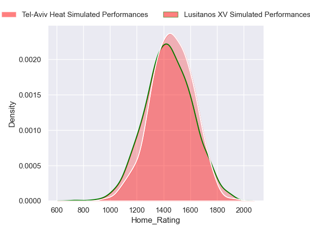

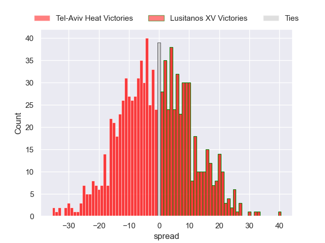

### Brussels Devils V Delta on 2023/11/04

Average Margin: Brussels Devils by 15.0

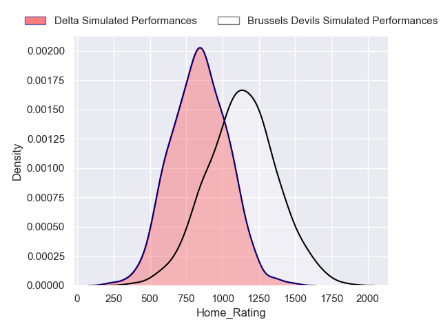
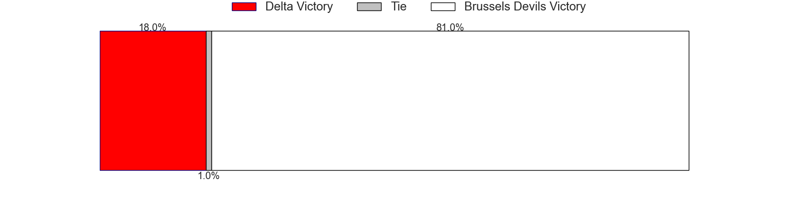
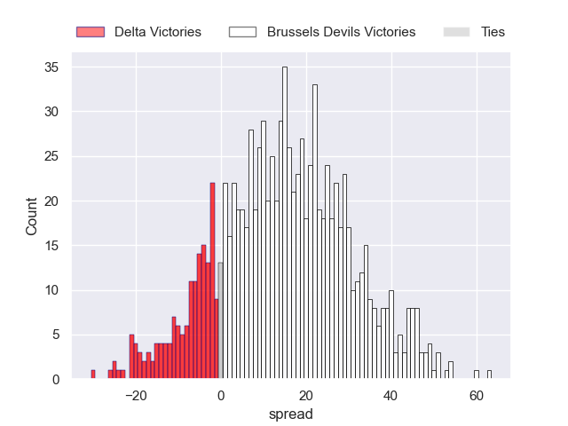

### Romanian Wolves V Bohemia Rugby Warriors on 2023/11/05

Average Margin: Bohemia Rugby Warriors by 45.9

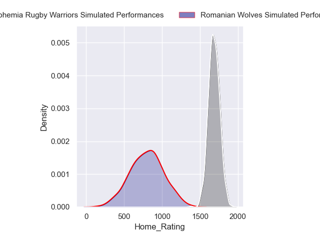

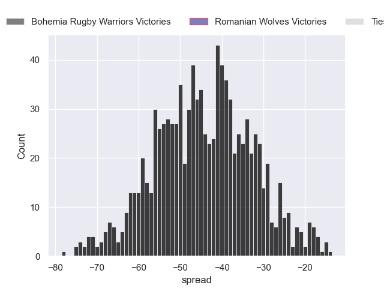

## Week 2

### Delta V Romanian Wolves on 2023/11/10

Average Margin: Delta by 8.9

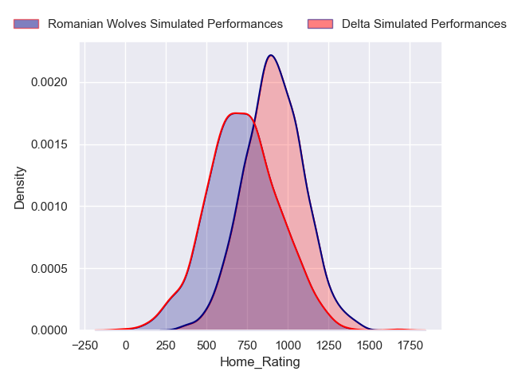
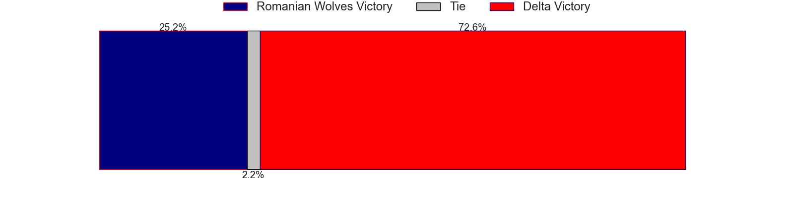
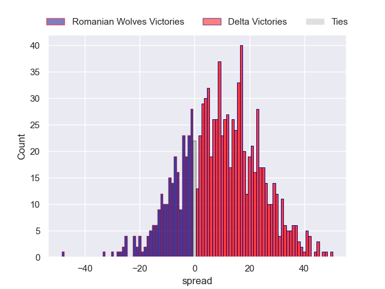

### Bohemia Rugby Warriors V Brussels Devils on 2023/11/11

Average Margin: Bohemia Rugby Warriors by 35.0

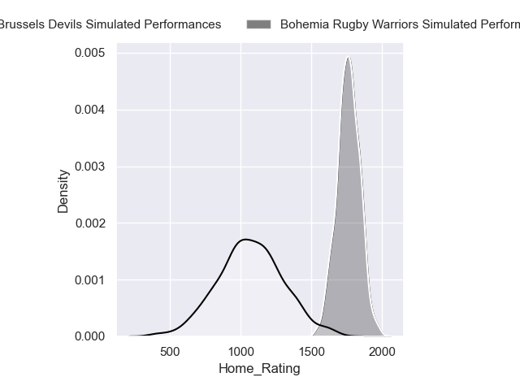

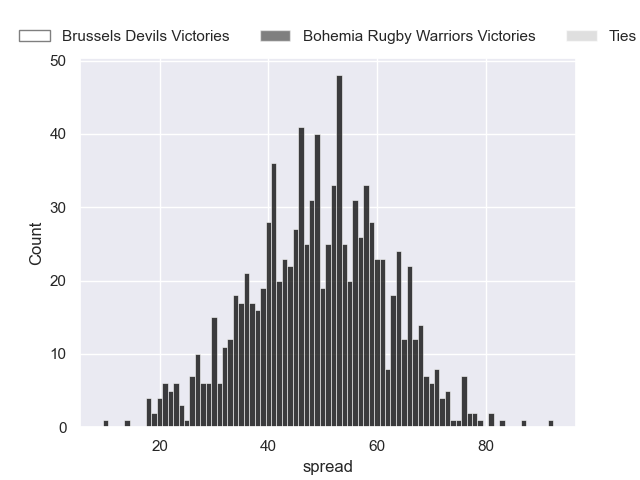

### Castilla y Leon Iberians V Tel-Aviv Heat on 2023/11/11

Average Margin: Castilla y Leon Iberians by 1.3

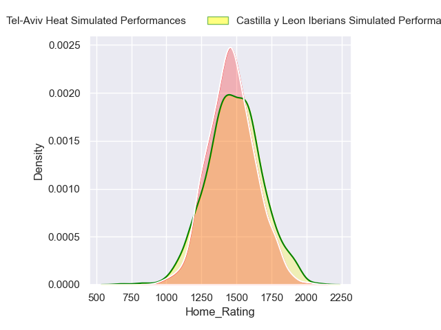

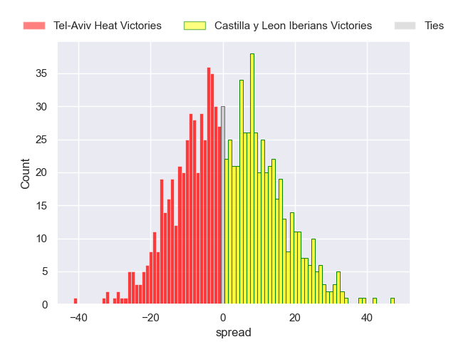

### Lusitanos XV V Black Lion on 2023/11/11

Average Margin: Black Lion by 5.7

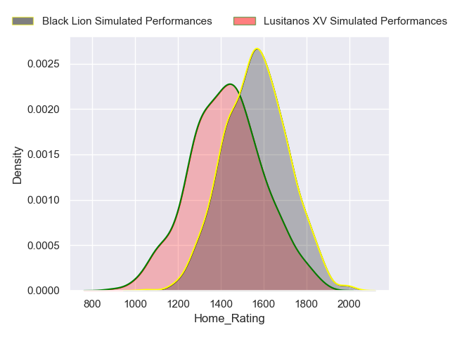

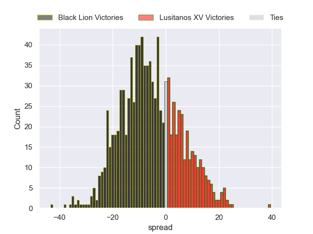

## Week 3

### Bohemia Rugby Warriors V Delta on 2023/11/16

Average Margin: Bohemia Rugby Warriors by 45.6

### Castilla y Leon Iberians V Lusitanos XV on 2023/11/18

Average Margin: Castilla y Leon Iberians by 6.1

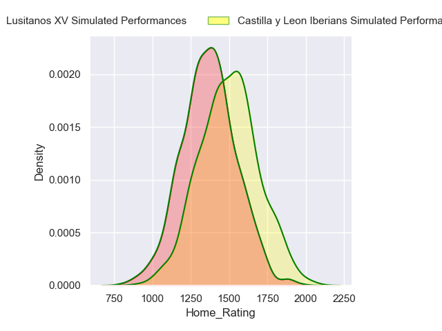
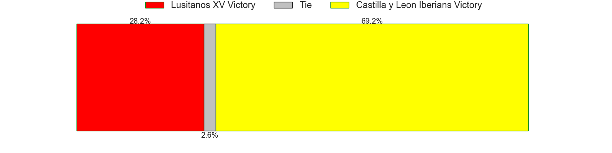
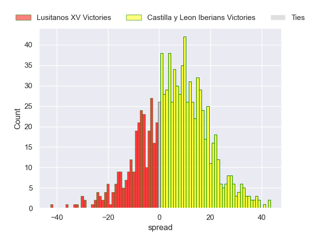

### Brussels Devils V Romanian Wolves on 2023/11/18

Average Margin: Brussels Devils by 20.4

### Tel-Aviv Heat V Black Lion on 2023/11/18

Average Margin: Black Lion by 1.0

