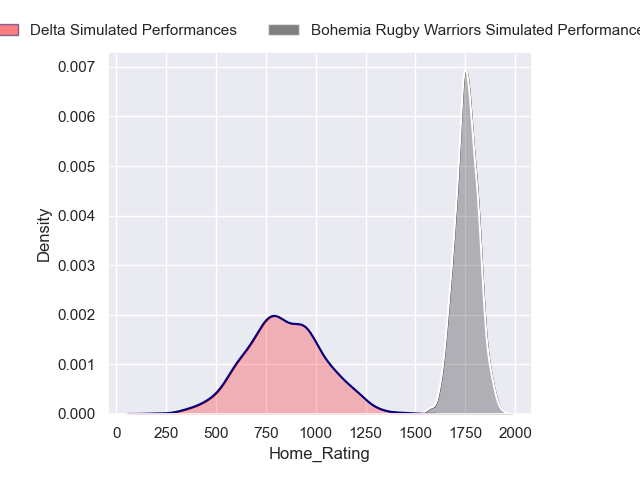
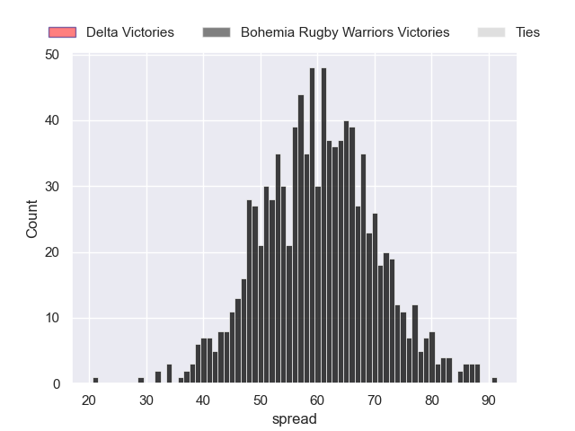

---  
title: "Rugby Europe Super Cup 2023 Status"  
date: 2023-11-13 6:00:00 -0500  
categories: model review projection  
layout: article  
aside:  
    toc: true  
---
# Current Team Rankings

# Standings

## Current Standings

| Club                     |   Played |   Wins |   Point Differential |   Losing Bonus Points |   Try Bonus Points |   Competition Points |
|:-------------------------|---------:|-------:|---------------------:|----------------------:|-------------------:|---------------------:|
| Romanian Wolves          |        2 |      2 |                   95 |                     0 |                nan |                    8 |
| Brussels Devils          |        2 |      2 |                   62 |                     0 |                nan |                    8 |
| Black Lion               |        2 |      2 |                   42 |                     0 |                nan |                    8 |
| Tel-Aviv Heat            |        2 |      2 |                   26 |                     0 |                nan |                    8 |
| Lusitanos XV             |        2 |      0 |                  -30 |                     0 |                nan |                    0 |
| Castilla y Leon Iberians |        2 |      0 |                  -38 |                     0 |                nan |                    0 |
| Delta                    |        2 |      0 |                  -55 |                     0 |                nan |                    0 |
| Bohemia Rugby Warriors   |        2 |      0 |                 -102 |                     0 |                nan |                    0 |

## Projected Remaining Table

| Club                     |   Matches Remaining |   Wins |   Point Differential |   Losing Bonus Points |   Try Bonus Points |   Competition Points |
|:-------------------------|--------------------:|-------:|---------------------:|----------------------:|-------------------:|---------------------:|
| Delta                    |                   1 |    1   |                 67   |                   0   |                1   |                  5   |
| Brussels Devils          |                   1 |    0.8 |                 11.9 |                   0.1 |                0.8 |                  4.1 |
| Castilla y Leon Iberians |                   1 |    0.7 |                  4.5 |                   0.2 |                0.7 |                  3.6 |
| Tel-Aviv Heat            |                   1 |    0.6 |                  1.9 |                   0.2 |                0.5 |                  3.1 |
| Black Lion               |                   1 |    0.4 |                 -1.9 |                   0.3 |                0.4 |                  2.4 |
| Lusitanos XV             |                   1 |    0.3 |                 -4.5 |                   0.3 |                0.3 |                  1.8 |
| Romanian Wolves          |                   1 |    0.2 |                -11.9 |                   0.1 |                0.2 |                  1.1 |
| Bohemia Rugby Warriors   |                   1 |    0   |                -67   |                   0   |                0   |                  0   |

## Projected Total Table

| Club                     |   Total Matches |   Wins |   Point Differential |   Losing Bonus Points |   Try Bonus Points |   Competition Points |
|:-------------------------|----------------:|-------:|---------------------:|----------------------:|-------------------:|---------------------:|
| Brussels Devils          |               3 |    2.8 |                 73.9 |                   0.1 |                0.8 |                 12.1 |
| Tel-Aviv Heat            |               3 |    2.6 |                 27.9 |                   0.2 |                0.5 |                 11.1 |
| Black Lion               |               3 |    2.4 |                 40.1 |                   0.3 |                0.4 |                 10.4 |
| Romanian Wolves          |               3 |    2.2 |                 83.1 |                   0.1 |                0.2 |                  9.1 |
| Delta                    |               3 |    1   |                 12   |                   0   |                1   |                  5   |
| Castilla y Leon Iberians |               3 |    0.7 |                -33.5 |                   0.2 |                0.7 |                  3.6 |
| Lusitanos XV             |               3 |    0.3 |                -34.5 |                   0.3 |                0.3 |                  1.8 |
| Bohemia Rugby Warriors   |               3 |    0   |               -169   |                   0   |                0   |                  0   |

# Completed Match Review

| Model | Percent Correct Predictions | Spread Error |
| ------ | ------ | ------ |
| Club Level | 50.0% | 33.3 |
| Player Level: Lineup | nan% | nan |
| Player Level: Minutes | nan% | nan |

# Future Predictions

## Week 3

### Bohemia Rugby Warriors V Delta on 2023/11/16

Average Margin: Delta by 67.5

### Tel-Aviv Heat V Black Lion on 2023/11/18

Average Margin: Tel-Aviv Heat by 1.9

### Brussels Devils V Romanian Wolves on 2023/11/18

Average Margin: Brussels Devils by 12.2

### Castilla y Leon Iberians V Lusitanos XV on 2023/11/19

Average Margin: Castilla y Leon Iberians by 4.7

