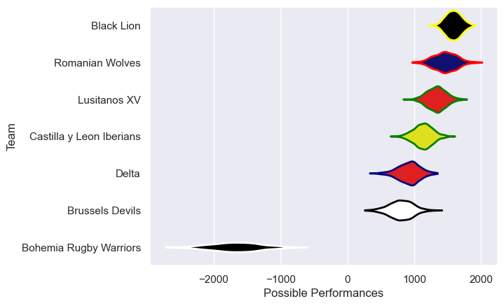
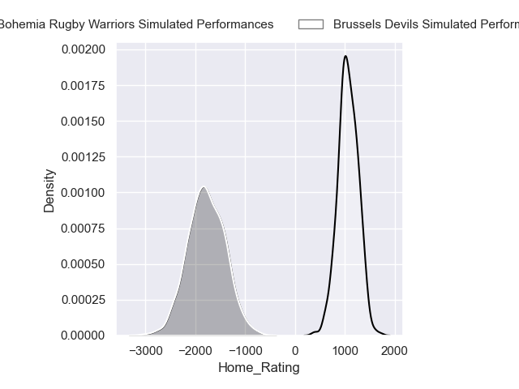
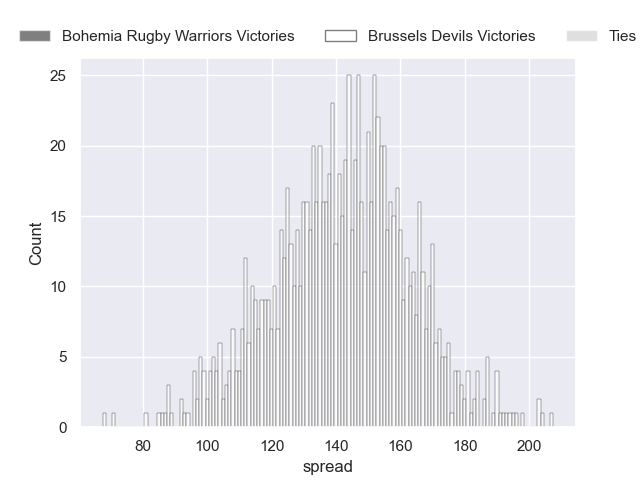
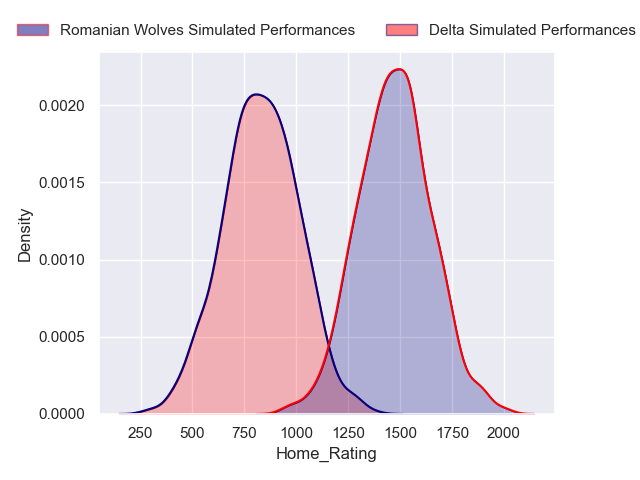
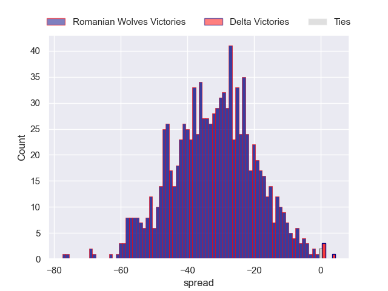
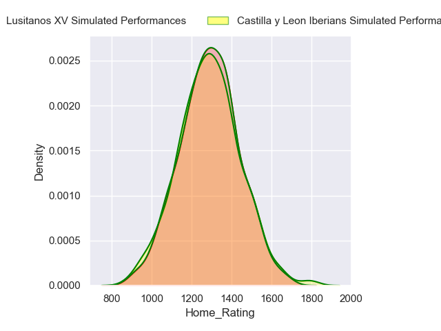
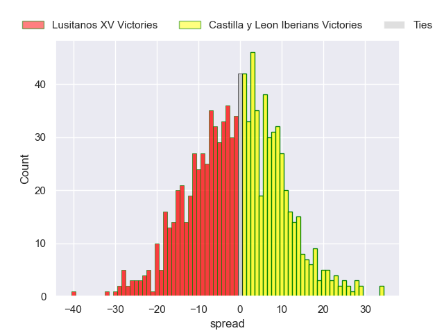

---  
title: "Rugby Europe Super Cup 2024 Status"  
date: 2024-10-18 6:00:00 -0500  
categories: model review projection  
layout: article  
aside:  
    toc: true  
---
# Current Team Rankings

# Standings

## Current Standings

| Club                     |   Played |   Wins |   Point Differential |   Losing Bonus Points |   Try Bonus Points |   Competition Points |
|:-------------------------|---------:|-------:|---------------------:|----------------------:|-------------------:|---------------------:|
| Black Lion               |        4 |      4 |                  137 |                     0 |                nan |                   16 |
| Lusitanos XV             |        3 |      1 |                  -42 |                     0 |                nan |                    4 |
| Castilla y Leon Iberians |        3 |      0 |                  -95 |                     0 |                nan |                    0 |

## Projected Remaining Table

| Club                     |   Matches Remaining |   Wins |   Point Differential |   Losing Bonus Points |   Try Bonus Points |   Competition Points |
|:-------------------------|--------------------:|-------:|---------------------:|----------------------:|-------------------:|---------------------:|
| Brussels Devils          |                   1 |    1   |            143.001   |                   0   |                0.9 |                  4.9 |
| Romanian Wolves          |                   1 |    1   |             32.8144  |                   0   |                0.9 |                  4.9 |
| Lusitanos XV             |                   1 |    0.7 |              3.94871 |                   0.2 |                0.7 |                  3.6 |
| Castilla y Leon Iberians |                   1 |    0.3 |             -3.94871 |                   0.3 |                0.2 |                  1.9 |
| Delta                    |                   1 |    0   |            -32.8144  |                   0   |                0.2 |                  0.2 |
| Bohemia Rugby Warriors   |                   1 |    0   |           -143.001   |                   0   |                0.1 |                  0.1 |

## Projected Total Table

| Club                     |   Total Matches |   Wins |   Point Differential |   Losing Bonus Points |   Try Bonus Points |   Competition Points |
|:-------------------------|----------------:|-------:|---------------------:|----------------------:|-------------------:|---------------------:|
| Black Lion               |               4 |    4   |             137      |                   0   |                0   |                 16   |
| Lusitanos XV             |               4 |    1.7 |             -38.0513 |                   0.2 |                0.7 |                  7.6 |
| Brussels Devils          |               1 |    1   |             143.001  |                   0   |                0.9 |                  4.9 |
| Romanian Wolves          |               1 |    1   |              32.8144 |                   0   |                0.9 |                  4.9 |
| Castilla y Leon Iberians |               4 |    0.3 |             -98.9487 |                   0.3 |                0.2 |                  1.9 |
| Delta                    |               1 |    0   |             -32.8144 |                   0   |                0.2 |                  0.2 |
| Bohemia Rugby Warriors   |               1 |    0   |            -143.001  |                   0   |                0.1 |                  0.1 |

# Completed Match Review

| Model | Percent Correct Predictions | Spread Error |
| ------ | ------ | ------ |
| Club Level | 100.0% | 16.1 |
| Player Level: Lineup | nan% | nan |
| Player Level: Minutes | nan% | nan |

# Future Predictions

## Week 5

### Brussels Devils V Bohemia Rugby Warriors on 2024/10/19

Average Margin: Brussels Devils by 143.0

Average Scoreline: 95--48

### Delta V Romanian Wolves on 2024/10/19

Average Margin: Romanian Wolves by 32.8

Average Scoreline: 41-8

### Castilla y Leon Iberians V Lusitanos XV on 2024/10/20

Average Margin: Lusitanos XV by 3.9

Average Scoreline: 27-23

