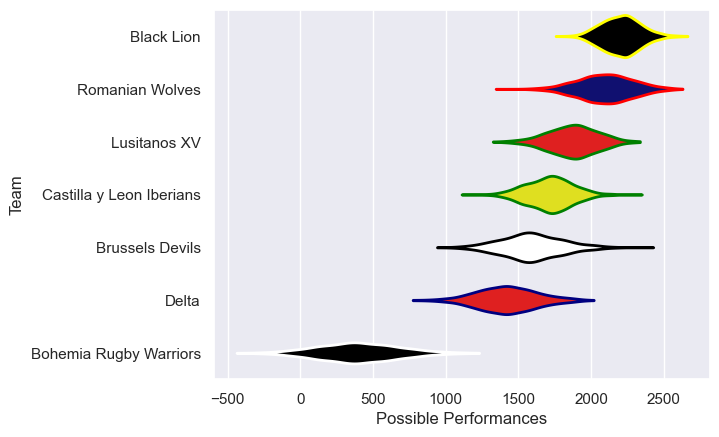

---  
title: "Rugby Europe Super Cup 2024 Status"  
date: 2025-07-28 6:00:00 -0500  
categories: model review projection  
layout: article  
aside:  
    toc: true  
---
# Current Team Rankings

# Standings

## Current Standings

| Club                     |   Played |   Wins |   Point Differential |   Losing Bonus Points | Try Bonus Points   |   Competition Points |
|:-------------------------|---------:|-------:|---------------------:|----------------------:|:-------------------|---------------------:|
| Black Lion               |        4 |      4 |                  137 |                     0 |                    |                   16 |
| Lusitanos XV             |        4 |      2 |                  -33 |                     0 |                    |                    8 |
| Romanian Wolves          |        1 |      1 |                   22 |                     0 |                    |                    4 |
| Brussels Devils          |        1 |      1 |                    4 |                     0 |                    |                    4 |
| Bohemia Rugby Warriors   |        1 |      0 |                   -4 |                     1 |                    |                    1 |
| Delta                    |        1 |      0 |                  -22 |                     0 |                    |                    0 |
| Castilla y Leon Iberians |        4 |      0 |                 -104 |                     0 |                    |                    0 |

# Completed Match Review

| Model | Percent Correct Predictions | Spread Error |
| ------ | ------ | ------ |
| Club Level | 100.0% | 19.3 |
| Player Level: Lineup | nan% | nan |
| Player Level: Minutes | nan% | nan |

