---  
title: "Rugby Europe Super Cup 2024 Status"  
date: 2024-09-09 6:00:00 -0500  
categories: model review projection  
layout: article  
aside:  
    toc: true  
---
# Current Team Rankings

# Standings

## Current Standings

| Club                     |   Played |   Wins |   Point Differential |   Losing Bonus Points |   Try Bonus Points |   Competition Points |
|:-------------------------|---------:|-------:|---------------------:|----------------------:|-------------------:|---------------------:|
| Lusitanos XV             |        1 |      1 |                   18 |                     0 |                nan |                    4 |
| Castilla y Leon Iberians |        1 |      0 |                  -18 |                     0 |                nan |                    0 |

## Projected Remaining Table

| Club                     |   Matches Remaining |   Wins |   Point Differential |   Losing Bonus Points |   Try Bonus Points |   Competition Points |
|:-------------------------|--------------------:|-------:|---------------------:|----------------------:|-------------------:|---------------------:|
| Black Lion               |                   4 |    3.7 |              60.9332 |                   0.3 |                2.7 |                 17.6 |
| Romanian Wolves          |                   3 |    3   |             226.323  |                   0   |                2.6 |                 14.5 |
| Brussels Devils          |                   3 |    1.8 |             124.453  |                   0.2 |                1.7 |                  9   |
| Delta                    |                   3 |    1.3 |              82.8389 |                   0.2 |                1.2 |                  6.4 |
| Lusitanos XV             |                   3 |    1   |             -16.1905 |                   0.6 |                0.8 |                  5.4 |
| Castilla y Leon Iberians |                   3 |    0.4 |             -44.7427 |                   0.4 |                0.6 |                  2.4 |
| Bohemia Rugby Warriors   |                   3 |    0   |            -433.615  |                   0   |                0.2 |                  0.2 |

## Projected Total Table

| Club                     |   Total Matches |   Wins |   Point Differential |   Losing Bonus Points |   Try Bonus Points |   Competition Points |
|:-------------------------|----------------:|-------:|---------------------:|----------------------:|-------------------:|---------------------:|
| Black Lion               |               4 |    3.7 |             60.9332  |                   0.3 |                2.7 |                 17.6 |
| Romanian Wolves          |               3 |    3   |            226.323   |                   0   |                2.6 |                 14.5 |
| Lusitanos XV             |               4 |    2   |              1.80952 |                   0.6 |                0.8 |                  9.4 |
| Brussels Devils          |               3 |    1.8 |            124.453   |                   0.2 |                1.7 |                  9   |
| Delta                    |               3 |    1.3 |             82.8389  |                   0.2 |                1.2 |                  6.4 |
| Castilla y Leon Iberians |               4 |    0.4 |            -62.7427  |                   0.4 |                0.6 |                  2.4 |
| Bohemia Rugby Warriors   |               3 |    0   |           -433.615   |                   0   |                0.2 |                  0.2 |

# Completed Match Review

| Model | Percent Correct Predictions | Spread Error |
| ------ | ------ | ------ |
| Club Level | 100.0% | 8.5 |
| Player Level: Lineup | nan% | nan |
| Player Level: Minutes | nan% | nan |

# Future Predictions

## Week 2

### Delta V Brussels Devils on 2024/09/14

Average Margin: Brussels Devils by 9.0

Average Scoreline: 27-18

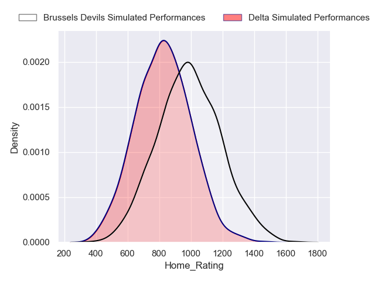

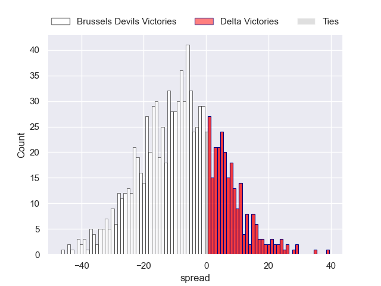

### Bohemia Rugby Warriors V Romanian Wolves on 2024/09/15

Average Margin: Romanian Wolves by 160.0

Average Scoreline: 113--47

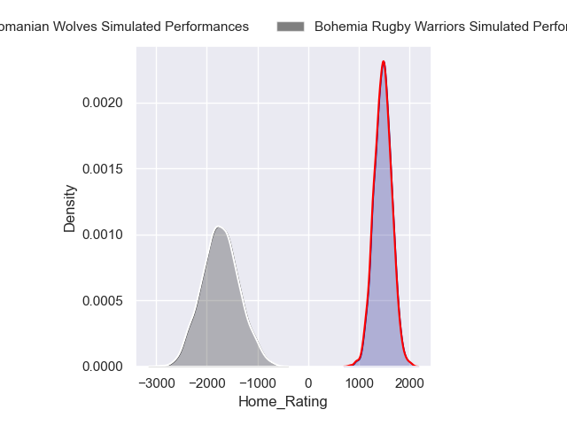

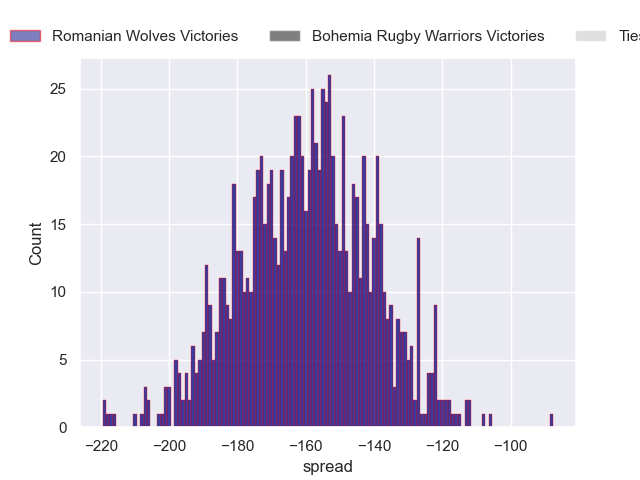

### Castilla y Leon Iberians V Black Lion on 2024/09/15

Average Margin: Black Lion by 16.2

Average Scoreline: 36-19

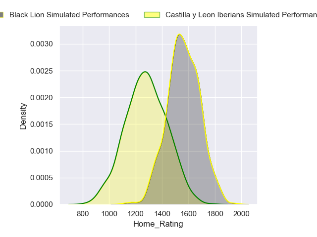

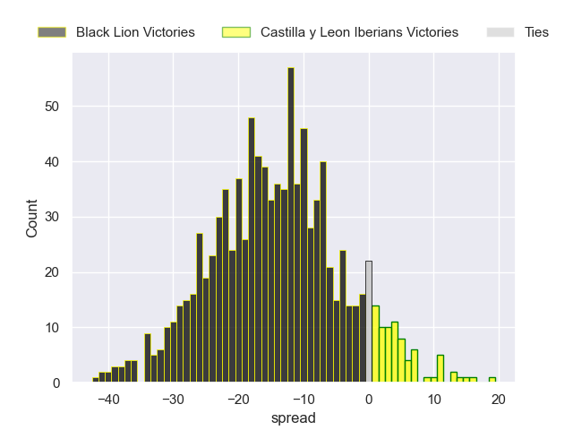

## Week 3

### Lusitanos XV V Black Lion on 2024/09/21

Average Margin: Black Lion by 7.5

Average Scoreline: 20-12

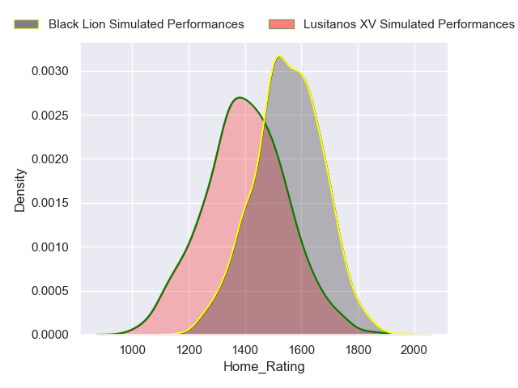

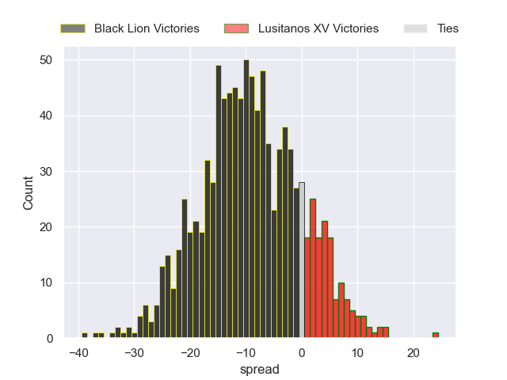

### Brussels Devils V Bohemia Rugby Warriors on 2024/09/21

Average Margin: Brussels Devils by 142.5

Average Scoreline: 96--47

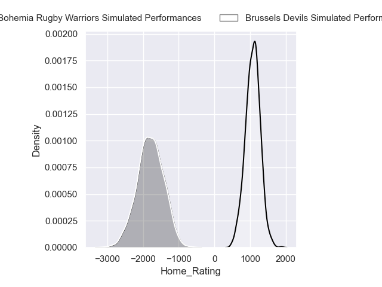

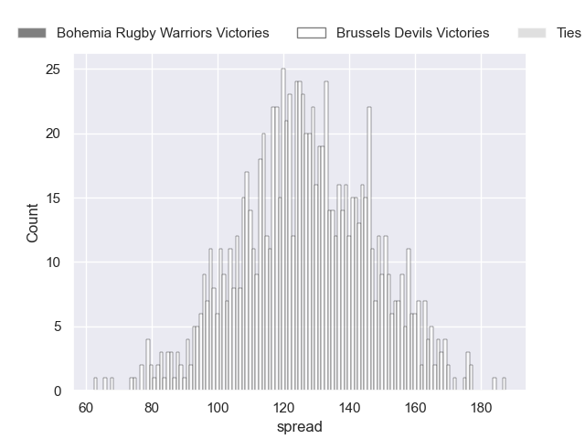

### Romanian Wolves V Delta on 2024/09/21

Average Margin: Romanian Wolves by 39.2

Average Scoreline: 46-7

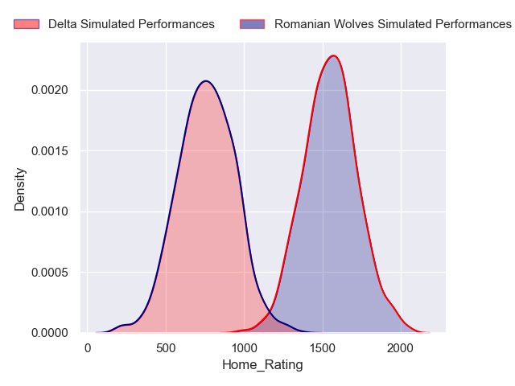

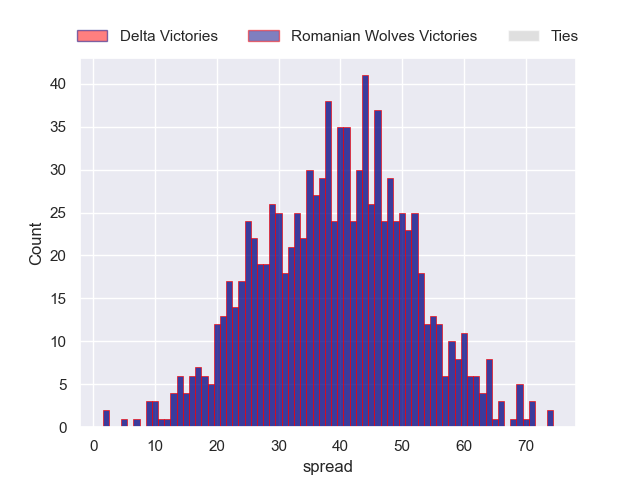

## Week 4

### Delta V Bohemia Rugby Warriors on 2024/09/27

Average Margin: Delta by 131.0

Average Scoreline: 83--48

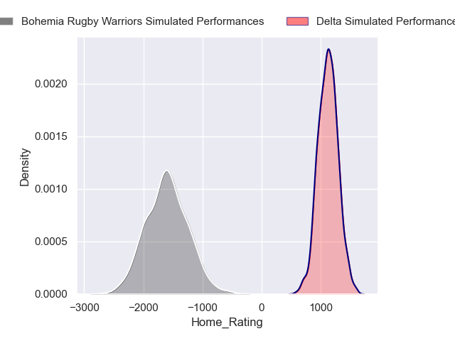

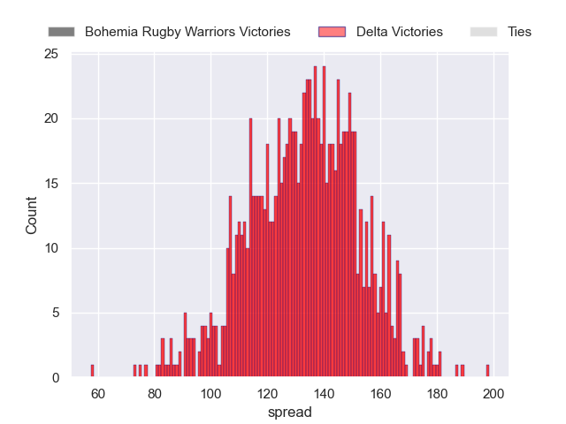

### Romanian Wolves V Brussels Devils on 2024/09/28

Average Margin: Romanian Wolves by 27.1

Average Scoreline: 42-15

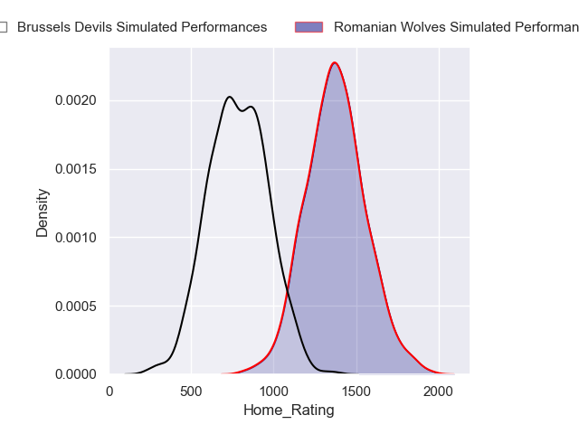
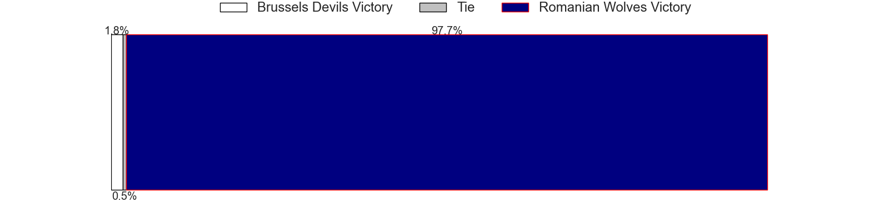
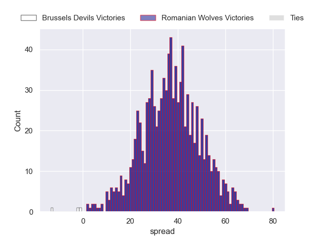

### Black Lion V Castilla y Leon Iberians on 2024/09/28

Average Margin: Black Lion by 23.2

Average Scoreline: 36-13

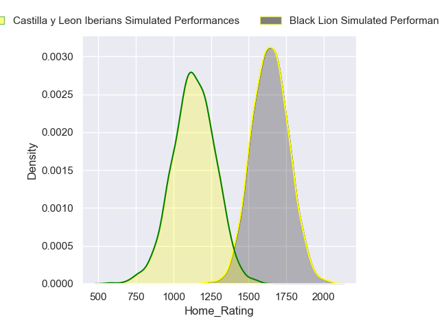

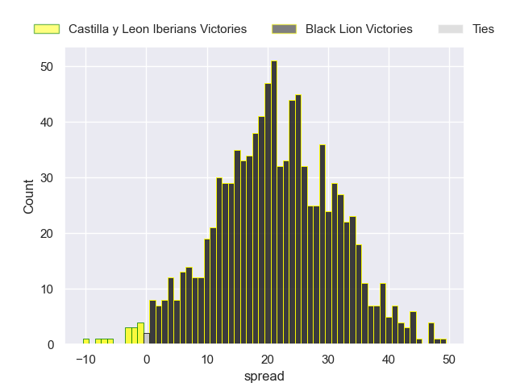

## Week 5

### Black Lion V Lusitanos XV on 2024/10/12

Average Margin: Black Lion by 14.0

Average Scoreline: 29-15

## Week 6

### Castilla y Leon Iberians V Lusitanos XV on 2024/10/20

Average Margin: Lusitanos XV by 5.4

Average Scoreline: 26-20

