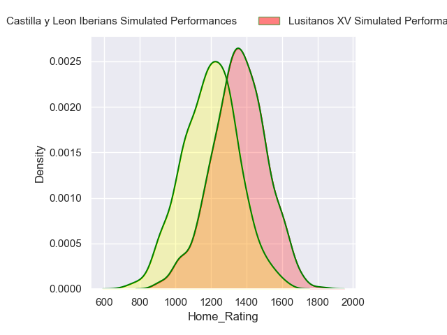
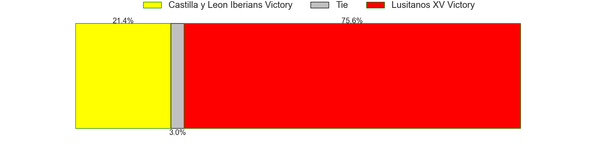
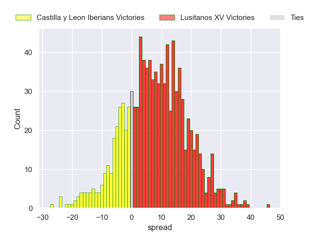

---  
title: "Rugby Europe Super Cup 2024 Status"  
date: 2024-09-05 6:00:00 -0500  
categories: model review projection  
layout: article  
aside:  
    toc: true  
---
# Current Team Rankings

# Standings

## Projected Total Table

| Club                     |   Total Matches |   Wins |   Point Differential |   Losing Bonus Points |   Try Bonus Points |   Competition Points |
|:-------------------------|----------------:|-------:|---------------------:|----------------------:|-------------------:|---------------------:|
| Black Lion               |               4 |    3.7 |              60.8803 |                   0.2 |                2.8 |                 17.7 |
| Romanian Wolves          |               3 |    3   |             225.643  |                   0   |                2.7 |                 14.6 |
| Brussels Devils          |               3 |    1.8 |             125.685  |                   0.2 |                1.9 |                  9.2 |
| Lusitanos XV             |               4 |    1.5 |             -17.1848 |                   0.7 |                1.2 |                  7.9 |
| Delta                    |               3 |    1.2 |              83.4921 |                   0.2 |                1.2 |                  6.4 |
| Castilla y Leon Iberians |               4 |    0.8 |             -43.6955 |                   0.7 |                1   |                  4.9 |
| Bohemia Rugby Warriors   |               3 |    0   |            -434.821  |                   0   |                0.2 |                  0.2 |

# Future Predictions

## Week 1

### Lusitanos XV V Castilla y Leon Iberians on 2024/09/07

Average Margin: Lusitanos XV by 8.0

Average Scoreline: 30-22

## Week 2

### Delta V Brussels Devils on 2024/09/14

Average Margin: Brussels Devils by 8.8

Average Scoreline: 38-30

### Castilla y Leon Iberians V Black Lion on 2024/09/15

Average Margin: Black Lion by 14.0

Average Scoreline: 42-28

### Bohemia Rugby Warriors V Romanian Wolves on 2024/09/15

Average Margin: Romanian Wolves by 159.8

Average Scoreline: 111--49

## Week 3

### Brussels Devils V Bohemia Rugby Warriors on 2024/09/21

Average Margin: Brussels Devils by 143.3

Average Scoreline: 107--36

### Romanian Wolves V Delta on 2024/09/21

Average Margin: Romanian Wolves by 39.4

Average Scoreline: 51-12

### Lusitanos XV V Black Lion on 2024/09/21

Average Margin: Black Lion by 9.4

Average Scoreline: 34-25

## Week 4

### Delta V Bohemia Rugby Warriors on 2024/09/27

Average Margin: Delta by 131.7

Average Scoreline: 91--41

### Romanian Wolves V Brussels Devils on 2024/09/28

Average Margin: Romanian Wolves by 26.4

Average Scoreline: 44-17

### Black Lion V Castilla y Leon Iberians on 2024/09/28

Average Margin: Black Lion by 21.6

Average Scoreline: 31-10

## Week 5

### Black Lion V Lusitanos XV on 2024/10/12

Average Margin: Black Lion by 15.8

Average Scoreline: 29-13

## Week 6

### Castilla y Leon Iberians V Lusitanos XV on 2024/10/20

Average Margin: Lusitanos XV by 0.0

Average Scoreline: 28-28

