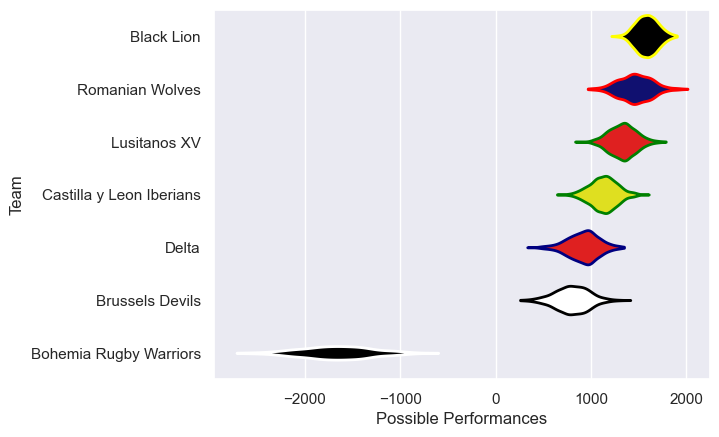
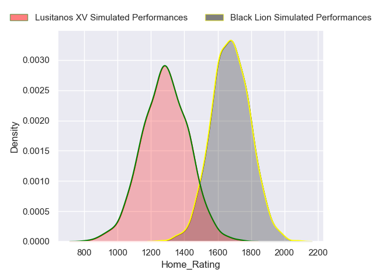
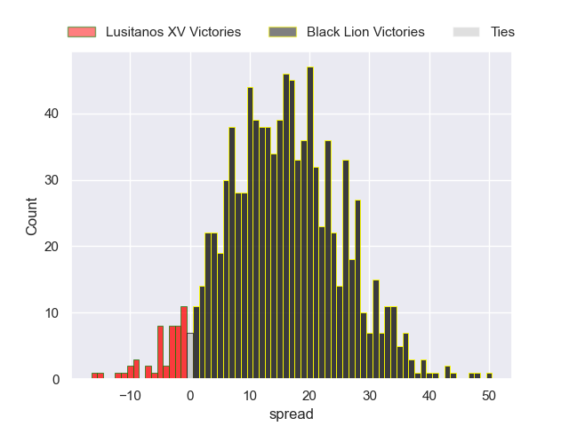
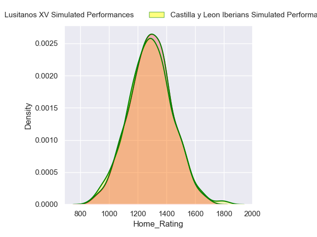
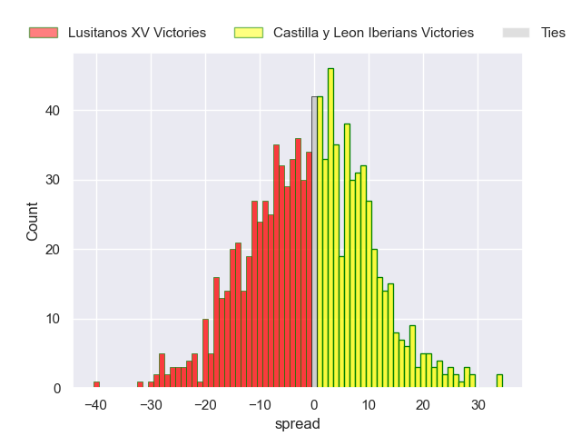

---  
title: "Rugby Europe Super Cup 2024 Status"  
date: 2024-10-03 6:00:00 -0500  
categories: model review projection  
layout: article  
aside:  
    toc: true  
---
# Current Team Rankings

# Standings

## Current Standings

| Club                     |   Played |   Wins |   Point Differential |   Losing Bonus Points |   Try Bonus Points |   Competition Points |
|:-------------------------|---------:|-------:|---------------------:|----------------------:|-------------------:|---------------------:|
| Black Lion               |        3 |      3 |                  101 |                     0 |                nan |                   12 |
| Delta                    |        3 |      3 |                   46 |                     0 |                nan |                   12 |
| Romanian Wolves          |        3 |      2 |                   41 |                     1 |                nan |                    9 |
| Lusitanos XV             |        2 |      1 |                   -6 |                     0 |                nan |                    4 |
| Brussels Devils          |        3 |      1 |                  -24 |                     0 |                nan |                    4 |
| Bohemia Rugby Warriors   |        3 |      0 |                  -63 |                     0 |                nan |                    0 |
| Castilla y Leon Iberians |        3 |      0 |                  -95 |                     0 |                nan |                    0 |

## Projected Remaining Table

| Club                     |   Matches Remaining |   Wins |   Point Differential |   Losing Bonus Points |   Try Bonus Points |   Competition Points |
|:-------------------------|--------------------:|-------:|---------------------:|----------------------:|-------------------:|---------------------:|
| Black Lion               |                   1 |    1   |             19.926   |                   0   |                0.8 |                  4.8 |
| Lusitanos XV             |                   2 |    0.7 |            -15.4528  |                   0.3 |                0.7 |                  3.7 |
| Castilla y Leon Iberians |                   1 |    0.3 |             -4.47324 |                   0.3 |                0.4 |                  1.9 |

## Projected Total Table

| Club                     |   Total Matches |   Wins |   Point Differential |   Losing Bonus Points |   Try Bonus Points |   Competition Points |
|:-------------------------|----------------:|-------:|---------------------:|----------------------:|-------------------:|---------------------:|
| Black Lion               |               4 |    4   |             120.926  |                   0   |                0.8 |                 16.8 |
| Delta                    |               3 |    3   |              46      |                   0   |                0   |                 12   |
| Romanian Wolves          |               3 |    2   |              41      |                   1   |                0   |                  9   |
| Lusitanos XV             |               4 |    1.7 |             -21.4528 |                   0.3 |                0.7 |                  7.7 |
| Brussels Devils          |               3 |    1   |             -24      |                   0   |                0   |                  4   |
| Castilla y Leon Iberians |               4 |    0.3 |             -99.4732 |                   0.3 |                0.4 |                  1.9 |
| Bohemia Rugby Warriors   |               3 |    0   |             -63      |                   0   |                0   |                  0   |

# Completed Match Review

| Model | Percent Correct Predictions | Spread Error |
| ------ | ------ | ------ |
| Club Level | 80.0% | 51.9 |
| Player Level: Lineup | nan% | nan |
| Player Level: Minutes | nan% | nan |

# Future Predictions

## Week 4

### Black Lion V Lusitanos XV on 2024/10/12

Average Margin: Black Lion by 19.9

Average Scoreline: 40-20

## Week 5

### Castilla y Leon Iberians V Lusitanos XV on 2024/10/20

Average Margin: Lusitanos XV by 4.5

Average Scoreline: 24-20

