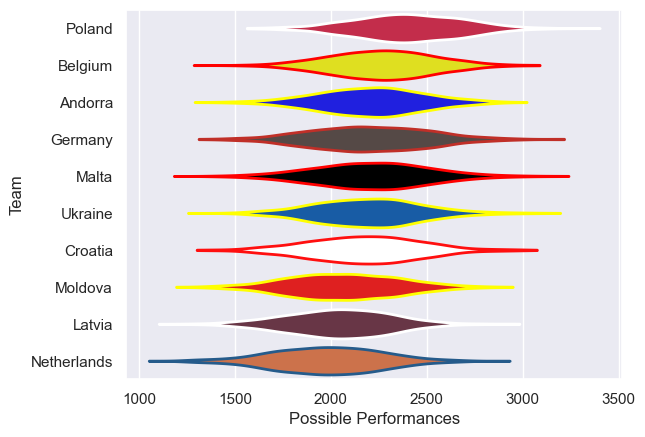

---  
title: "Rugby Europe Trophy 2008"  
date: 2025-07-29 6:00:00 -0500  
categories: model review projection  
layout: article  
aside:  
    toc: true  
---
# Current Team Rankings

# Standings

## Current Standings

| Club        |   Played |   Wins |   Point Differential |   Losing Bonus Points | Try Bonus Points   |   Competition Points |
|:------------|---------:|-------:|---------------------:|----------------------:|:-------------------|---------------------:|
| Poland      |        2 |      2 |                   68 |                     0 |                    |                    8 |
| Belgium     |        2 |      2 |                   51 |                     0 |                    |                    8 |
| Germany     |        2 |      2 |                   18 |                     0 |                    |                    8 |
| Andorra     |        2 |      1 |                   -4 |                     1 |                    |                    5 |
| Ukraine     |        2 |      1 |                   -3 |                     0 |                    |                    4 |
| Croatia     |        2 |      1 |                   -7 |                     0 |                    |                    4 |
| Latvia      |        2 |      1 |                  -43 |                     0 |                    |                    4 |
| Moldova     |        2 |      0 |                   -8 |                     2 |                    |                    2 |
| Malta       |        2 |      0 |                  -14 |                     1 |                    |                    1 |
| Netherlands |        2 |      0 |                  -58 |                     0 |                    |                    0 |

# Completed Match Review

| Model | Percent Correct Predictions | Spread Error |
| ------ | ------ | ------ |
| Club Level | 70.0% | 13.8 |
| Player Level: Lineup | nan% | nan |
| Player Level: Minutes | nan% | nan |

