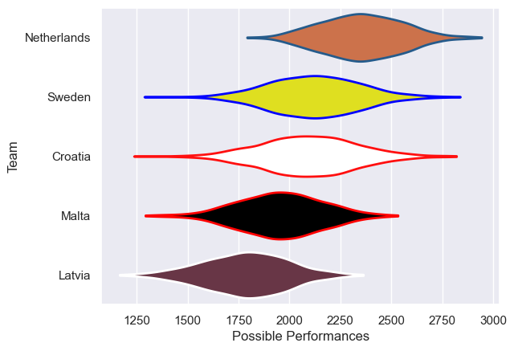

---  
title: "Rugby Europe Trophy 2009"  
date: 2025-07-29 6:00:00 -0500  
categories: model review projection  
layout: article  
aside:  
    toc: true  
---
# Current Team Rankings

# Standings

## Current Standings

| Club        |   Played |   Wins |   Point Differential |   Losing Bonus Points | Try Bonus Points   |   Competition Points |
|:------------|---------:|-------:|---------------------:|----------------------:|:-------------------|---------------------:|
| Netherlands |        2 |      2 |                   57 |                     0 |                    |                    8 |
| Croatia     |        2 |      2 |                   34 |                     0 |                    |                    8 |
| Malta       |        2 |      1 |                  -18 |                     0 |                    |                    4 |
| Sweden      |        2 |      0 |                   -5 |                     2 |                    |                    2 |
| Latvia      |        2 |      0 |                  -68 |                     0 |                    |                    0 |

# Completed Match Review

| Model | Percent Correct Predictions | Spread Error |
| ------ | ------ | ------ |
| Club Level | 80.0% | 9.3 |
| Player Level: Lineup | nan% | nan |
| Player Level: Minutes | nan% | nan |

