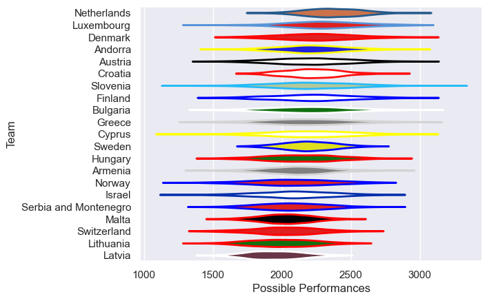

---  
title: "Rugby Europe Trophy 2010 Status"  
date: 2025-07-28 6:00:00 -0500  
categories: model review projection  
layout: article  
aside:  
    toc: true  
---
# Current Team Rankings

# Standings

## Current Standings

| Club                  |   Played |   Wins |   Point Differential |   Losing Bonus Points | Try Bonus Points   |   Competition Points |
|:----------------------|---------:|-------:|---------------------:|----------------------:|:-------------------|---------------------:|
| Sweden                |        4 |      3 |                   22 |                     1 |                    |                   13 |
| Latvia                |        4 |      2 |                   -8 |                     1 |                    |                    9 |
| Croatia               |        4 |      2 |                  -18 |                     1 |                    |                    9 |
| Bulgaria              |        2 |      2 |                   13 |                     0 |                    |                    8 |
| Denmark               |        2 |      1 |                    1 |                     0 |                    |                    6 |
| Malta                 |        4 |      1 |                  -12 |                     2 |                    |                    6 |
| Netherlands           |        2 |      1 |                   17 |                     1 |                    |                    5 |
| Andorra               |        2 |      1 |                   12 |                     1 |                    |                    5 |
| Armenia               |        2 |      1 |                    0 |                     1 |                    |                    5 |
| Austria               |        2 |      1 |                    0 |                     1 |                    |                    5 |
| Switzerland           |        2 |      1 |                    0 |                     1 |                    |                    5 |
| Lithuania             |        2 |      1 |                   -1 |                     1 |                    |                    5 |
| Hungary               |        3 |      1 |                   -4 |                     1 |                    |                    5 |
| Cyprus                |        1 |      1 |                   20 |                     0 |                    |                    4 |
| Slovenia              |        2 |      1 |                   15 |                     0 |                    |                    4 |
| Israel                |        1 |      1 |                    9 |                     0 |                    |                    4 |
| Luxembourg            |        2 |      1 |                   -2 |                     0 |                    |                    4 |
| Serbia and Montenegro |        2 |      1 |                  -27 |                     0 |                    |                    4 |
| Norway                |        2 |      0 |                   -6 |                     1 |                    |                    3 |
| Greece                |        2 |      0 |                  -23 |                     1 |                    |                    1 |
| Finland               |        1 |      0 |                   -8 |                     0 |                    |                    0 |

# Completed Match Review

| Model | Percent Correct Predictions | Spread Error |
| ------ | ------ | ------ |
| Club Level | 62.5% | 10.3 |
| Player Level: Lineup | nan% | nan |
| Player Level: Minutes | nan% | nan |

