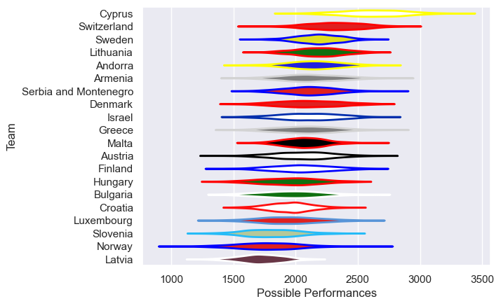

---  
title: "Rugby Europe Trophy 2011"  
date: 2025-07-29 6:00:00 -0500  
categories: model review projection  
layout: article  
aside:  
    toc: true  
---
# Current Team Rankings

# Standings

## Current Standings

| Club                  |   Played |   Wins |   Point Differential |   Losing Bonus Points | Try Bonus Points   |   Competition Points |
|:----------------------|---------:|-------:|---------------------:|----------------------:|:-------------------|---------------------:|
| Cyprus                |        4 |      4 |                  198 |                     0 |                    |                   16 |
| Switzerland           |        4 |      4 |                   44 |                     0 |                    |                   16 |
| Israel                |        5 |      4 |                   26 |                     0 |                    |                   16 |
| Sweden                |        4 |      3 |                   42 |                     0 |                    |                   14 |
| Greece                |        4 |      3 |                   58 |                     1 |                    |                   13 |
| Malta                 |        4 |      3 |                   28 |                     0 |                    |                   12 |
| Denmark               |        4 |      3 |                   22 |                     0 |                    |                   12 |
| Lithuania             |        4 |      2 |                   67 |                     1 |                    |                   11 |
| Austria               |        4 |      2 |                   37 |                     1 |                    |                    9 |
| Andorra               |        4 |      2 |                   13 |                     1 |                    |                    9 |
| Serbia and Montenegro |        4 |      2 |                   29 |                     0 |                    |                    8 |
| Bulgaria              |        4 |      2 |                  -82 |                     0 |                    |                    8 |
| Croatia               |        4 |      1 |                   -4 |                     2 |                    |                    6 |
| Armenia               |        2 |      1 |                   18 |                     1 |                    |                    5 |
| Finland               |        4 |      1 |                  -68 |                     1 |                    |                    5 |
| Hungary               |        3 |      1 |                  -23 |                     0 |                    |                    4 |
| Luxembourg            |        4 |      0 |                 -106 |                     1 |                    |                    1 |
| Norway                |        4 |      0 |                  -62 |                     0 |                    |                    0 |
| Slovenia              |        4 |      0 |                 -104 |                     0 |                    |                    0 |
| Latvia                |        4 |      0 |                 -133 |                     0 |                    |                    0 |

# Completed Match Review

| Model | Percent Correct Predictions | Spread Error |
| ------ | ------ | ------ |
| Club Level | 82.1% | 13.4 |
| Player Level: Lineup | nan% | nan |
| Player Level: Minutes | nan% | nan |

