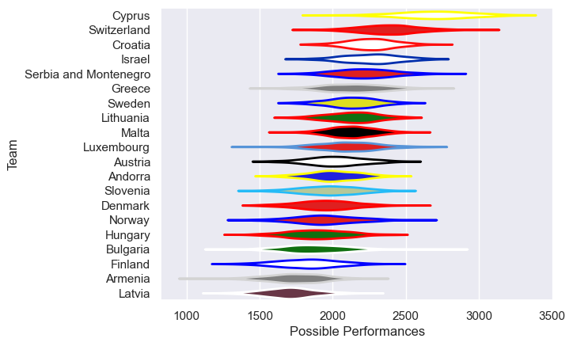

---  
title: "Rugby Europe Trophy 2012 Status"  
date: 2025-07-28 6:00:00 -0500  
categories: model review projection  
layout: article  
aside:  
    toc: true  
---
# Current Team Rankings

# Standings

## Current Standings

| Club                  |   Played |   Wins |   Point Differential |   Losing Bonus Points | Try Bonus Points   |   Competition Points |
|:----------------------|---------:|-------:|---------------------:|----------------------:|:-------------------|---------------------:|
| Cyprus                |        4 |      4 |                  239 |                     0 |                    |                   16 |
| Israel                |        4 |      4 |                  101 |                     0 |                    |                   16 |
| Croatia               |        4 |      3 |                   50 |                     1 |                    |                   13 |
| Bulgaria              |        5 |      3 |                  -86 |                     1 |                    |                   13 |
| Luxembourg            |        3 |      3 |                   32 |                     0 |                    |                   12 |
| Hungary               |        5 |      2 |                  -24 |                     2 |                    |                   10 |
| Andorra               |        5 |      2 |                  -30 |                     0 |                    |                   10 |
| Slovenia              |        4 |      2 |                  -59 |                     0 |                    |                   10 |
| Serbia and Montenegro |        4 |      2 |                   15 |                     1 |                    |                    9 |
| Switzerland           |        2 |      2 |                  110 |                     0 |                    |                    8 |
| Lithuania             |        2 |      2 |                   42 |                     0 |                    |                    8 |
| Norway                |        3 |      2 |                   20 |                     0 |                    |                    8 |
| Denmark               |        4 |      1 |                   -9 |                     0 |                    |                    8 |
| Malta                 |        3 |      1 |                   -8 |                     1 |                    |                    5 |
| Sweden                |        2 |      1 |                   20 |                     0 |                    |                    4 |
| Austria               |        4 |      0 |                  -50 |                     3 |                    |                    3 |
| Finland               |        5 |      0 |                 -103 |                     2 |                    |                    2 |
| Greece                |        2 |      0 |                  -74 |                     1 |                    |                    1 |
| Latvia                |        3 |      0 |                  -86 |                     0 |                    |                    0 |
| Armenia               |        4 |      0 |                 -100 |                     0 |                    |                    0 |

# Completed Match Review

| Model | Percent Correct Predictions | Spread Error |
| ------ | ------ | ------ |
| Club Level | 75.0% | 17.9 |
| Player Level: Lineup | nan% | nan |
| Player Level: Minutes | nan% | nan |

