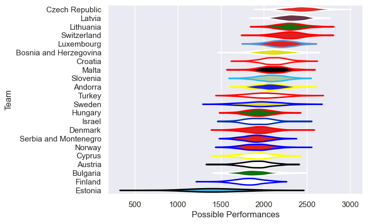

---  
title: "Rugby Europe Trophy 2016 Status"  
date: 2025-07-28 6:00:00 -0500  
categories: model review projection  
layout: article  
aside:  
    toc: true  
---
# Current Team Rankings

# Standings

## Current Standings

| Club                   |   Played |   Wins |   Point Differential |   Losing Bonus Points | Try Bonus Points   |   Competition Points |
|:-----------------------|---------:|-------:|---------------------:|----------------------:|:-------------------|---------------------:|
| Czech Republic         |        4 |      4 |                   93 |                     0 |                    |                   16 |
| Latvia                 |        4 |      3 |                   56 |                     1 |                    |                   13 |
| Malta                  |        4 |      3 |                   71 |                     0 |                    |                   12 |
| Turkey                 |        3 |      2 |                   43 |                     1 |                    |                    9 |
| Bosnia and Herzegovina |        3 |      2 |                   17 |                     1 |                    |                    9 |
| Luxembourg             |        4 |      2 |                   -2 |                     1 |                    |                    9 |
| Slovenia               |        3 |      2 |                   57 |                     0 |                    |                    8 |
| Switzerland            |        2 |      2 |                   51 |                     0 |                    |                    8 |
| Hungary                |        4 |      2 |                   30 |                     0 |                    |                    8 |
| Finland                |        4 |      2 |                    6 |                     0 |                    |                    8 |
| Lithuania              |        4 |      2 |                   -2 |                     0 |                    |                    8 |
| Israel                 |        4 |      2 |                  -25 |                     0 |                    |                    8 |
| Norway                 |        5 |      2 |                  -29 |                     0 |                    |                    8 |
| Serbia and Montenegro  |        3 |      2 |                  -44 |                     0 |                    |                    8 |
| Denmark                |        4 |      1 |                    0 |                     2 |                    |                    6 |
| Croatia                |        4 |      1 |                  -21 |                     1 |                    |                    5 |
| Austria                |        3 |      1 |                  -22 |                     0 |                    |                    4 |
| Sweden                 |        2 |      1 |                  -23 |                     0 |                    |                    4 |
| Cyprus                 |        4 |      1 |                  -58 |                     0 |                    |                    4 |
| Andorra                |        4 |      1 |                  -86 |                     0 |                    |                    4 |
| Bulgaria               |        2 |      0 |                  -19 |                     0 |                    |                    0 |
| Estonia                |        2 |      0 |                  -93 |                     0 |                    |                    0 |

## Projected Remaining Table

| Club                  |   To Play |   Projected Wins |   Projected Differential |   Projected Losing Bonus Points | Projected Try Bonus Points   |   Projected Competition Points |
|:----------------------|----------:|-----------------:|-------------------------:|--------------------------------:|:-----------------------------|-------------------------------:|
| Turkey                |         3 |             1.56 |                     5.6  |                            0.62 |                              |                           6.98 |
| Serbia and Montenegro |         1 |             0.52 |                    -0.08 |                            0.16 |                              |                           2.28 |
| Slovenia              |         1 |             0.49 |                    -1.39 |                            0.16 |                              |                           2.16 |
| Austria               |         1 |             0.37 |                    -4.13 |                            0.23 |                              |                           1.75 |

## Projected Total Table

| Club                   |   Played |   Wins |   Point Differential |   Losing Bonus Points | Try Bonus Points   |   Competition Points |
|:-----------------------|---------:|-------:|---------------------:|----------------------:|:-------------------|---------------------:|
| Czech Republic         |        4 |   4    |                93    |                  0    |                    |                16    |
| Turkey                 |        6 |   3.56 |                48.6  |                  1.62 |                    |                15.98 |
| Latvia                 |        4 |   3    |                56    |                  1    |                    |                13    |
| Malta                  |        4 |   3    |                71    |                  0    |                    |                12    |
| Serbia and Montenegro  |        4 |   2.52 |               -44.08 |                  0.16 |                    |                10.28 |
| Slovenia               |        4 |   2.49 |                55.61 |                  0.16 |                    |                10.16 |
| Bosnia and Herzegovina |        3 |   2    |                17    |                  1    |                    |                 9    |
| Luxembourg             |        4 |   2    |                -2    |                  1    |                    |                 9    |
| Switzerland            |        2 |   2    |                51    |                  0    |                    |                 8    |
| Hungary                |        4 |   2    |                30    |                  0    |                    |                 8    |
| Finland                |        4 |   2    |                 6    |                  0    |                    |                 8    |
| Lithuania              |        4 |   2    |                -2    |                  0    |                    |                 8    |
| Israel                 |        4 |   2    |               -25    |                  0    |                    |                 8    |
| Norway                 |        5 |   2    |               -29    |                  0    |                    |                 8    |
| Denmark                |        4 |   1    |                 0    |                  2    |                    |                 6    |
| Austria                |        4 |   1.37 |               -26.13 |                  0.23 |                    |                 5.75 |
| Croatia                |        4 |   1    |               -21    |                  1    |                    |                 5    |
| Sweden                 |        2 |   1    |               -23    |                  0    |                    |                 4    |
| Cyprus                 |        4 |   1    |               -58    |                  0    |                    |                 4    |
| Andorra                |        4 |   1    |               -86    |                  0    |                    |                 4    |
| Bulgaria               |        2 |   0    |               -19    |                  0    |                    |                 0    |
| Estonia                |        2 |   0    |               -93    |                  0    |                    |                 0    |

# Completed Match Review

| Model | Percent Correct Predictions | Spread Error |
| ------ | ------ | ------ |
| Club Level | 70.7% | 16.7 |
| Player Level: Lineup | nan% | nan |
| Player Level: Minutes | nan% | nan |

# Future Predictions

## Week 6

### Serbia and Montenegro V Turkey on 2016/11/05

Average Margin: Turkey by 0.0

## Week 7

### Turkey V Austria on 2016/11/12

Average Margin: Turkey by 6.3

## Week 8

### Turkey V Slovenia on 2016/11/26

Average Margin: Turkey by 2.5

